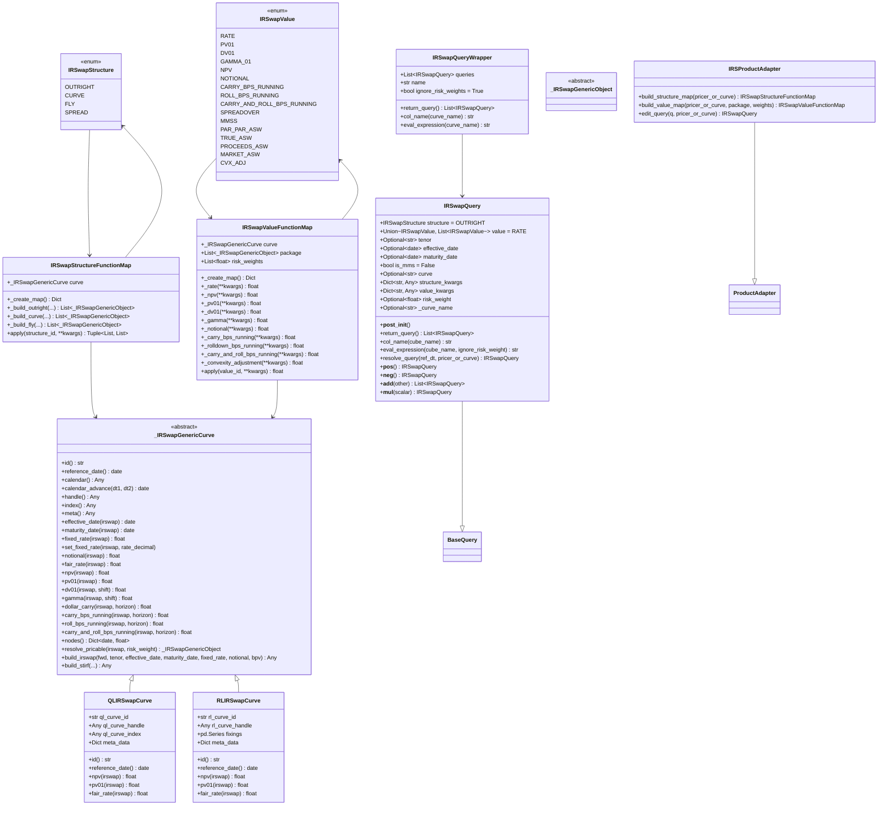
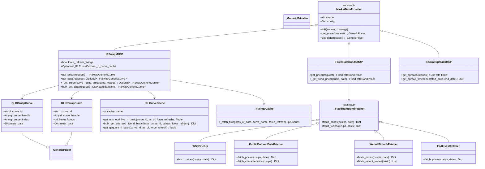
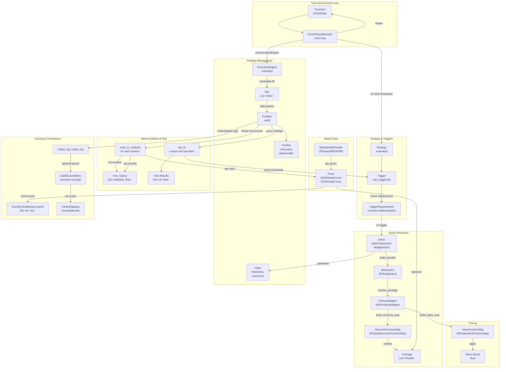
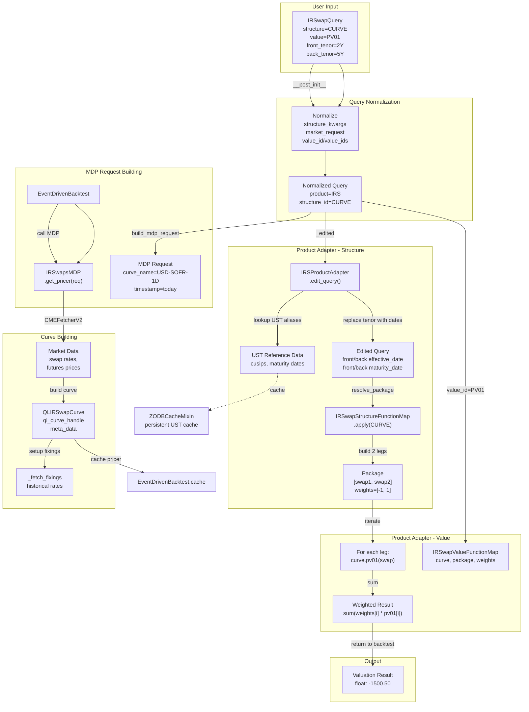
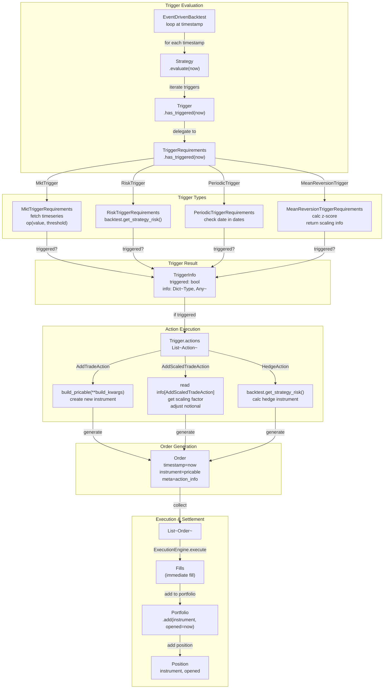
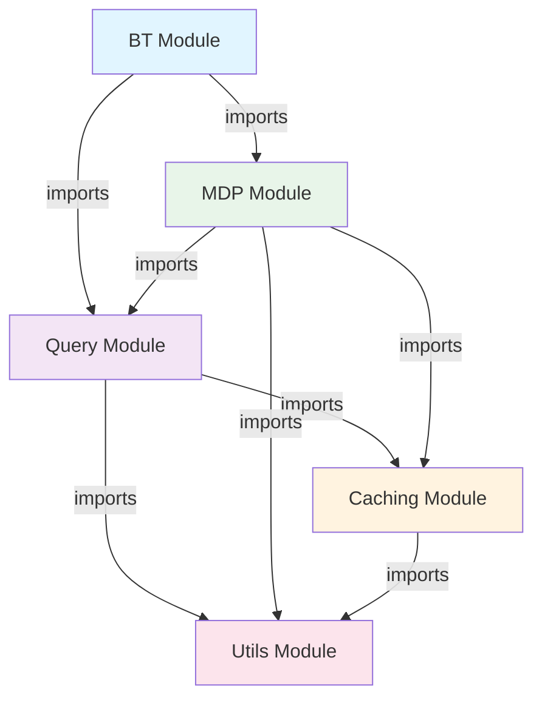

# ARBS Codebase - Comprehensive Class Diagrams

This document provides detailed Mermaid class diagrams for the ARBS project, showing complete class hierarchies, inheritance relationships, composition, dependencies, and data flow patterns.

## 1. BT Module - Event-Driven Backtesting Architecture

### 1.1 Complete BT Class Hierarchy with Methods and Attributes

```mermaid
classDiagram
    %% Core Data Classes
    class TriggerInfo {
        -bool triggered
        -Dict~Type, Any~ info
        +__bool__() bool
    }

    class Order {
        +datetime.datetime timestamp
        +_GenericPricable instrument
        +Optional~Dict~ meta
    }

    class Position {
        +_GenericPricable instrument
        +datetime.datetime opened
        +dict meta
    }

    class Portfolio {
        -List~Position~ positions
        -List orders_log
        -List trades_log
        +add(instrument, opened, meta)
        +trade_count_between(start, end) int
        +instruments_by_key() Dict~str, _GenericPricable~
        +iter_instruments() Iterable~_GenericPricable~
    }

    class TimeGrid {
        -List~datetime.datetime~ _states
        +__iter__() Iterator~datetime.datetime~
    }

    %% Strategy and Triggers
    class Strategy {
        +str name
        +Iterable~Trigger~ triggers
        +evaluate(now, backtest) List~Order~
    }

    class Trigger {
        +TriggerRequirements trigger_requirements
        +Union~Action, Iterable~Action~, None~ actions
        -ClassVar~List~type~~ __sub_classes
        +__init_subclass__(**kwargs)
        +has_triggered(state, backtest) TriggerInfo
        +get_trigger_times() List~time~
        +calc_type() str
        +risks() List
        +{static} sub_classes() tuple
    }

    class TriggerRequirements {
        +str calc_type
        +has_triggered(state, backtest) TriggerInfo
        +get_trigger_times() List~time~
    }

    %% Concrete Trigger Requirements
    class PeriodicTriggerRequirements {
        +Sequence~date~ dates
        +str calc_type = "calendar"
        +has_triggered(state, backtest) TriggerInfo
    }

    class IntradayTriggerRequirements {
        +Sequence~time~ times
        +str calc_type = "intraday"
        +get_trigger_times() List~time~
        +has_triggered(state, backtest) TriggerInfo
    }

    class MktTriggerRequirements {
        +Callable fetch
        +Callable~float, float, bool~ op
        +float threshold
        +str calc_type = "market"
        +has_triggered(state, backtest) TriggerInfo
    }

    class RiskTriggerRequirements {
        +str risk
        +Callable~float, float, bool~ op
        +float threshold
        +str calc_type = "risk"
        +has_triggered(state, backtest) TriggerInfo
    }

    class AggregateTriggerRequirements {
        +List~Trigger~ triggers
        +str mode = "any"
        +str calc_type = "aggregate"
        +has_triggered(state, backtest) TriggerInfo
    }

    class NotTriggerRequirements {
        +Trigger trigger
        +str calc_type = "not"
        +has_triggered(state, backtest) TriggerInfo
    }

    class DateTriggerRequirements {
        +Sequence~date~ dates
        +str calc_type = "date"
        +has_triggered(state, backtest) TriggerInfo
    }

    class PortfolioTriggerRequirements {
        +Callable~Any, bool~ predicate
        +str calc_type = "portfolio"
        +has_triggered(state, backtest) TriggerInfo
    }

    class MeanReversionTriggerRequirements {
        +Callable fetch
        +int lookback
        +float z_entry
        +str calc_type = "stat"
        +has_triggered(state, backtest) TriggerInfo
    }

    class TradeCountTriggerRequirements {
        +datetime.timedelta lookback
        +Callable~int, int, bool~ op
        +int count
        +str calc_type = "trade_count"
        +has_triggered(state, backtest) TriggerInfo
    }

    class EventTriggerRequirements {
        +Callable~datetime, List~str~~ events_on
        +str event_name
        +str calc_type = "event"
        +has_triggered(state, backtest) TriggerInfo
    }

    %% Concrete Triggers
    class PeriodicTrigger {
    }

    class IntradayPeriodicTrigger {
    }

    class MktTrigger {
    }

    class StrategyRiskTrigger {
        +risks() List
    }

    class AggregateTrigger {
    }

    class NotTrigger {
    }

    class DateTrigger {
    }

    class PortfolioTrigger {
    }

    class MeanReversionTrigger {
    }

    class TradeCountTrigger {
    }

    class EventTrigger {
    }

    class OrdersGeneratorTrigger {
        +get_trigger_times() List~time~
        +generate_orders(state, backtest) List~Order~
        +has_triggered(state, backtest) TriggerInfo
    }

    %% Actions
    class Action {
        <<interface>>
        +Optional~str~ risk
        +__call__(pricer, now, backtest, info) List~Order~
    }

    class AddTradeAction {
        +Dict~str, Any~ build_kwargs
        +Optional~str~ risk
        +__call__(pricer, now, backtest, info) List~Order~
    }

    class AddScaledTradeAction {
        +Dict~str, Any~ build_kwargs
        +str scale_key = "scaling"
        +str notional_key = "notional"
        +float default_notional = 1.0e6
        +Optional~str~ risk
        +__call__(pricer, now, backtest, info) List~Order~
    }

    class HedgeAction {
        +str risk_name
        +Callable hedge_builder
        +Optional~str~ risk
        +__call__(pricer, now, backtest, info) List~Order~
    }

    %% Execution Engine
    class ExecutionEngine {
        +execute(orders) List~Order~
    }

    %% Main Backtest
    class EventDrivenBacktest {
        +TimeGrid time_grid
        +Optional~_GenericPricer~ pricer
        +Optional~MarketDataProvider~ mdp
        +Optional~Callable~ mdp_request_builder
        +Strategy strategy
        +ExecutionEngine exec_engine
        +Callable risk_fn
        +Portfolio portfolio
        +Dict~str, Any~ cache
        +Dict~datetime, float~ mtm_history
        +_current_pricer() _GenericPricer
        +_resolve_pricer_for(now) _GenericPricer
        +get_strategy_risk(name) float
        +trade_count_since(start, end) int
        +window(fetch_fn, now, lookback) List
        +mark_to_market(now) float
        +run()
    }

    %% Relationships
    TriggerRequirements <|-- PeriodicTriggerRequirements
    TriggerRequirements <|-- IntradayTriggerRequirements
    TriggerRequirements <|-- MktTriggerRequirements
    TriggerRequirements <|-- RiskTriggerRequirements
    TriggerRequirements <|-- AggregateTriggerRequirements
    TriggerRequirements <|-- NotTriggerRequirements
    TriggerRequirements <|-- DateTriggerRequirements
    TriggerRequirements <|-- PortfolioTriggerRequirements
    TriggerRequirements <|-- MeanReversionTriggerRequirements
    TriggerRequirements <|-- TradeCountTriggerRequirements
    TriggerRequirements <|-- EventTriggerRequirements

    Trigger <|-- PeriodicTrigger
    Trigger <|-- IntradayPeriodicTrigger
    Trigger <|-- MktTrigger
    Trigger <|-- StrategyRiskTrigger
    Trigger <|-- AggregateTrigger
    Trigger <|-- NotTrigger
    Trigger <|-- DateTrigger
    Trigger <|-- PortfolioTrigger
    Trigger <|-- MeanReversionTrigger
    Trigger <|-- TradeCountTrigger
    Trigger <|-- EventTrigger
    Trigger <|-- OrdersGeneratorTrigger

    Trigger --> TriggerRequirements
    Trigger --> Action

    Action <|-- AddTradeAction
    Action <|-- AddScaledTradeAction
    Action <|-- HedgeAction

    Strategy --> Trigger
    Strategy --> Order

    Portfolio --> Position
    Position --> Order

    EventDrivenBacktest --> TimeGrid
    EventDrivenBacktest --> Strategy
    EventDrivenBacktest --> ExecutionEngine
    EventDrivenBacktest --> Portfolio

    TriggerInfo --> Order
```

---

## 2. Query Module - Product-Agnostic Pricing Architecture

### 2.1 Core Base Classes - Generic Pricer and Pricable

```mermaid
classDiagram
    %% Generic Base Classes
    class _GenericPricable {
        <<abstract>>
    }

    class _GenericPricer {
        <<abstract>>
        +npv(instrument) float*
        +build_pricable(**kwargs) _GenericPricable*
        +resolve_pricable(priceable, risk_weight) _GenericPricable*
    }

    %% Base Query
    class BaseQuery {
        <<abstract>>
        +str product
        +Any structure_id
        +Dict~str, Any~ structure_kwargs
        +Optional~Any~ value_id
        +Tuple~Any...~ value_ids
        +Dict~str, Any~ market_request
        +str mdp_time_key = "timestamp"
        +Optional~str~ name
        +Tuple~str...~ tags
        +Dict~str, Any~ meta
        
        +build_mdp_request(now) Dict~str, Any~
        +_edited(pricer_or_curve) BaseQuery
        +resolve_package(pricer_or_curve) Tuple~List, List~
        +build_value_map(pricer_or_curve, package, weights) Any
        +default_mtm_value_id() Any
        +signature() str
        +return_query() Union~BaseQuery, List~
        +col_name(cube_name) str
        +eval_expression(cube_name) str
        +__pos__() BaseQuery
        +__neg__() BaseQuery
        +__add__(other) List~BaseQuery~
        +__mul__(scalar) List~BaseQuery~
    }

    class BaseValue {
        <<abstract>>
    }

    class BaseStructure {
        <<abstract>>
    }

    %% Product Adapter Pattern
    class ProductAdapter {
        <<abstract>>
        +build_structure_map(pricer_or_curve) Any*
        +build_value_map(pricer_or_curve, package, weights) Any*
        +edit_query(q, pricer_or_curve) BaseQuery*
    }

    class AdapterRegistry {
        -Dict~str, Type~ProductAdapter~~ _ADAPTERS
        +{static} register_product(product, adapter_cls)
        +{static} get_adapter(product) Type~ProductAdapter~
    }

    %% Relationships
    BaseQuery --> ProductAdapter : uses
    BaseQuery --> BaseStructure : uses
    BaseQuery --> BaseValue : uses
    AdapterRegistry --> ProductAdapter : registers
```

### 2.2 IRS Query Module - Complete Class Hierarchy



### 2.3 FixedRateBonds Query Module

```mermaid
classDiagram
    %% FRB Specific Classes
    class FixedRateBondStructure {
        <<enum>>
        OUTRIGHT
        CURVE
        BUTTERFLY
    }

    class FixedRateBondValue {
        <<enum>>
        PRICE
        YIELD
        DV01
        CONVEXITY
        DURATION
        ACCRUED
        NPV
    }

    class FixedRateBondQuery {
        +FixedRateBondStructure structure = OUTRIGHT
        +Union~FixedRateBondValue, List~FixedRateBondValue~~ value
        +Optional~str~ cusip
        +Optional~date~ maturity_date
        +Optional~float~ price
        +Dict~str, Any~ structure_kwargs
        +Dict~str, Any~ value_kwargs
        +Optional~float~ risk_weight
        
        +__post_init__()
        +return_query() List~FixedRateBondQuery~
        +col_name(cube_name) str
        +eval_expression(cube_name) str
    }

    %% Generic FRB Objects
    class _GenericPricable
    class _GenericPricer
    class _FixedRateBondGenericPricable {
        +str cusip
        +date maturity
        +float coupon
    }

    class _FixedRateBondGenericPricer {
        +npv(bond) float
        +build_pricable(**kwargs) _FixedRateBondGenericPricable
        +price_from_yield(bond, yield) float
        +yield_from_price(bond, price) float
    }

    %% Implementations
    class QLFixedRateBondPricer {
        -Any ql_bond_engine
        +npv(bond) float
        +build_pricable(...) _FixedRateBondGenericPricable
    }

    class RLFixedRateBondPricer {
        -Any rl_bond_curve
        +npv(bond) float
        +build_pricable(...) _FixedRateBondGenericPricable
    }

    %% Structure and Value Maps
    class FixedRateBondStructureFunctionMap {
        +_apply(structure_id, **kwargs) Tuple~List, List~
    }

    class FixedRateBondValueFunctionMap {
        +_apply(value_id, **kwargs) float
    }

    %% FRB Product Adapter
    class FRBProductAdapter {
        +build_structure_map(pricer_or_curve) FixedRateBondStructureFunctionMap
        +build_value_map(pricer_or_curve, package, weights) FixedRateBondValueFunctionMap
        +edit_query(q, pricer_or_curve) FixedRateBondQuery
    }

    %% Relationships
    FixedRateBondQuery --|> BaseQuery
    _FixedRateBondGenericPricable --|> _GenericPricable
    _FixedRateBondGenericPricer --|> _GenericPricer
    QLFixedRateBondPricer --|> _FixedRateBondGenericPricer
    RLFixedRateBondPricer --|> _FixedRateBondGenericPricer
    FRBProductAdapter --|> ProductAdapter
```



---

## 3. MDP Module - Market Data Provider Hierarchy

### 3.1 Complete MDP Architecture with All Providers



---

## 4. Caching Module - Mixin Patterns and Cache Architecture

### 4.1 ZODB Cache Mixin and Timeseries Caching

```mermaid
classDiagram
    %% Connection Management
    class _DBHandle {
        -DB db
        -FileStorage storage
        -int refcnt
        -List~Connection~ _conns
        -threading.Lock _lock
        -int _pool_cap
        
        +get_conn() Connection
        +release_conn(conn)
        +incref()
        +decref()
    }

    %% Main Caching Mixin
    class ZODBCacheMixin {
        <<mixin>>
        -Dict~str, _DBHandle~ _DB_REGISTRY
        -threading.Lock _REGISTRY_LOCK
        -bool _use_btree = True
        -bool _force_refresh = False
        -Dict~str, Tuple~Connection, _DBHandle~~ _z_conns
        -Dict~str, CodecMapping~ _codec_wrappers
        
        +CACHE_ROOT Path | None
        
        +__init__(use_btree, force_refresh, **kwargs)
        +{static} _open_filestorage(path) FileStorage
        +{static} _slug(text, repl) str
        +{static} _user_cache_root() Path
        +{static} default_cache_path(stem, ext) str
        +{classmethod} _acquire_db(path) _DBHandle
        +{classmethod} _release_db(path)
        +zodb_open_cache(cache_attr, path, encode, decode, force)
        +batched() Generator
        +zodb_commit()
        +close_zodb()
        +{classmethod} diagnostics() MappingProxyType
    }

    %% Codec Wrapper
    class CodecMapping {
        -MutableMapping~Any, Any~ mapping
        -Optional~Callable~ encode
        -Optional~Callable~ decode
        
        +__getitem__(key) Any
        +__setitem__(key, value)
        +__contains__(key) bool
        +__delitem__(key)
        +__iter__() Iterator
        +keys() List
        +values() List
        +items() List
    }

    %% Timeseries Catalog
    class TSCatalog {
        <<persistent>>
        -OOBTree shards
        -OOBTree pointers
        
        +__init__()
    }

    class SymbolIndex {
        <<persistent>>
        -OOBTree by_date
        
        +__init__()
    }

    class TimeSeriesCache {
        -str cache_dir
        -TSCatalog catalog
        -int compression_level
        -bool use_parquet
        
        +write_timeseries(symbol, df) 
        +read_timeseries(symbol, start_date, end_date) pd.DataFrame
        +list_symbols() List~str~
        +get_metadata(symbol) Dict
        +clear_symbol(symbol)
        +vacuum()
    }

    %% Storage Backends
    class FileStorage {
        <<external>>
        -str _file_name
        +sync()
        +close()
    }

    class DemoStorage {
        <<external>>
        -FileStorage _base
        +sync()
        +close()
    }

    class DB {
        <<external>>
        -FileStorage storage
        +int pool_size = 7
        +open(transaction_manager) Connection
        +close()
    }

    class Connection {
        <<external>>
        +root() MutableMapping
        +close()
    }

    %% Persistent Data Structure
    class Persistent {
        <<external>>
    }

    class OOBTree {
        <<external>>
    }

    class PersistentMapping {
        <<external>>
    }

    %% Relationships
    ZODBCacheMixin --> _DBHandle
    _DBHandle --> DB
    _DBHandle --> FileStorage
    _DBHandle --> Connection

    ZODBCacheMixin --> CodecMapping
    ZODBCacheMixin --> OOBTree
    ZODBCacheMixin --> PersistentMapping

    TSCatalog --|> Persistent
    SymbolIndex --|> Persistent

    TimeSeriesCache --> TSCatalog
    TimeSeriesCache --> SymbolIndex
    TimeSeriesCache --> FileStorage

    FileStorage --|> FileStorage
    DemoStorage --|> FileStorage
    DB --> FileStorage
    Connection --> DB
```

---

## 5. Data Flow Architecture

### 5.1 Complete Data Flow - Backtesting with Event-Driven Architecture



### 5.2 Query Resolution and Pricing Flow



### 5.3 Trigger and Action Execution Flow



---

## 6. Adapter Pattern Diagram - Extensibility

```mermaid
graph TB
    subgraph "Product-Agnostic Interface"
        BQ["BaseQuery<br/>product: str<br/>structure_id: Any<br/>market_request: Dict"]
        ADAPTER["ProductAdapter<br/>build_structure_map()<br/>build_value_map()<br/>edit_query()"]
        REGISTRY["ProductAdapter Registry<br/>product -> adapter_cls"]
    end

    subgraph "Product-Specific Adapters"
        IRSADAPTER["IRSProductAdapter"]
        FRBADAPTER["FRBProductAdapter"]
        SWAPTIONADAPTER["SwaptionProductAdapter<br/>(future)"]
    end

    subgraph "IRS Adapter Components"
        IRSADAPTER -->|provides| IRSTRUCT["IRSwapStructureFunctionMap<br/>OUTRIGHT/CURVE/FLY"]
        IRSADAPTER -->|provides| IRSVALUE["IRSwapValueFunctionMap<br/>RATE/PV01/DV01/etc"]
        IRSADAPTER -->|provides| IRSEDIT["edit_query()<br/>resolve UST aliases<br/>MMS normalization"]
    end

    subgraph "FRB Adapter Components"
        FRBADAPTER -->|provides| FRBSTRUCT["FRBStructureFunctionMap<br/>OUTRIGHT/CURVE/BUTTERFLY"]
        FRBADAPTER -->|provides| FRBVALUE["FRBValueFunctionMap<br/>PRICE/YIELD/DV01/etc"]
        FRBADAPTER -->|provides| FRBEDIT["edit_query()<br/>CUSIP validation<br/>reference data lookup"]
    end

    BQ -->|get_adapter(product)| REGISTRY
    REGISTRY -->|lookup IRS| IRSADAPTER
    REGISTRY -->|lookup FRB| FRBADAPTER
    REGISTRY -->|register new| SWAPTIONADAPTER

    BQ -->|resolve_package()| IRSTRUCT
    BQ -->|resolve_package()| FRBSTRUCT
    BQ -->|build_value_map()| IRSVALUE
    BQ -->|build_value_map()| FRBVALUE
```

---

## 7. Mixin and Composition Patterns

### 7.1 Caching Mixin Pattern

```mermaid
graph TB
    subgraph "Mixin Application"
        CLASS["CustomClass<br/>inherits ZODBCacheMixin<br/>calls super().__init__()"]
        MIXIN["ZODBCacheMixin<br/>__init__()<br/>zodb_open_cache()<br/>zodb_commit()<br/>close_zodb()"]
    end

    subgraph "Initialization"
        CLASS -->|super().__init__()| INIT["ZODBCacheMixin.__init__<br/>_use_btree=True<br/>_force_refresh=False<br/>_z_conns={}<br/>_codec_wrappers={}"]
    end

    subgraph "Cache Opening"
        INIT -->|zodb_open_cache()| OPEN["_acquire_db(path)<br/>create/open FileStorage<br/>create DB with pool_size=32"]
        OPEN -->|get connection| CONN["Connection<br/>get root()"]
        CONN -->|create container| CONT["OOBTree or<br/>PersistentMapping"]
        CONT -->|wrap if encode/decode| CODEC["CodecMapping<br/>encode on set<br/>decode on get"]
        CODEC -->|set attribute| ATTR["self.cache_attr<br/>= codec_wrapper"]
    end

    subgraph "Usage"
        ATTR -->|get/set| CACHE["self.my_cache[key]<br/>transparent persistence"]
    end

    subgraph "Lifecycle"
        INIT -->|on demand| OPEN
        CACHE -->|batched()| BATCH["transaction.commit()"]
        BATCH -->|explicit| COMMIT["zodb_commit()"]
        COMMIT -->|at cleanup| CLOSE["close_zodb()<br/>release all connections<br/>close DB"]
    end

    CLASS -->|inherits| MIXIN
```

---

## 8. Summary: Class Relationships Matrix

### Key Inheritance Relationships

| Child Class | Parent Class | Module | Purpose |
|---|---|---|---|
| PeriodicTrigger | Trigger | BT | Periodic trigger implementation |
| MktTrigger | Trigger | BT | Market signal trigger |
| StrategyRiskTrigger | Trigger | BT | Risk-based trigger |
| AddTradeAction | Action | BT | Generate trade orders |
| HedgeAction | Action | BT | Generate hedge orders |
| IRSwapQuery | BaseQuery | Query | IRS-specific query |
| FixedRateBondQuery | BaseQuery | Query | FRB-specific query |
| QLIRSwapCurve | _IRSwapGenericCurve | Query | QuantLib IRS curve |
| RLIRSwapCurve | _IRSwapGenericCurve | Query | Rateslib IRS curve |
| IRSProductAdapter | ProductAdapter | Query | IRS adapter |
| FRBProductAdapter | ProductAdapter | Query | FRB adapter |
| IRSwapsMDP | MarketDataProvider | MDP | IRS market data |
| FixedRateBondsMDP | MarketDataProvider | MDP | FRB market data |
| WSJFetcher | _FixedRateBondFetcher | MDP | Data source for FRB |

### Key Composition Relationships

| Container Class | Contained Class | Relationship | Count |
|---|---|---|---|
| EventDrivenBacktest | Strategy | 1:1 | Single active strategy |
| EventDrivenBacktest | Portfolio | 1:1 | Single portfolio |
| EventDrivenBacktest | ExecutionEngine | 1:1 | Single engine |
| Strategy | Trigger | 1:N | Multiple triggers |
| Trigger | TriggerRequirements | 1:1 | Delegating object |
| Trigger | Action | 1:N | Multiple actions per trigger |
| Portfolio | Position | 1:N | Multiple positions |
| BaseQuery | ProductAdapter | 1:1 | Runtime lookup |

### Key Protocol/Interface Implementations

| Interface | Implementations | Module |
|---|---|---|
| Action (Protocol) | AddTradeAction, AddScaledTradeAction, HedgeAction | BT |
| TriggerRequirements (ABC) | 9 concrete classes | BT |
| _GenericPricer (ABC) | QLIRSwapCurve, RLIRSwapCurve, FRB pricers | Query/MDP |
| _GenericPricable (ABC) | IRS swaps, FRB bonds, STIR futures | Query |
| ProductAdapter (ABC) | IRSProductAdapter, FRBProductAdapter | Query |
| MarketDataProvider (ABC) | IRSwapsMDP, FixedRateBondsMDP | MDP |
| ZODBCacheMixin (Mixin) | Any class needing persistence | Caching |

---

## Appendix: Module Dependency Graph



