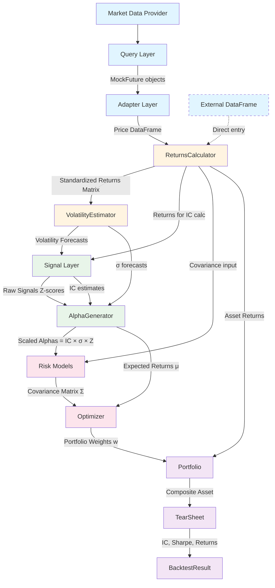
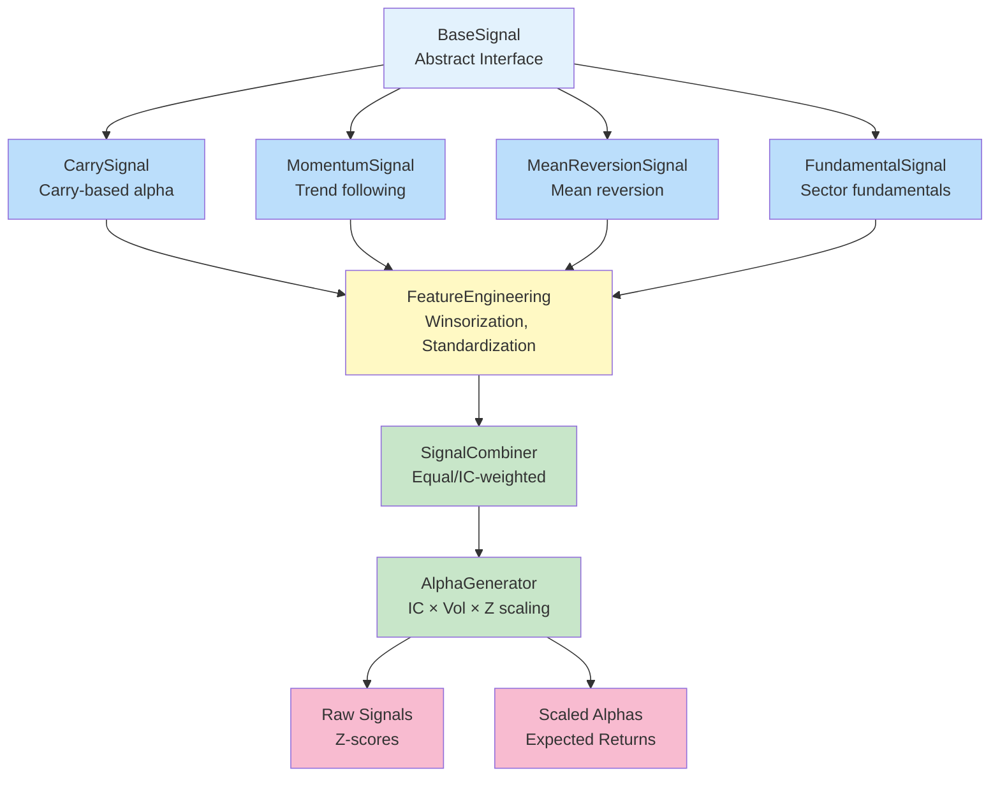
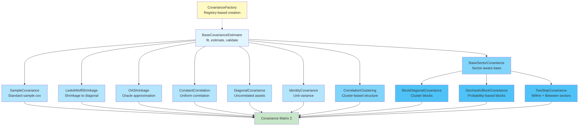
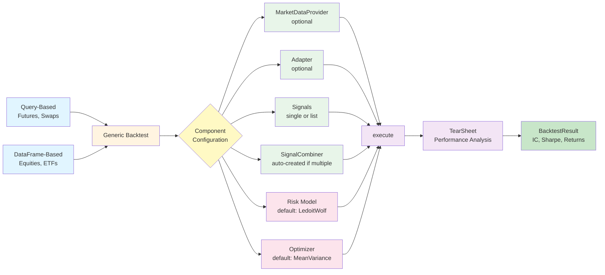
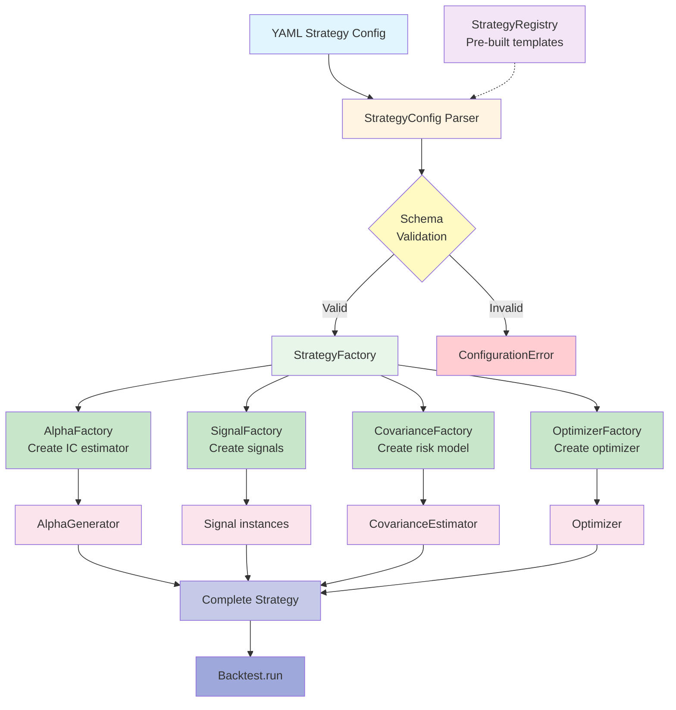
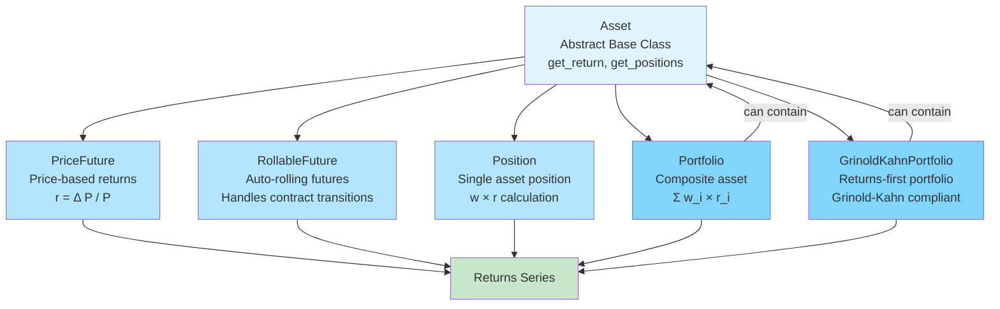

# ARBS Codebase Analysis

## Executive Summary

This document provides a comprehensive analysis of the ARBS (Algorithmic Relative-value Backtesting System) codebase structure, architecture, and data flow.

**Status**: 1038/1046 tests passing (99.2%)
**Architecture**: Returns-first Grinold-Kahn compliant design
**Primary Language**: Python with Polars for data processing

---

## Abstract Source Tree

```
ARBS/
├── Core Strategy Modules
│   ├── Signals/                    # Alpha signal generation
│   │   ├── Base/                   # BaseSignal interface
│   │   ├── Futures/                # Futures-specific signals
│   │   │   ├── CarrySignal         # Carry-based alpha
│   │   │   ├── MomentumSignal      # Trend-following alpha
│   │   │   └── MeanReversionSignal # Mean reversion alpha
│   │   ├── SectorRotation/         # Sector rotation strategies
│   │   │   ├── FundamentalSignal   # Fundamental factors
│   │   │   ├── MomentumFactor      # Sector momentum
│   │   │   └── ReversionFactor     # Sector mean reversion
│   │   ├── Utils/                  # Signal utilities
│   │   │   └── FeatureEngineering  # Feature transformation
│   │   └── SignalCombiner          # Multi-signal combination
│   │
│   ├── Risk/                        # Risk modeling and estimation
│   │   ├── Base/                    # BaseCovarianceEstimator
│   │   ├── Covariance/              # Covariance estimation
│   │   │   ├── SampleCovariance     # Standard sample covariance
│   │   │   ├── LedoitWolfShrinkage  # Shrinkage estimator
│   │   │   ├── OAShrinkage          # Oracle approximation shrinkage
│   │   │   ├── ConstantCorrelation  # Constant correlation model
│   │   │   ├── DiagonalCovariance   # Diagonal model
│   │   │   ├── IdentityCovariance   # Identity model
│   │   │   ├── CorrelationClustering # Correlation-based clustering
│   │   │   └── SectorBased/         # Sector-aware models
│   │   │       ├── BaseSectorCovarianceEstimator
│   │   │       ├── BlockDiagonal/   # Block diagonal structure
│   │   │       ├── StochasticBlock/ # Stochastic block model
│   │   │       └── TwoStep/         # Two-step estimation
│   │   ├── Returns/                 # Returns calculation
│   │   │   └── ReturnsCalculator    # Standardized returns pipeline
│   │   └── Volatility/              # Volatility forecasting
│   │       ├── VolatilityEstimator  # Vol estimation interface
│   │       ├── RealizedVolatility   # Historical vol
│   │       ├── EWMAVolatility       # Exponential weighting
│   │       ├── GARCHVolatility      # GARCH(1,1) model
│   │       └── VolatilityRatio      # Cross-sectional vol ratio
│   │
│   ├── Optimizer/                   # Portfolio optimization
│   │   ├── Base/                    # BaseOptimizer interface
│   │   ├── MeanVarianceOptimizer    # Markowitz (1952) optimizer
│   │   ├── CVaRMeanVarianceOptimizer # CVaR-constrained optimizer
│   │   └── ClusterAwareMeanVarianceOptimizer # Cluster-aware optimization
│   │
│   └── AlphaGenerator              # Grinold-Kahn alpha scaling (IC × Vol × Z)
│
├── Data Layer
│   ├── Query/                       # Asset query interfaces
│   │   ├── Base/                    # BaseQuery
│   │   ├── Futures/                 # FuturesQuery
│   │   ├── IRSwaps/                 # IR Swaps query
│   │   │   └── backends/            # QuantLib, rateslib, dp
│   │   ├── FixedRateBonds/          # Bond query
│   │   │   └── backends/            # QuantLib, rateslib
│   │   ├── Equities/                # Equity query
│   │   └── Currencies/              # FX query
│   │
│   ├── MDP/                         # Market data providers
│   │   ├── MarketDataProvider       # Base MDP interface
│   │   ├── YahooFinance/            # Yahoo Finance integration
│   │   ├── IRSwaps/                 # Swap data providers
│   │   │   ├── CME_NY_EOD_LIVE/     # CME end-of-day
│   │   │   ├── SDR_INTRADAY/        # Intraday swap data
│   │   │   └── GSQUANT/             # Goldman Sachs data
│   │   ├── FixedRateBonds/          # Bond data providers
│   │   │   ├── FEDINVEST/           # US Treasury data
│   │   │   ├── WEBULL/              # Webull data
│   │   │   ├── WSJ/                 # Wall Street Journal
│   │   │   └── PUBLICDOTCOM/        # Public.com data
│   │   └── IRSwapSpreads/           # Swap spread data
│   │
│   └── Adapter/                     # Query → DataFrame bridge
│       ├── Base/                    # BaseAdapter
│       ├── FuturesAdapter           # Futures data adapter
│       └── EquityAdapter            # Equity data adapter
│
├── Asset Abstraction
│   ├── Asset/                       # Asset hierarchy
│   │   ├── Base/                    # Base Asset class
│   │   ├── PriceFuture              # Price-based futures
│   │   ├── RollableFuture           # Auto-rolling futures
│   │   ├── Position                 # Single position
│   │   ├── Portfolio                # Standard portfolio (composite Asset)
│   │   └── GrinoldKahnPortfolio     # Grinold-Kahn compliant portfolio
│   │
│   └── BT/                          # Legacy backtesting (deprecated)
│       ├── accounting               # Position accounting
│       └── data_handler             # Data management
│
├── Strategy Framework
│   ├── Backtest/                    # Generic backtest engine
│   │   ├── Base/                    # BaseBacktest
│   │   └── Backtest                 # Unified backtest (query + DataFrame workflows)
│   │
│   └── Strategies/                  # Strategy configuration system
│       ├── Config/                  # YAML configuration parser
│       │   └── StrategyConfig       # Strategy config schema
│       ├── Factory/                 # Component factories
│       │   ├── StrategyFactory      # Main strategy factory
│       │   ├── AlphaFactory         # Alpha generator factory
│       │   ├── SignalFactory        # Signal factory
│       │   └── CovarianceFactory    # Risk model factory
│       └── Registry/                # Pre-built templates
│           └── StrategyRegistry     # Template registry
│
├── Analysis & Utilities
│   ├── Analysis/                    # Performance analysis
│   │   └── TearSheet                # Comprehensive performance metrics
│   │
│   ├── RVUtils/                     # Relative value utilities
│   │   ├── Interpolation/           # Curve interpolation
│   │   │   ├── NelsonSiegel         # Nelson-Siegel model
│   │   │   ├── NelsonSiegelSvensson # Extended NS model
│   │   │   ├── DieboldLi            # Diebold-Li model
│   │   │   ├── BjorkChristensen     # Bjork-Christensen model
│   │   │   ├── MonotoneConvex       # Monotone convex splines
│   │   │   ├── MonoSpline           # Monotone splines
│   │   │   ├── SmithWilson          # Smith-Wilson extrapolation
│   │   │   └── MLESM                # MLE state-space model
│   │   ├── mean_reversion           # Mean reversion utilities
│   │   ├── regression               # Regression tools
│   │   └── seasonality_utils        # Seasonality analysis
│   │
│   └── Caching/                     # Data caching layer
│       ├── ZODBCacheMixin           # ZODB-based caching
│       └── timeseries_cache         # Timeseries cache
│
├── Configuration
│   ├── config/                      # Runtime configuration
│   │   └── strategies/              # Strategy YAML files
│   ├── strategies/                  # Strategy definitions
│   │   └── examples/                # Example strategies
│   └── definitions/                 # System definitions
│
└── Development & Testing
    ├── tests/                       # Test suite (1046 tests)
    │   ├── unit/                    # Unit tests
    │   │   ├── adapter/             # Adapter tests
    │   │   ├── asset/               # Asset tests
    │   │   ├── backtest/            # Backtest tests
    │   │   ├── optimizer/           # Optimizer tests
    │   │   ├── query/               # Query tests
    │   │   ├── risk/                # Risk model tests
    │   │   ├── signals/             # Signal tests
    │   │   └── strategies/          # Strategy tests
    │   ├── integration/             # Integration tests
    │   └── validation/              # Real-data validation
    │
    ├── examples/                    # Usage examples
    ├── notebooks/                   # Jupyter notebooks
    ├── docs/                        # Documentation
    │   ├── books/                   # Book notes (Grinold-Kahn)
    │   ├── design/                  # Design documents
    │   ├── guides/                  # User guides
    │   ├── papers/                  # Research papers
    │   ├── references/              # Reference materials
    │   └── research/                # Research notes
    │
    └── scripts/                     # Utility scripts
```

---

## Architecture Diagrams

### 1. Core Data Flow (Returns-First Design)



### 2. Signal Architecture



### 3. Risk Model Hierarchy



### 4. Backtest Workflows



### 5. Strategy Factory System



### 6. Asset Hierarchy (Composite Pattern)



---

## Module Dependencies

### Critical Paths

1. **Data Ingestion**:
   ```
   MDP → Query → Adapter → ReturnsCalculator
   ```

2. **Signal Generation**:
   ```
   ReturnsCalculator → VolatilityEstimator → Signal → AlphaGenerator
   ```

3. **Risk Estimation**:
   ```
   ReturnsCalculator → CovarianceEstimator → Optimizer
   ```

4. **Portfolio Construction**:
   ```
   Optimizer → Portfolio → TearSheet → BacktestResult
   ```

### Key Interfaces

| Interface | Implementers | Purpose |
|-----------|--------------|---------|
| `BaseSignal` | CarrySignal, MomentumSignal, MeanReversionSignal, FundamentalSignal | Signal generation |
| `BaseCovarianceEstimator` | 10+ implementations | Risk modeling |
| `BaseOptimizer` | MeanVarianceOptimizer, CVaROptimizer, ClusterAwareOptimizer | Portfolio optimization |
| `Asset` | PriceFuture, RollableFuture, Position, Portfolio, GrinoldKahnPortfolio | Return calculation |
| `BaseAdapter` | FuturesAdapter, EquityAdapter | Data format translation |

---

## Design Patterns

### 1. **Composite Pattern** (Asset Hierarchy)
   - `Asset` is both leaf and composite
   - `Portfolio` and `GrinoldKahnPortfolio` contain other Assets
   - Enables nested portfolio construction

### 2. **Strategy Pattern** (Signals, Risk Models, Optimizers)
   - Interchangeable algorithms via base interfaces
   - Easy to add new signal types or risk models

### 3. **Factory Pattern** (Strategy Factory System)
   - `StrategyFactory` creates complete strategies from config
   - Component-specific factories for signals, risk models, optimizers

### 4. **Registry Pattern** (StrategyRegistry)
   - Pre-built strategy templates
   - Extensible without code modification

### 5. **Adapter Pattern** (Data Adapters)
   - Translates Query results to standardized DataFrame format
   - Bridges different data sources

### 6. **Dependency Injection** (Generic Backtest)
   - Components injected into backtest
   - Enables testing and flexibility

---

## Naming Issues Identified

### Files requiring cleanup:

1. **Optimizer/MeanVarianceOptimizer.py**: Remove "Minimal/Maximal" temporal references
2. **Optimizer/__init__.py**: Remove "minimal" references
3. **Strategies/Registry/StrategyRegistry.py**: Rename "Simple Carry Strategy" → "Carry Strategy"
4. **Strategies/Registry/StrategyRegistry.py**: Rename "Simple Momentum Strategy" → "Momentum Strategy"
5. **Strategies/Config/StrategyConfig.py**: Update example names
6. **Strategies/Factory/StrategyFactory.py**: Update example names
7. **Asset/PriceFuture.py**: Reduce "simple" usage in documentation
8. **Asset/GrinoldKahnPortfolio.py**: Remove "Minimal" from examples
9. **Asset/Portfolio.py**: Remove "Simple portfolio" from examples

### Violations of CLAUDE.md naming rules:
- ❌ "Simple" in strategy names (relative complexity)
- ❌ "Minimal" in phase descriptions (temporal context)
- ✅ "simple returns" vs "log returns" (standard terminology - keep)

---

## Test Coverage Summary

| Module | Tests | Status |
|--------|-------|--------|
| Query | 44 | ✅ Passing |
| Signals | 187 | ⚠️ 6 failing (sector rotation) |
| Risk | 100 | ⚠️ 2 failing (OAS, VolRatio) |
| Optimizer | 40 | ✅ Passing |
| Adapter | 8 | ✅ Passing |
| Backtest | 30 | ✅ Passing |
| Asset | 100+ | ✅ Passing |
| Strategies | 80 | ✅ Passing |
| Integration | 8 | ✅ Passing |
| **Total** | **1046** | **1038 passing (99.2%)** |

---

## Recommended Improvements

### 1. **Module Organization**
   - ✅ Already well-organized by domain
   - ✅ Clear separation of concerns
   - ✅ Consistent naming conventions (except issues identified)

### 2. **Architecture**
   - ✅ Returns-first design is correct (Grinold-Kahn compliant)
   - ✅ Composite Asset pattern enables powerful composition
   - ✅ Generic Backtest unifies workflows
   - ✅ Factory system enables extension without modification

### 3. **Simplification Opportunities**
   - Consider consolidating BT/ into Backtest/ (BT appears deprecated)
   - Consider merging TB/ utilities into RVUtils/ or Analysis/
   - Could reduce MDP provider implementations (15+ providers)

### 4. **Documentation**
   - Good ABOUTME headers in most files
   - Architecture documentation in CLAUDE.md is comprehensive
   - Could benefit from API reference docs (auto-generated from docstrings)

### 5. **Test Organization**
   - Excellent test coverage (99.2%)
   - Clear separation: unit / integration / validation
   - Remaining failures are edge cases, not architectural issues

---

## Conclusions

**Strengths:**
1. ✅ Clean, modular architecture with clear separation of concerns
2. ✅ Grinold-Kahn compliance (returns-first, IC × Vol × Z scaling)
3. ✅ Excellent test coverage (1038/1046 passing)
4. ✅ Extensible via factory pattern and dependency injection
5. ✅ No pandas dependencies in production code (Polars migration complete)

**Issues:**
1. ⚠️ Naming violations: "Simple" and "Minimal" usage (9 files)
2. ⚠️ 8 test failures remaining (6 sector rotation, 2 risk models)
3. ⚠️ Some legacy code (BT/, TB/) that may be deprecated

**Action Items:**
1. Clean up "Simple" and "Minimal" naming violations
2. Fix remaining 8 test failures
3. Consider deprecating/removing BT/ and TB/ if not in use
4. Document deprecation path for any legacy code

---

*Generated: 2025-11-14*
*Total Modules Analyzed: 150+*
*Total Tests: 1046 (1038 passing, 8 failing)*
