# ARBS Architecture - Detailed Mermaid Diagrams

---

## 1. System Architecture Overview

```mermaid
graph LR
    subgraph DataSources["Data Sources"]
        CME["CME Futures<br/>End-of-Day"]
        FRED["Federal Reserve<br/>Economic Data"]
        SDR["SEC SDR<br/>Transaction Data"]
        ERIS["ERIS Derivatives<br/>Pricing"]
        BARCHART["Barchart<br/>Market Data"]
        WEBULL["Webull<br/>Bond Prices"]
        WSJ["Wall Street<br/>Journal"]
    end

    subgraph MDP["Market Data Provider Layer"]
        IRSMDP_BOX["IRSwapsMDP<br/>(IRSwapsMDP.py)"]
        FRBMDP_BOX["FixedRateBondsMDP<br/>(FixedRateBondsMDP.py)"]
    end

    subgraph PRICING["Pricing Engines"]
        QL["QuantLib<br/>Backend"]
        RL["RatesLib<br/>Backend"]
    end

    subgraph QUERY["Query Layer"]
        IRSQUERY["IRSwapQuery<br/>(IRSwapQuery.py)"]
        FRBQUERY["FixedRateBondQuery<br/>(FixedRateBondQuery.py)"]
    end

    subgraph ENGINE["Execution Engine"]
        BACKTEST["QueryDrivenBacktest<br/>(query_engine.py)"]
        STRAT["QueryStrategy<br/>(query_strategy.py)"]
        PORT["QueryPortfolio<br/>(query_portfolio.py)"]
    end

    subgraph TIMESERIES["Timeseries Builder"]
        TB_BOX["TimeseriesBuilder<br/>(TimeseriesBuilder.py)"]
        CACHE_BOX["Cache Layer<br/>(timeseries_cache.py)"]
    end

    DataSources --> MDP
    MDP --> PRICING
    PRICING --> QUERY
    QUERY --> ENGINE
    ENGINE --> TIMESERIES
    STRAT --> QUERY

    style DataSources fill:#e3f2fd
    style MDP fill:#fff3e0
    style PRICING fill:#f3e5f5
    style QUERY fill:#e8f5e9
    style ENGINE fill:#fce4ec
    style TIMESERIES fill:#f1f8e9
```

---

## 2. Data Flow - IR Swaps Backtest

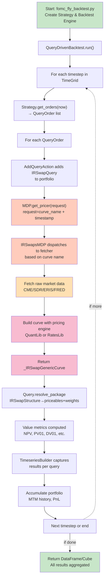

---

## 3. Module Dependency Tree

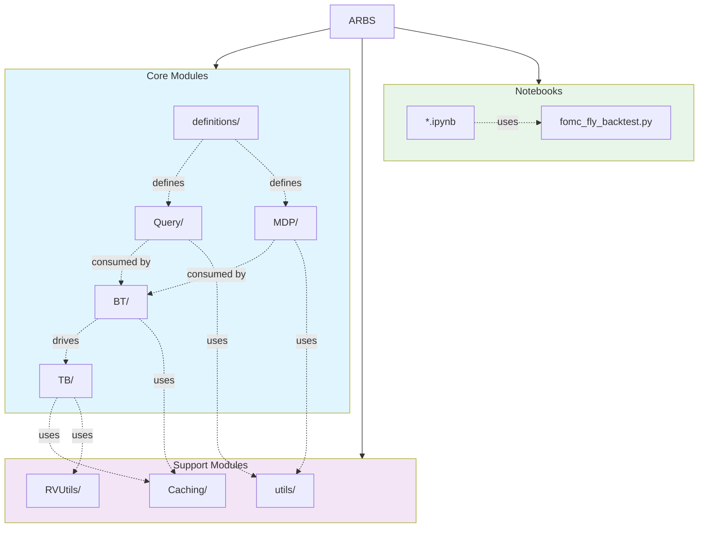

---

## 4. IR Swaps Module Detail

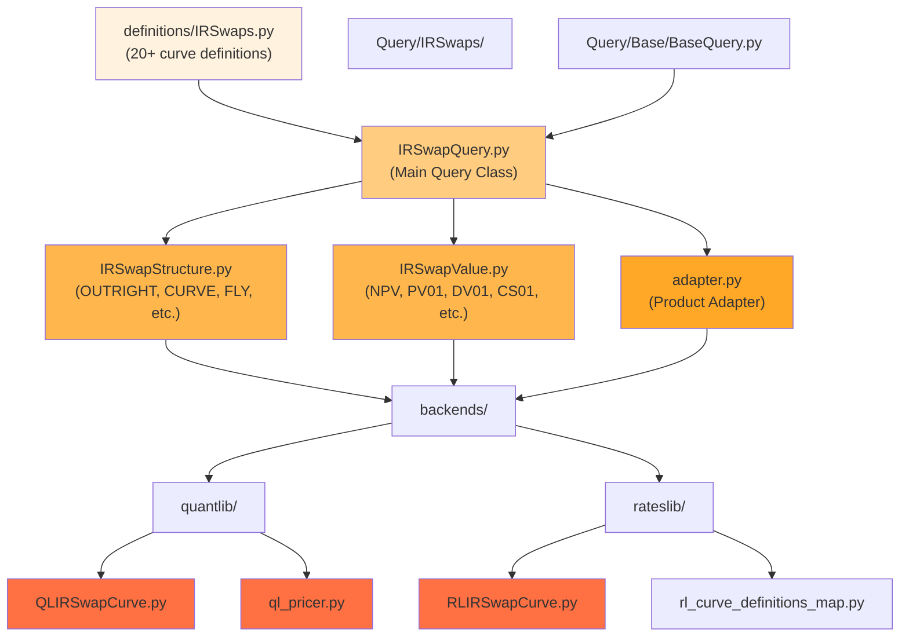

---

## 5. Market Data Provider Hierarchy

```mermaid
graph TD
    A["MarketDataProvider.py<br/>(Abstract Base)"]
    B["IRSwapsMDP.py"]
    C["FixedRateBondsMDP.py"]

    B1["CME_NY_EOD_LIVE/"]
    B2["SDR_INTRADAY/"]
    B3["GSQUANT/"]
    B4["fixings_cache/"]

    B1A["ql_basic/"]
    B1B["rl_basic/"]
    B1A1["CMEFetcher.py"]
    B1A2["FredFetcher.py"]
    B1A3["ErisFuturesFetcher.py"]
    B1B1["CMEFetcher.py"]
    B1B2["ErisFuturesFetcher.py"]

    B2A["rl_curve_utils/"]
    B2B["rl_usd_sofr_mt_q12/"]
    B2C["rl_usd_ois_stir_q12x12/"]
    B2A1["SDRDataBuilder.py"]
    B2A2["stir_curve_building_utils.py"]
    B2A3["BarchartFetcher.py"]

    C1["WEBULL/"]
    C2["WSJ/"]
    C3["FEDINVEST/"]
    C4["PUBLICDOTCOM/"]
    C5["reference_data_cache/"]

    C1A["WebullFintechFetcher.py"]
    C2A["WSJFetcher.py"]
    C3A["FedInvestFetcher.py"]
    C4A["PublicDotcomDataFetcher.py"]

    A --> B
    A --> C

    B --> B1
    B --> B2
    B --> B3
    B --> B4

    B1 --> B1A
    B1 --> B1B
    B1A --> B1A1
    B1A --> B1A2
    B1A --> B1A3
    B1B --> B1B1
    B1B --> B1B2

    B2 --> B2A
    B2 --> B2B
    B2 --> B2C
    B2A --> B2A1
    B2A --> B2A2
    B2A --> B2A3

    C --> C1
    C --> C2
    C --> C3
    C --> C4
    C --> C5

    C1 --> C1A
    C2 --> C2A
    C3 --> C3A
    C4 --> C4A

    style A fill:#fff3e0
    style B fill:#ffe0b2
    style C fill:#ffe0b2
    style B1A fill:#ffcc80
    style B1B fill:#ffcc80
    style B2A fill:#ffcc80
    style C1A fill:#ffb74d
    style C2A fill:#ffb74d
    style C3A fill:#ffb74d
    style C4A fill:#ffb74d
```

---

## 6. Backtesting Engine Flow

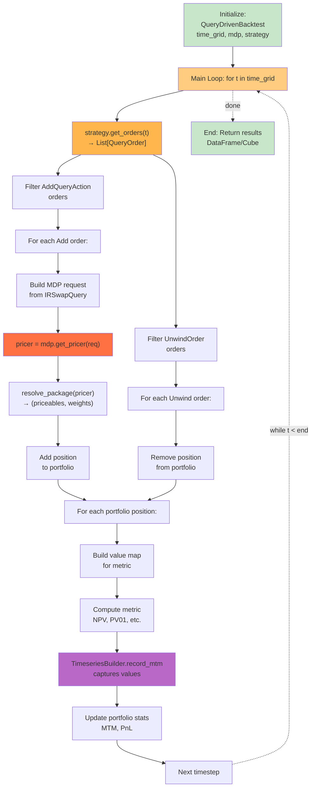

---

## 7. Query Resolution Pipeline

```mermaid
graph LR
    A["IRSwapQuery<br/>structure_id=CURVE<br/>structure_kwargs={...}"]

    B["Step 1: Edit Query<br/>_edited()"]

    C["Step 2: Get Adapter<br/>get_adapter(product)"]

    D["Step 3: Build Structure Map<br/>adapter.build_structure_map"]

    E["Step 4: Apply Structure<br/>struct_map.apply(struct_id,<br/>**kwargs)"]

    F["Result: Package<br/>(priceables, weights)"]

    G["Step 5: Build Value Map<br/>adapter.build_value_map"]

    H["ValueMap<br/>(struct_id → value_id)<br/>→ metric"]

    A --> B
    B --> C
    C --> D
    D --> E
    E --> F
    F --> G
    G --> H

    style A fill:#e8f5e9
    style B fill:#c8e6c9
    style C fill:#a5d6a7
    style D fill:#81c784
    style E fill:#66bb6a
    style F fill:#4caf50
    style G fill:#66bb6a
    style H fill:#4caf50
```

---

## 8. Timeseries Builder Architecture

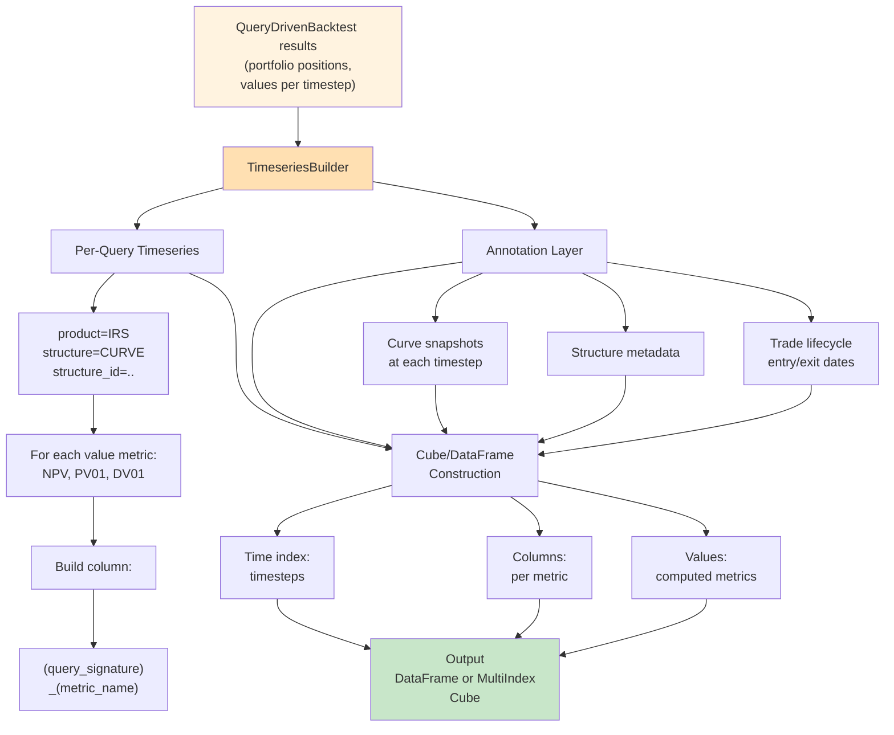

---

## 9. RVUtils Analysis Tools

```mermaid
graph TD
    A["RVUtils/"]

    B["Interpolation/"]
    C["regression.py"]
    D["plt_timeseries.py"]
    E["ust_viz.py"]
    F["Other utils"]

    B1["GeneralCurveInterpolator.py"]
    B2["nss.py<br/>Nelson-Siegel-Svensson"]
    B3["MonotoneConvex.py"]
    B4["SmithWilson.py"]
    B5["Vasicek.py"]
    B6["calibrate.py"]
    B7["Other methods..."]

    C1["Time-series models"]
    C2["Risk models"]
    C3["Statistical tests"]

    D1["Plot timeseries"]
    D2["Plot curves"]
    D3["Plot risk metrics"]

    E1["UST curve viz"]
    E2["Tenor analysis"]

    F1["arbl_hedge_ratios.py"]
    F2["seasonality_utils.py"]
    F3["mean_reversion.py"]

    A --> B
    A --> C
    A --> D
    A --> E
    A --> F

    B --> B1
    B --> B2
    B --> B3
    B --> B4
    B --> B5
    B --> B6
    B --> B7

    C --> C1
    C --> C2
    C --> C3

    D --> D1
    D --> D2
    D --> D3

    E --> E1
    E --> E2

    F --> F1
    F --> F2
    F --> F3

    style A fill:#f3e5f5
    style B fill:#e1bee7
    style C fill:#e1bee7
    style D fill:#e1bee7
    style E fill:#e1bee7
    style F fill:#e1bee7
    style B1 fill:#ce93d8
    style B2 fill:#ce93d8
    style B3 fill:#ce93d8
    style C1 fill:#ce93d8
    style D1 fill:#ce93d8
```

---

## 10. Data Source Integration

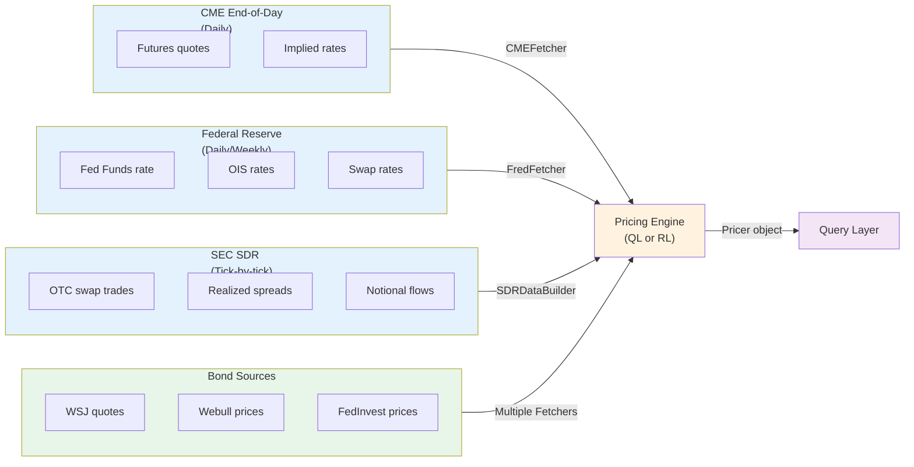

---

## 11. Curve Building Pipeline (SDR_INTRADAY)

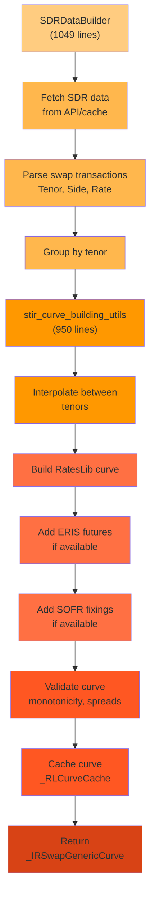

---

## 12. Fixed Rate Bond Pricing

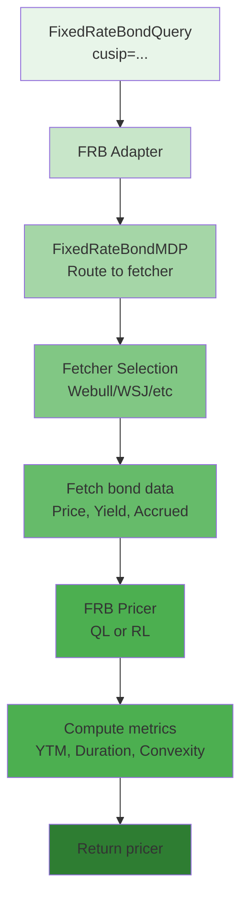

---

## 13. Caching Strategy

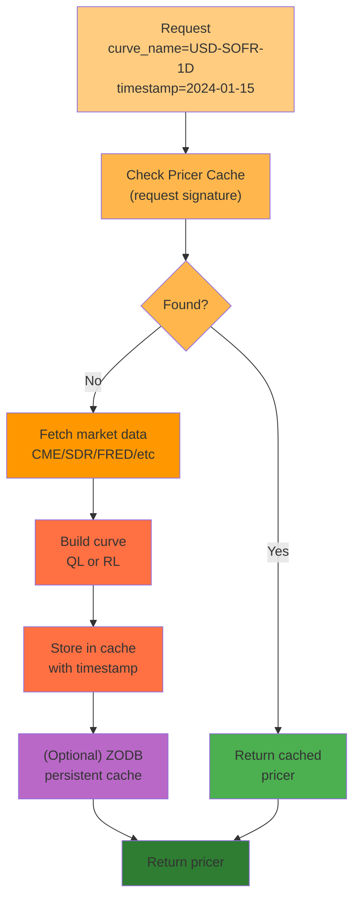

---

Generated automatically with comprehensive Mermaid diagrams showing all major data flows and architectural relationships.

