# ARBS Source Code Tree Visualization

**Generated:** November 10, 2025
**Total Python Files:** 121
**Total Lines of Code:** ~28,342

---

## Table of Contents
1. [Complete Directory Structure (ASCII Tree)](#ascii-tree)
2. [Module Descriptions and Dependencies](#module-descriptions)
3. [Architecture Diagram (Mermaid)](#mermaid-architecture)
4. [File Statistics and Metadata](#file-statistics)
5. [Entry Points and Main Files](#entry-points)
6. [Dependency Graph](#dependency-graph)

---

## ASCII TREE

### Complete Directory Structure with File Statistics

```
ARBS/ (Arbitrage Backtesting System)
│
├── definitions/                          [Core Product Definitions]
│   ├── IRSwaps.py                        (5.5K | 159 lines) ⭐ Entry Point
│   │   └─ Defines curve definitions for IR Swaps
│   │   └─ Exports: CURVE_DEFINITIONS (20+ curves)
│   │
│   └── FixedRateBonds.py                 (328B | 12 lines)
│       └─ Bond product definitions
│
├── Query/                                [Query & Valuation Layer]
│   │
│   ├── Base/                             [Abstract Base Classes]
│   │   ├── BaseQuery.py                  (7.1K | 190 lines) ⭐ Core Abstract
│   │   │   └─ Abstract entry point for backtester
│   │   │   └─ Provides: build_mdp_request(), resolve_package(), build_value_map()
│   │   │   └─ Depends on: _GenericPricable, product_adapter
│   │   │
│   │   ├── BaseStructure.py              (999B | 38 lines)
│   │   │   └─ Abstract structure definitions
│   │   │
│   │   ├── BaseValue.py                  (853B | 32 lines)
│   │   │   └─ Abstract value metrics/enums
│   │   │
│   │   ├── _GenericPricable.py           (199B | 8 lines)
│   │   │   └─ Generic pricable interface
│   │   │
│   │   ├── _GenericPricer.py             (591B | 18 lines)
│   │   │   └─ Generic pricer interface
│   │   │
│   │   └── product_adapter.py            (1.9K | 43 lines)
│   │       └─ Product adapter registry/dispatcher
│   │       └─ Provides: get_adapter(product_name)
│   │
│   ├── IRSwaps/                          [Interest Rate Swaps Query]
│   │   ├── IRSwapQuery.py                (18K | 413 lines) ⭐ Main Query
│   │   │   └─ Extends: BaseQuery
│   │   │   └─ Enum: IRSwapStructure (OUTRIGHT, CURVE, FLY, STIR_FLY, etc.)
│   │   │   └─ Enum: IRSwapValue (NPV, PV01, DV01, CS01, Basis, etc.)
│   │   │   └─ Methods: return_query(), col_name(), eval_expression()
│   │   │
│   │   ├── IRSwapStructure.py            (14K | 344 lines)
│   │   │   └─ Concrete structure definitions for swaps
│   │   │   └─ Builds risk/exposure packages
│   │   │
│   │   ├── IRSwapValue.py                (7.2K | 209 lines)
│   │   │   └─ Value metric definitions (NPV, Greeks, Basis)
│   │   │
│   │   ├── _CENTRAL_BANK_DATES.py        (6.3K | 189 lines)
│   │   │   └─ Fed/ECB/BOE meeting dates
│   │   │
│   │   ├── _IRSwapGenericObject.py       (1.3K | 47 lines)
│   │   │   └─ Base swap object interface
│   │   │
│   │   ├── _IRSwapGenericCurve.py        (2.7K | 95 lines)
│   │   │   └─ Curve interface for swaps
│   │   │
│   │   ├── adapter.py                    (7.5K | 239 lines)
│   │   │   └─ IRSwap product adapter
│   │   │   └─ Registers with product_adapter
│   │   │   └─ Maps structures to pricers
│   │   │
│   │   └── backends/                     [Pricing Engines]
│   │       ├── quantlib/                 [QuantLib Backend]
│   │       │   ├── QLIRSwapCurve.py      (5.6K | 160 lines)
│   │       │   │   └─ QuantLib curve implementation
│   │       │   │
│   │       │   ├── ql_pricer.py          (15K | 456 lines)
│   │       │   │   └─ Core pricing engine (QuantLib)
│   │       │   │   └─ Builds curves from market data
│   │       │   │
│   │       │   ├── ql_curve_building_utils.py  (7.5K | 238 lines)
│   │       │   │   └─ Utility functions for curve construction
│   │       │   │
│   │       │   ├── ql_curve_definitions_map.py (2.4K | 91 lines)
│   │       │   │   └─ Maps curve names to QuantLib configs
│   │       │   │
│   │       │   └── utils.py              (1.4K | 39 lines)
│   │       │       └─ QL helper utilities
│   │       │
│   │       └── rateslib/                 [RatesLib Backend]
│   │           ├── RLIRSwapCurve.py      (7.6K | 242 lines)
│   │           │   └─ RatesLib curve implementation
│   │           │
│   │           └── rl_curve_definitions_map.py (3.9K | 138 lines)
│   │               └─ Maps curve names to RatesLib configs
│   │
│   └── FixedRateBonds/                   [Fixed Rate Bonds Query]
│       ├── FixedRateBondQuery.py         (4.4K | 108 lines) ⭐ Main Query
│       │   └─ Extends: BaseQuery
│       │   └─ Enum: FixedRateBondStructure
│       │   └─ Enum: FixedRateBondValue (YTM, Price, Duration, etc.)
│       │
│       ├── FixedRateBondStructure.py     (8.0K | 247 lines)
│       │   └─ Bond structure builders
│       │
│       ├── FixedRateBondValue.py         (3.7K | 110 lines)
│       │   └─ Value metric enums
│       │
│       ├── _FixedRateBondGenericPricable.py (912B | 28 lines)
│       │   └─ Generic bond interface
│       │
│       ├── _FixedRateBondGenericPricer.py (1.6K | 52 lines)
│       │   └─ Generic bond pricer
│       │
│       ├── adapter.py                    (947B | 28 lines)
│       │   └─ Bond product adapter
│       │
│       └── backends/                     [Pricing Engines]
│           ├── quantlib/
│           │   ├── QLFixedRateBondPricer.py (13K | 421 lines)
│           │   │   └─ QuantLib bond pricer
│           │   │
│           │   └── ql_frb_definitions_map.py (843B | 31 lines)
│           │       └─ Bond definition maps
│           │
│           └── rateslib/
│               ├── RLFixedRateBondPricer.py (7.7K | 245 lines)
│               │   └─ RatesLib bond pricer
│               │
│               └── rl_frb_definitions_map.py (344B | 12 lines)
│                   └─ RatesLib bond definitions
│
├── MDP/                                  [Market Data Provider Layer]
│   │
│   ├── MarketDataProvider.py             (818B | 27 lines) ⭐ Abstract Base
│   │   └─ Abstract market data interface
│   │   └─ Signature: get_pricer(request) -> _GenericPricer
│   │
│   ├── IRSwaps/                          [IR Swap Data Providers]
│   │   │
│   │   ├── IRSwapsMDP.py                 (46K | 878 lines) ⭐ Main Swap MDP
│   │   │   └─ Extends: MarketDataProvider
│   │   │   └─ Supports 15+ curve building strategies
│   │   │   └─ Caches curves for performance
│   │   │   └─ Handles: CME, SDR, ERIS, GSQUANT sources
│   │   │
│   │   ├── CME_NY_EOD_LIVE/             [CME End-of-Day Data]
│   │   │   ├── ql_basic/                [QuantLib Based]
│   │   │   │   ├── BaseFetcher.py       (1.6K | 49 lines)
│   │   │   │   ├── CMEFetcher.py        (17K | 414 lines)
│   │   │   │   ├── CMEFetcherV2.py      (9.6K | 298 lines)
│   │   │   │   ├── ErisFuturesFetcher.py (17K | 416 lines)
│   │   │   │   ├── FixingsFetcher.py    (9.9K | 305 lines)
│   │   │   │   └── FredFetcher.py       (26K | 688 lines) [Largest]
│   │   │   │
│   │   │   └── rl_basic/                [RatesLib Based]
│   │   │       ├── BaseFetcher.py       (1.6K | 49 lines)
│   │   │       ├── CMEFetcher.py        (16K | 391 lines)
│   │   │       ├── CMEFetcherV2.py      (9.0K | 285 lines)
│   │   │       └── ErisFuturesFetcher.py (26K | 606 lines)
│   │   │
│   │   ├── SDR_INTRADAY/                [SEC SDR Intraday Data]
│   │   │   ├── rl_curve_utils/          [Curve Building Utilities]
│   │   │   │   ├── SDRDataBuilder.py    (41K | 1049 lines) [Large]
│   │   │   │   ├── stir_curve_building_utils.py (37K | 950 lines) [Large]
│   │   │   │   ├── tos.py               (26K | 775 lines)
│   │   │   │   ├── BarchartFetcher.py   (30K | 700 lines)
│   │   │   │   ├── ErisFuturesFetcher.py (18K | 428 lines)
│   │   │   │   ├── _RLCurveCache.py     (9.8K | 310 lines)
│   │   │   │   ├── rl_usd_sofr_mt_builder_parallel.py (21K | 496 lines)
│   │   │   │   ├── rl_usd_sofr_mt_builder.py (15K | 334 lines)
│   │   │   │   └── rl_usd_curve_stir_builder.py (14K | 330 lines)
│   │   │   │
│   │   │   ├── rl_usd_ois_stir_misc/    [OIS STIR Curves]
│   │   │   ├── rl_usd_ois_stir_q12x12/  [OIS STIR 12x12]
│   │   │   ├── rl_usd_ois_stir_q12x9/   [OIS STIR 12x9]
│   │   │   ├── rl_usd_sofr_mt_misc/     [SOFR Mid-Term]
│   │   │   ├── rl_usd_sofr_mt_q12/      [SOFR MT 12M]
│   │   │   ├── rl_usd_sofr_mt_q16/      [SOFR MT 16M]
│   │   │   ├── rl_usd_sofr_mtv2_q12x11/ [SOFR MT V2 12x11]
│   │   │   ├── rl_usd_sofr_stir_misc/   [SOFR STIR]
│   │   │   ├── rl_usd_sofr_stir_q12x12/ [SOFR STIR 12x12]
│   │   │   ├── rl_usd_sofr_stir_q12x8/  [SOFR STIR 12x8]
│   │   │   └── rl_usd_sofr_stir_q13x10/ [SOFR STIR 13x10]
│   │   │
│   │   ├── fixings_cache/               [SOFR Fixings Cache]
│   │   │   └── fixings_cache.py         (5.9K | 184 lines)
│   │   │
│   │   ├── GSQUANT/                     [Goldman Sachs Quant]
│   │   │   └── rl_basic/
│   │   │       └── build.py             (13K | 391 lines)
│   │   │
│   │   └── IRSwapSpreadsMDP.py           (0B | 0 lines) [Stub]
│   │
│   ├── FixedRateBonds/                   [Bond Data Providers]
│   │   ├── FixedRateBondsMDP.py          (59K | 1215 lines) ⭐ Main Bond MDP
│   │   │   └─ Extends: MarketDataProvider
│   │   │   └─ Coordinates fetchers for multiple sources
│   │   │
│   │   ├── WEBULL/                       [Webull Fintech]
│   │   │   └── WebullFintechFetcher.py   (50K | 1337 lines) [Largest]
│   │   │
│   │   ├── WSJ/                          [Wall Street Journal]
│   │   │   └── WSJFetcher.py             (24K | 580 lines)
│   │   │
│   │   ├── FEDINVEST/                    [FedInvest]
│   │   │   └── FedInvestFetcher.py       (13K | 326 lines)
│   │   │
│   │   ├── PUBLICDOTCOM/                 [Public.com]
│   │   │   └── PublicDotcomDataFetcher.py (10K | 313 lines)
│   │   │
│   │   └── reference_data_cache/         [Reference Data]
│   │       ├── ust_reference_data.py     (11K | 354 lines)
│   │       └── cme_tcf.py                (3.9K | 126 lines)
│   │
│   └── IRSwapSpreads/                    [IR Swap Spreads]
│       └── SDR_WEBULL/
│           └── SDR_WEBULL.py             (0B | 0 lines) [Stub]
│
├── BT/                                   [Backtesting Engine]
│   ├── query_engine.py                   (6.0K | 194 lines) ⭐ Main Engine
│   │   └─ QueryDrivenBacktest class
│   │   └─ Core backtesting loop
│   │   └─ Manages portfolio, pricing, execution
│   │
│   ├── query_strategy.py                 (797B | 29 lines)
│   │   └─ Strategy interface
│   │
│   ├── query_portfolio.py                (1.5K | 54 lines)
│   │   └─ Portfolio tracking
│   │
│   ├── query_order.py                    (569B | 22 lines)
│   │   └─ Order definitions
│   │
│   ├── query_actions.py                  (2.5K | 75 lines)
│   │   └─ Strategy actions (Add, Unwind)
│   │
│   ├── generic_engine.py                 (3.6K | 103 lines)
│   │   └─ Generic backtesting engine
│   │
│   ├── execution_engine.py               (303B | 12 lines)
│   │   └─ Execution logic
│   │
│   ├── data_handler.py                   (371B | 14 lines)
│   │   └─ TimeGrid management
│   │
│   ├── strategy.py                       (673B | 23 lines)
│   │   └─ Base strategy class
│   │
│   ├── order.py                          (336B | 13 lines)
│   │   └─ Order model
│   │
│   ├── portfolio.py                      (2.0K | 55 lines)
│   │   └─ Portfolio model
│   │
│   ├── misc.py                           (2.5K | 82 lines)
│   │   └─ Misc utilities
│   │
│   ├── actions.py                        (2.0K | 62 lines)
│   │   └─ Action definitions
│   │
│   ├── event.py                          (305B | 12 lines)
│   │   └─ Event definitions
│   │
│   └── triggers.py                       (8.8K | 269 lines)
│       └─ Trigger definitions (Date, Market, etc.)
│
├── TB/                                   [Timeseries Builder]
│   ├── TimeseriesBuilder.py              (14K | 361 lines) ⭐ Main Builder
│   │   └─ Extends backtesting with timeseries capture
│   │   └─ Builds cube/dataframe from backtest results
│   │
│   ├── IRSwapsTB.py                      (28K | 702 lines)
│   │   └─ IR Swap specific builder
│   │   └─ Handles: curves, structures, values
│   │
│   ├── FixedRateBondsTB.py               (18K | 437 lines)
│   │   └─ Bond specific builder
│   │
│   └── utils.py                          (19K | 486 lines)
│       └─ Shared builder utilities
│
├── Caching/                              [Caching Layer]
│   ├── timeseries_cache.py               (13K | 386 lines)
│   │   └─ Time-series cache implementation
│   │   └─ Multi-backend support
│   │
│   ├── ZODBCacheMixin.py                 (7.3K | 233 lines)
│   │   └─ ZODB object database mixin
│   │
│   ├── CodecMapping.py                   (859B | 28 lines)
│   │   └─ Codec definitions
│   │
│   └── utils.py                          (2.0K | 64 lines)
│       └─ Caching utilities
│
├── RVUtils/                              [Risk/Volatility Utilities]
│   │
│   ├── Interpolation/                    [Curve Interpolation Methods]
│   │   ├── GeneralCurveInterpolator.py   (21K | 465 lines)
│   │   │   └─ Meta-interpolator framework
│   │   │
│   │   ├── calibrate.py                  (9.5K | 302 lines)
│   │   │   └─ Calibration utilities
│   │   │
│   │   ├── nss.py                        (12K | 384 lines)
│   │   │   └─ Nelson-Siegel-Svensson
│   │   │
│   │   ├── MonotoneConvex.py             (9.6K | 306 lines)
│   │   │   └─ Monotone convex interpolation
│   │   │
│   │   ├── SmithWilson.py                (6.5K | 211 lines)
│   │   │   └─ Smith-Wilson curve model
│   │   │
│   │   ├── NelsonSiegelSvensson.py       (3.0K | 93 lines)
│   │   ├── NelsonSiegel.py               (2.5K | 77 lines)
│   │   ├── BjorkChristensen.py           (2.2K | 68 lines)
│   │   ├── BjorkChristensenAugmented.py  (1.8K | 56 lines)
│   │   ├── Vasicek.py                    (4.7K | 154 lines)
│   │   ├── MonoSpline.py                 (3.4K | 108 lines)
│   │   ├── DieboldLi.py                  (786B | 24 lines)
│   │   └── MLESM.py                      (1.8K | 56 lines)
│   │
│   ├── regression.py                     (51K | 1286 lines) [Large]
│   │   └─ Statistical regression models
│   │
│   ├── plt_timeseries.py                 (57K | 1223 lines) [Large]
│   │   └─ Timeseries plotting utilities
│   │
│   ├── ust_viz.py                        (22K | 610 lines)
│   │   └─ UST visualization
│   │
│   ├── arbl_hedge_ratios.py              (3.7K | 114 lines)
│   │   └─ ARBL hedge ratio calculations
│   │
│   ├── seasonality_utils.py              (5.5K | 170 lines)
│   │   └─ Seasonality analysis
│   │
│   ├── mean_reversion.py                 (3.4K | 105 lines)
│   │   └─ Mean reversion utilities
│   │
│   └── general.py                        (189B | 7 lines)
│       └─ General utilities
│
├── utils/                                [General Utilities]
│   ├── misc.py                           (2.1K | 67 lines)
│   │   └─ Miscellaneous helpers
│   │
│   └── ql_utils.py                       (8.2K | 263 lines)
│       └─ QuantLib helpers
│
├── config/                               [Configuration]
│   └─ (Configuration files)
│
└── [Jupyter Notebooks - Analysis/Backtesting Examples]
    ├── fomc_fly_backtest.ipynb           (FOMC butterfly spreads backtest)
    ├── fomc_fly_backtest.py              (Entry point script - 6.3K | 197 lines)
    ├── simple_irswaps_backtest.ipynb     (Basic IRS backtest)
    ├── month_end_irswaps_backtest.ipynb  (Month-end backtest)
    ├── intraday_swaps.ipynb              (Intraday analysis)
    ├── curve_risk_model.ipynb            (Curve risk modeling)
    ├── curve_builds.ipynb                (Curve building)
    ├── medium_term_swap_pricer.ipynb     (Mid-term swap pricing)
    ├── timeseries_builder.ipynb          (Timeseries construction)
    ├── sfr_cvx.ipynb                     (Single-name FRB convexity)
    └── usts_rv.ipynb                     (UST realized volatility)
```

---

## MODULE DESCRIPTIONS

### Layer 1: Query Layer (Query/)
**Purpose:** Define what products to value and at what level of granularity.

- **BaseQuery.py**: Abstract base class for all product queries
  - Provides standard interface for backtester engine
  - Handles market request building
  - Coordinates with product adapters
  
- **IRSwapQuery.py / FixedRateBondQuery.py**: Product-specific query classes
  - Define structure types (OUTRIGHT, CURVE, FLY, etc.)
  - Define value metrics (NPV, PV01, DV01, etc.)
  - Return query objects for backtester consumption

### Layer 2: Market Data Provider (MDP/)
**Purpose:** Fetch and cache market data, build pricers/curves.

- **MarketDataProvider.py**: Abstract interface
  - Signature: `get_pricer(request) -> _GenericPricer`
  
- **IRSwapsMDP.py**: Concrete swap provider
  - 15+ curve building strategies
  - Caches built curves
  - Supports CME, SDR, ERIS, GSQUANT sources
  
- **FixedRateBondsMDP.py**: Bond provider
  - Coordinates 5+ data sources (Webull, WSJ, FedInvest, Public.com, etc.)
  - Reference data caching
  
- **Data Fetchers**: Source-specific implementations
  - CMEFetcher, FredFetcher, SDRDataBuilder, WebullFetcher, WSJFetcher, etc.

### Layer 3: Pricing Layer (Query/[Product]/backends/)
**Purpose:** Price individual products given market data.

- **QuantLib Backend**: Using QuantLib library
  - QLIRSwapCurve, ql_pricer, QL bond pricing
  
- **RatesLib Backend**: Using RatesLib library
  - RLIRSwapCurve, RL bond pricing
  - Often more flexible for curve building

### Layer 4: Backtesting Engine (BT/)
**Purpose:** Drive the simulation loop.

- **QueryDrivenBacktest**: Main engine
  - Manages time grid, portfolio, execution
  - Coordinates MDP, Query execution, reporting
  - Caches pricers per request signature
  
- **QueryStrategy**: Strategy implementation
  - Actions: AddQueryAction, UnwindPositionsAction
  - Triggers: DateTrigger, DateTriggerRequirements
  - Returns list of orders per timestep

### Layer 5: Timeseries Builder (TB/)
**Purpose:** Aggregate backtest results into cube/dataframe.

- **TimeseriesBuilder**: Core builder
  - Manages per-query timeseries construction
  - Builds columns from value metrics
  - Handles expression evaluation
  
- **IRSwapsTB / FixedRateBondsTB**: Product-specific builders
  - Curve snapshot handling
  - Structure annotation
  - Value metric aggregation

### Layer 6: Utilities (utils/, RVUtils/)
**Purpose:** Statistical/analytical tools.

- **RVUtils/Interpolation/**: 10+ curve interpolation methods
  - Nelson-Siegel-Svensson, Smith-Wilson, etc.
  
- **RVUtils/regression.py**: Statistical regression (1286 lines)
  - Time-series models, risk analysis
  
- **RVUtils/plt_timeseries.py**: Plotting utilities (1223 lines)
  - Timeseries visualization

### Layer 7: Caching (Caching/)
**Purpose:** Cache expensive computations.

- **timeseries_cache.py**: Multi-backend time-series cache
- **ZODBCacheMixin.py**: Object database integration

### Layer 8: Definitions (definitions/)
**Purpose:** Static product/curve definitions.

- **IRSwaps.py**: 20+ curve definitions with metadata
- **FixedRateBonds.py**: Bond definitions

---

## MERMAID ARCHITECTURE

```mermaid
graph TB
    subgraph Definitions["Definitions Layer"]
        DEF_IRS["IRSwaps.py<br/>(Curve Definitions)"]
        DEF_FRB["FixedRateBonds.py<br/>(Bond Definitions)"]
    end

    subgraph Query["Query Layer"]
        BASEQ["BaseQuery.py<br/>(Abstract)"]
        IRSQ["IRSwapQuery.py<br/>(IR Swap Query)"]
        FRBQ["FixedRateBondQuery.py<br/>(Bond Query)"]
        
        IRSSTR["IRSwapStructure.py"]
        IRSVAL["IRSwapValue.py"]
        FRBSTR["FixedRateBondStructure.py"]
        FRBVAL["FixedRateBondValue.py"]
        
        BASEQ --> IRSQ
        BASEQ --> FRBQ
        IRSQ --> IRSSTR
        IRSQ --> IRSVAL
        FRBQ --> FRBSTR
        FRBQ --> FRBVAL
    end

    subgraph MDP["Market Data Provider Layer"]
        MDP_BASE["MarketDataProvider.py<br/>(Abstract)"]
        
        IRSMDP["IRSwapsMDP.py"]
        FRBMDP["FixedRateBondsMDP.py"]
        
        subgraph IRS_Fetchers["IRS Data Fetchers"]
            CME["CMEFetcher<br/>(QL/RL)"]
            FRED["FredFetcher"]
            ERIS["ErisFuturesFetcher"]
            SDR["SDRDataBuilder"]
            BARCHART["BarchartFetcher"]
            FIXINGS["FixingsFetcher"]
        end
        
        subgraph FRB_Fetchers["FRB Data Fetchers"]
            WEBULL["WebullFetcher"]
            WSJ["WSJFetcher"]
            FEDINVEST["FedInvestFetcher"]
            PUBLIC["PublicDotcomFetcher"]
        end
        
        MDP_BASE --> IRSMDP
        MDP_BASE --> FRBMDP
        
        IRSMDP --> CME
        IRSMDP --> FRED
        IRSMDP --> ERIS
        IRSMDP --> SDR
        IRSMDP --> BARCHART
        IRSMDP --> FIXINGS
        
        FRBMDP --> WEBULL
        FRBMDP --> WSJ
        FRBMDP --> FEDINVEST
        FRBMDP --> PUBLIC
    end

    subgraph Pricing["Pricing Layer"]
        subgraph QL_Backend["QuantLib Backend"]
            QL_IRS["QLIRSwapCurve.py"]
            QL_Pricer["ql_pricer.py"]
            QL_FRB["QLFixedRateBondPricer.py"]
            QL_Utils["ql_curve_building_utils.py"]
        end
        
        subgraph RL_Backend["RatesLib Backend"]
            RL_IRS["RLIRSwapCurve.py"]
            RL_FRB["RLFixedRateBondPricer.py"]
            RL_Utils["rl_curve_building_utils.py"]
        end
        
        IRSMDP --> QL_IRS
        IRSMDP --> RL_IRS
        FRBMDP --> QL_FRB
        FRBMDP --> RL_FRB
        QL_Pricer --> QL_Utils
        RL_IRS --> RL_Utils
    end

    subgraph BT_Engine["Backtesting Engine"]
        ENGINE["QueryDrivenBacktest<br/>(query_engine.py)"]
        STRAT["QueryStrategy<br/>(query_strategy.py)"]
        PORT["QueryPortfolio<br/>(query_portfolio.py)"]
        EXEC["ExecutionEngine<br/>(execution_engine.py)"]
        TRIG["Triggers<br/>(triggers.py)"]
        ACTION["Actions<br/>(query_actions.py)"]
        
        ENGINE --> STRAT
        ENGINE --> PORT
        ENGINE --> EXEC
        STRAT --> ACTION
        STRAT --> TRIG
        ACTION --> IRSQ
        ACTION --> FRBQ
    end

    subgraph TB["Timeseries Builder"]
        TB_BASE["TimeseriesBuilder.py"]
        TB_IRS["IRSwapsTB.py"]
        TB_FRB["FixedRateBondsTB.py"]
        TB_UTILS["utils.py"]
        
        TB_BASE --> TB_IRS
        TB_BASE --> TB_FRB
        TB_IRS --> TB_UTILS
        TB_FRB --> TB_UTILS
    end

    subgraph Caching["Caching Layer"]
        CACHE["timeseries_cache.py"]
        ZODB["ZODBCacheMixin.py"]
        CACHE --> ZODB
    end

    subgraph RVUtils["RV Utilities"]
        INTERP["Interpolation/<br/>(10+ methods)"]
        REGR["regression.py<br/>(1286 lines)"]
        PLT["plt_timeseries.py<br/>(1223 lines)"]
        UST["ust_viz.py"]
        SEASONALITY["seasonality_utils.py"]
    end

    %% Main data flow
    DEF_IRS --> IRSMDP
    DEF_FRB --> FRBMDP
    
    ENGINE --> MDP_BASE
    ENGINE --> TB_BASE
    
    TB_BASE --> CACHE
    
    QL_Pricer --> INTERP
    REGR --> PLT
    
    %% Styling
    classDef layer fill:#e1f5ff,stroke:#01579b,stroke-width:2px
    classDef core fill:#fff3e0,stroke:#e65100,stroke-width:2px
    classDef utils fill:#f3e5f5,stroke:#4a148c,stroke-width:2px
    classDef entry fill:#e8f5e9,stroke:#1b5e20,stroke-width:3px
    
    class Definitions,Query,MDP,Pricing,BT_Engine,TB,Caching layer
    class ENGINE,IRSMDP,FRBMDP core
    class RVUtils utils

```



---

## FILE STATISTICS

### Largest Files by Line Count

| Rank | File | Size | Lines | Purpose |
|------|------|------|-------|---------|
| 1 | regression.py | 51K | 1286 | Statistical models |
| 2 | plt_timeseries.py | 57K | 1223 | Plotting utilities |
| 3 | WebullFintechFetcher.py | 50K | 1337 | Webull data fetcher |
| 4 | FixedRateBondsMDP.py | 59K | 1215 | Bond data provider |
| 5 | SDRDataBuilder.py | 41K | 1049 | SDR curve builder |
| 6 | stir_curve_building_utils.py | 37K | 950 | Curve utilities |
| 7 | IRSwapsMDP.py | 46K | 878 | Swap data provider |
| 8 | IRSwapsTB.py | 28K | 702 | Swap timeseries builder |
| 9 | FredFetcher.py | 26K | 688 | Fed data fetcher |
| 10 | ust_viz.py | 22K | 610 | UST visualization |

### Distribution by Module

```
definitions/              2 files    167 lines
Query/Base/              6 files    329 lines
Query/IRSwaps/           7 files   1256 lines
Query/FixedRateBonds/    7 files    633 lines
MDP/IRSwaps/            40 files   9421 lines (largest module)
MDP/FixedRateBonds/      7 files   3532 lines
BT/                     15 files    946 lines
TB/                      4 files   1986 lines
Caching/                 4 files    745 lines
RVUtils/               18 files   7142 lines
utils/                  2 files    330 lines
───────────────────────────────────────────
TOTAL:                 121 files  28,342 lines
```

---

## ENTRY POINTS

### Standalone Scripts

1. **fomc_fly_backtest.py** (197 lines)
   - Runs FOMC butterfly spread backtest
   - Uses: QueryDrivenBacktest, IRSwapQuery, IRSwapsMDP
   - Entry point for FOMC analysis

### Jupyter Notebooks

1. **simple_irswaps_backtest.ipynb**
   - Basic IR swap backtesting template
   
2. **month_end_irswaps_backtest.ipynb**
   - Month-end rebalancing strategy
   
3. **fomc_fly_backtest.ipynb**
   - FOMC butterfly analysis and backtesting
   
4. **intraday_swaps.ipynb**
   - Intraday swap analysis
   
5. **timeseries_builder.ipynb**
   - Timeseries construction examples
   
6. **curve_builds.ipynb**
   - Curve building demonstrations
   
7. **curve_risk_model.ipynb**
   - Risk modeling on curves
   
8. **medium_term_swap_pricer.ipynb**
   - Mid-term swap pricing analysis
   
9. **sfr_cvx.ipynb**
   - Single FRB convexity analysis
   
10. **usts_rv.ipynb**
    - UST realized volatility studies

### Configuration Files

- `.env.example` - Environment variable template
- `config/` - Configuration directory
- `requirements.txt`, `requirements-dev.txt`, `requirements-prod.txt` - Dependencies

---

## DEPENDENCY GRAPH

### Core Dependencies

```
BaseQuery (Abstract)
  ├─ IRSwapQuery
  │  └─ IRSwapStructure
  │     └─ backends/(QL|RL)
  │
  └─ FixedRateBondQuery
     └─ FixedRateBondStructure
        └─ backends/(QL|RL)

MarketDataProvider (Abstract)
  ├─ IRSwapsMDP
  │  ├─ CME_NY_EOD_LIVE fetchers
  │  ├─ SDR_INTRADAY curve builders
  │  ├─ ERIS fetchers
  │  └─ GSQUANT builders
  │
  └─ FixedRateBondsMDP
     ├─ WebullFintechFetcher
     ├─ WSJFetcher
     ├─ FedInvestFetcher
     ├─ PublicDotcomDataFetcher
     └─ reference_data_cache

QueryDrivenBacktest
  ├─ TimeGrid
  ├─ MarketDataProvider
  ├─ QueryStrategy
  │  ├─ Triggers
  │  └─ Actions
  │     ├─ AddQueryAction
  │     └─ UnwindPositionsAction
  ├─ QueryPortfolio
  │  └─ ResolvedQueryPosition
  └─ ExecutionEngine

TimeseriesBuilder
  ├─ QueryDrivenBacktest
  ├─ BaseQuery
  ├─ Product Specific Builders
  │  ├─ IRSwapsTB
  │  └─ FixedRateBondsTB
  └─ Caching/timeseries_cache

Caching Layer
  ├─ timeseries_cache.py (Multi-backend)
  └─ ZODBCacheMixin.py (Optional)

RVUtils (Utilities)
  ├─ Interpolation/ (10 methods)
  ├─ regression.py (Statistical)
  ├─ plt_timeseries.py (Visualization)
  └─ Other utilities
```

---

## KEY INTERFACES

### Product Query Interface

```python
class BaseQuery(ABC):
    product: str                          # "IRS" or "FRB"
    structure_id: Any                     # Structure enum
    structure_kwargs: Dict[str, Any]      # Build parameters
    market_request: Dict[str, Any]        # MDP request template
    
    # Methods
    build_mdp_request(now) -> Dict        # Build MDP request
    resolve_package(...) -> (priceables, weights)  # Get pricer
    build_value_map(...) -> ValueMap      # Get value metrics
```

### Market Data Provider Interface

```python
class MarketDataProvider(ABC, Generic[_GP]):
    def __init__(self, source: str, **kwargs)
    def get_pricer(request: dict) -> _GenericPricer
    def get_data(request: dict) -> _GenericPricer  # Deprecated
```

### Backtesting Engine Interface

```python
@dataclass
class QueryDrivenBacktest:
    time_grid: TimeGrid
    mdp: MarketDataProvider
    strategy: QueryStrategy
    
    portfolio: QueryPortfolio  # Running positions
    mtm_history: Dict         # Mark-to-market history
    realized_pnl: float       # Realized P&L
```

---

## MODULE INTERDEPENDENCIES

### Critical Path

```
Backtest Execution
├─ fomc_fly_backtest.py (Entry)
│  └─ QueryDrivenBacktest.run()
│     ├─ Strategy.get_orders(now) -> [QueryOrder]
│     │  ├─ AddQueryAction(query)
│     │  └─ UnwindPositionsAction()
│     │
│     ├─ MDP.get_pricer(request) -> Pricer
│     │  ├─ IRSwapsMDP
│     │  │  ├─ Fetch market data (CME, SDR, ERIS)
│     │  │  └─ Build curve (QL or RL backend)
│     │  │
│     │  └─ FixedRateBondsMDP
│     │     ├─ Fetch bond prices (Webull, WSJ, etc.)
│     │     └─ Construct pricer
│     │
│     ├─ Query.resolve_package(pricer) -> (priceables, weights)
│     │  └─ Product adapter maps structure->risks
│     │
│     └─ Value.compute(priceables, weights) -> metrics
│        └─ TimeseriesBuilder captures results
│
└─ DataFrame/Cube of results
   ├─ Per-query timeseries
   └─ Aggregated statistics
```

---

## TESTING ENTRY POINTS

### Available Test Strategies

1. **FOMC Fly (fomc_fly_backtest.py)**
   - Strategy: Buy OIS flies on FOMC announcement
   - Products: IR swaps
   - Data: CME_NY_EOD_LIVE
   
2. **Simple IRS Backtest**
   - Strategy: Simple rebalancing
   - Products: IR swaps
   - Data: CME historical
   
3. **Month-End IRS**
   - Strategy: Month-end rolls
   - Products: IR swaps
   - Data: CME historical
   
4. **Intraday Analysis**
   - Analysis: Curve snapshots
   - Products: IR swaps
   - Data: SDR_INTRADAY (tick-by-tick)

---

## CONFIGURATION

### Environment Variables (.env)

```
# Data sources
CME_API_KEY=...
FRED_API_KEY=...
WEBULL_API_KEY=...

# Cache settings
CACHE_BACKEND=zodb  # or memory
CACHE_PATH=/data/cache

# Logging
LOG_LEVEL=INFO
LOG_FILE=/logs/arbs.log
```

---

## ARCHITECTURE NOTES

### Design Patterns

1. **Abstract Base Classes (ABC)**
   - BaseQuery, MarketDataProvider, etc.
   - Allow pluggable implementations

2. **Adapter Pattern**
   - Product adapters (IRSwaps, FixedRateBonds)
   - Map queries to pricers

3. **Factory Pattern**
   - Fetcher classes (CMEFetcher, WebullFetcher, etc.)
   - Create data providers

4. **Template Method**
   - QueryDrivenBacktest.run() manages loop
   - Strategy and MDP plugged in

5. **Observer Pattern**
   - Triggers notify actions
   - Backtester observes portfolio

### Performance Considerations

- **Caching**: Pricer results cached by request signature
- **Lazy Loading**: Backends imported on demand
- **Parallelization**: Some curve builders support parallel execution
- **ZODB**: Optional persistent object cache

### Extensibility Points

1. Add new data source: Implement MarketDataProvider
2. Add new curve model: Implement backend adapter
3. Add new strategy: Extend QueryStrategy
4. Add new product: Create Query + Adapter classes
5. Add new analysis: Extend RVUtils or create notebook

---

Generated automatically with comprehensive analysis of 121 Python files across 8 major modules.

