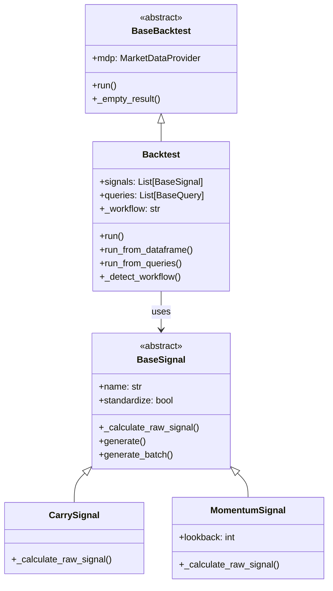
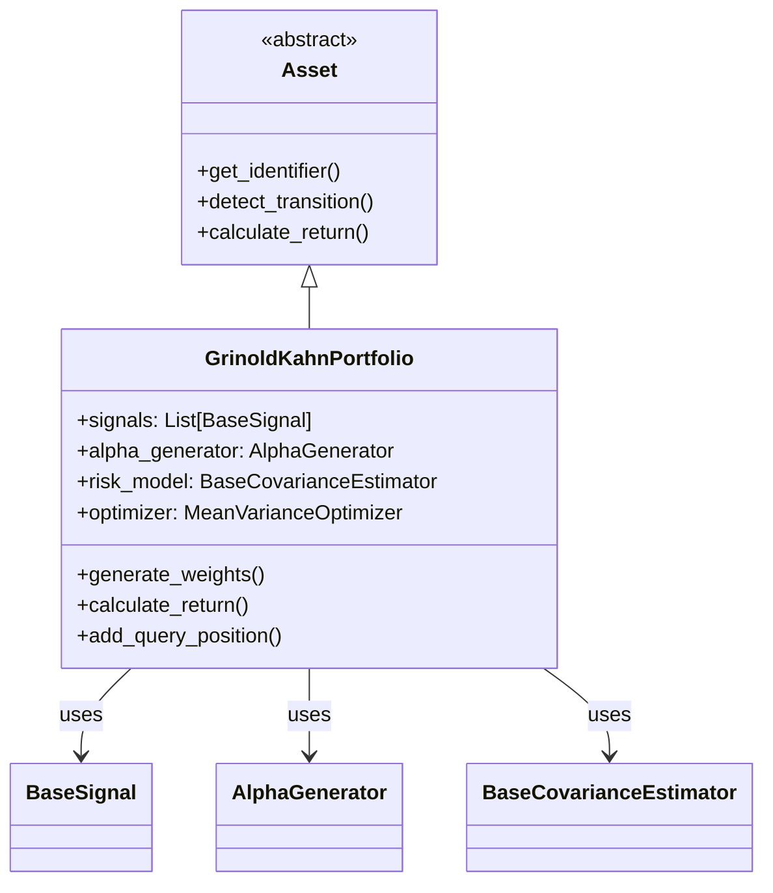
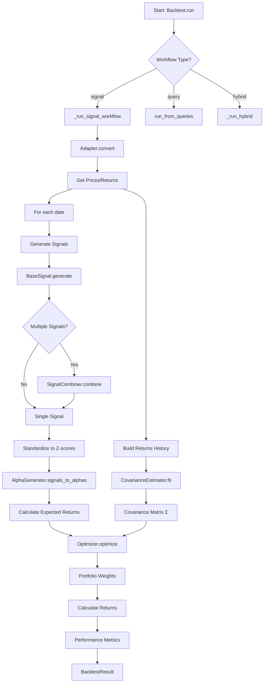
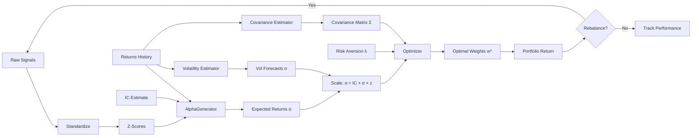
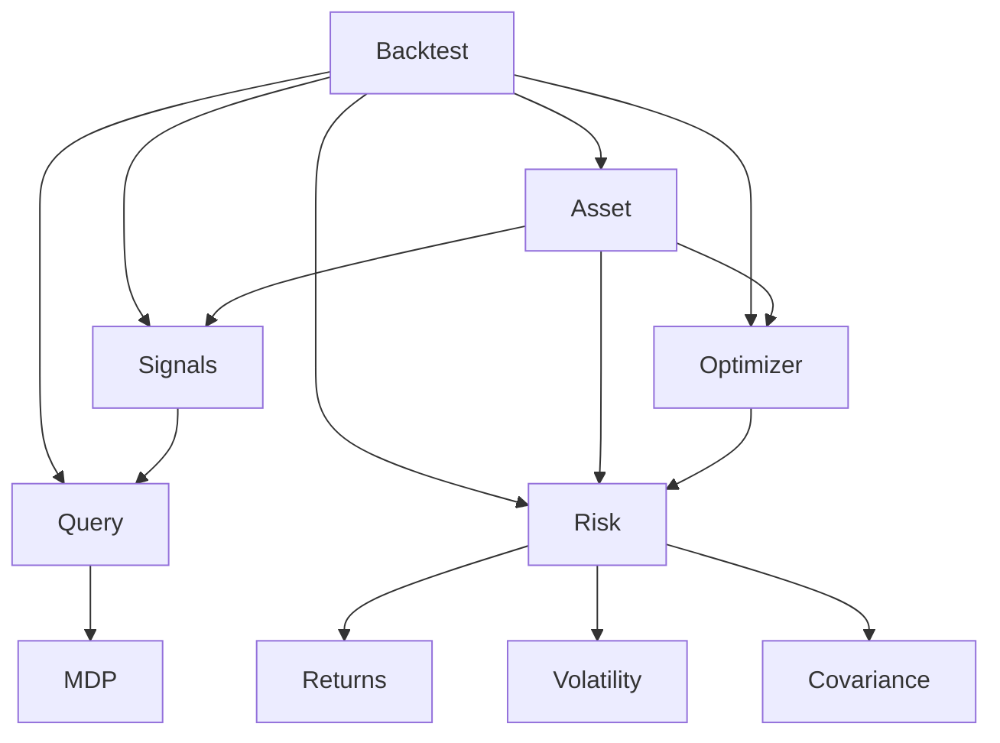
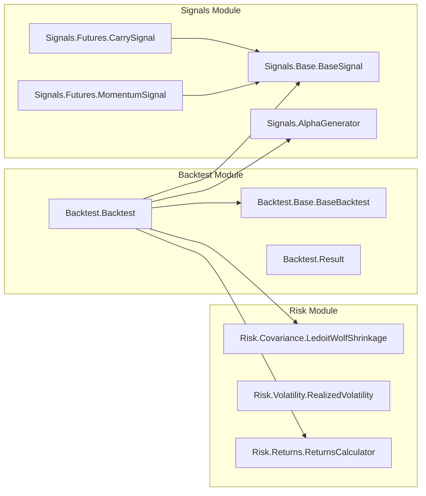

# Documentation Cleanup & Auto-Generation Plan

Created: 2025-11-14
Branch: `claude/docs-cleanup-autogen-<session-id>`

## Objective

Transform 164 markdown files (~110K lines) into a unified, indexed documentation system with auto-generated Mermaid diagrams.

## Current State

- 164 markdown files across all directories
- Multiple outdated/redundant documents
- No central index
- No auto-generated architecture diagrams

## Target State

- Indexed documentation with central navigation
- Consolidated related documents
- Auto-generated class diagrams (Mermaid)
- Auto-generated flow charts (Mermaid)
- Auto-generated API reference docs
- Auto-generated module dependency graphs
- Manual regeneration on demand (no automatic CI/CD)

---

## Phase 1: Documentation Inventory & Analysis

### Task 1.1: Parallel Document Analysis (164 tasks)

**Objective**: Analyze each markdown file to determine keep/archive/delete/consolidate

**Approach**: Launch 164 parallel subagents (one per file) to analyze:
- Last modified date (git log)
- Creation date and original author
- Number of updates and recent activity
- Cross-references (grep for filename in codebase)
- Content summary (first 50 lines)
- Accuracy assessment (compare to current code if applicable)
- Size (line count, word count)
- Categorization (reference, guide, design, archive candidate)

**Output**: `docs/analysis/inventory-report.json` with structure:
```json
{
  "files": [
    {
      "path": "./README.md",
      "category": "essential",
      "last_modified": "2025-11-14",
      "created": "2024-01-15",
      "updates_count": 47,
      "lines": 234,
      "referenced_by": ["CONTRIBUTING.md", "docs/index.md"],
      "references": ["CLAUDE.md", "docs/getting-started.md"],
      "recommendation": "KEEP",
      "notes": "Main entry point, up-to-date"
    },
    {
      "path": "./POLARS_MIGRATION_COMPLETE.md",
      "category": "completed_task",
      "last_modified": "2024-08-20",
      "created": "2024-08-15",
      "updates_count": 3,
      "lines": 156,
      "referenced_by": [],
      "references": ["POLARS_MIGRATION_PLAN.md"],
      "recommendation": "ARCHIVE",
      "notes": "Completed task, historical value only"
    }
  ],
  "summary": {
    "total_files": 164,
    "recommendations": {
      "KEEP": 25,
      "ARCHIVE": 89,
      "DELETE": 12,
      "CONSOLIDATE": 38
    }
  }
}
```

**Parallel Execution**:
```bash
# Launch 164 subagents in parallel
python scripts/analyze_docs_parallel.py --output docs/analysis/inventory-report.json
```

**Success Criteria**:
- ✅ All 164 files analyzed
- ✅ JSON report generated
- ✅ Categorization complete
- ✅ Recommendations provided

---

### Task 1.2: Consolidation Opportunities Analysis

**Objective**: Identify groups of docs that should be merged

**Analysis Categories**:

1. **Grinold-Kahn Documentation** (15+ files):
   - Consolidate into: `docs/architecture/grinold-kahn-framework.md`
   - Source files:
     - `GRINOLD_KAHN_DETAILED_SPECS.md`
     - `GRINOLD_KAHN_FRAMEWORK.md`
     - `GRINOLD_KAHN_IMPLEMENTATION_GAP_ANALYSIS.md`
     - `docs/books/grinold_kahn_equity_notes_part*.md`
     - `docs/design/GRINOLD_KAHN_KNOWLEDGE_GRAPH.md`

2. **Backtest Documentation** (8 files):
   - Keep: `docs/BACKTEST_UNIFIED_API.md` (current)
   - Archive: All planning/progress docs
   - Consolidate history into: `docs/architecture/backtest-evolution.md`

3. **Phase/Session Summaries** (12+ files):
   - Consolidate into: `CHANGELOG.md` or `PROJECT_HISTORY.md`
   - Archive individual phase docs

4. **Paper References** (50+ files in `docs/references/papers/`):
   - Keep curated list with summaries
   - Move full PDFs/markdowns to separate repo or archive

5. **Book Chunks** (37 files in `docs/books/grinold_kahn_markdown/`):
   - Keep index and summaries
   - Archive full chunks (or keep as reference)

**Output**: `docs/analysis/consolidation-plan.md`

---

## Phase 2: Documentation Structure Redesign

### Task 2.1: Create New Documentation Structure

**Target Structure**:
```
/
├── README.md                          # Main entry (ENHANCED)
├── CLAUDE.md                          # Dev guidelines (KEEP)
├── CONTRIBUTING.md                    # Contribution guide (CREATE)
├── CHANGELOG.md                       # Project history (CREATE from phase docs)
├── docs/
│   ├── index.md                       # Documentation hub (CREATE)
│   │
│   ├── architecture/                  # Living architecture docs
│   │   ├── README.md                 # Architecture overview
│   │   ├── system-overview.md        # High-level design
│   │   ├── class-hierarchy.md        # AUTO-GEN: Mermaid class diagrams
│   │   ├── data-flow.md              # AUTO-GEN: Signal → Portfolio flow
│   │   ├── module-dependencies.md    # AUTO-GEN: Import graph
│   │   ├── grinold-kahn.md          # Consolidated GK framework
│   │   └── backtest-design.md        # Backtest architecture
│   │
│   ├── user-guides/                   # How-to guides
│   │   ├── getting-started.md        # Quick start
│   │   ├── installation.md           # Setup instructions
│   │   ├── creating-strategies.md    # Strategy development
│   │   ├── custom-signals.md         # Adding signals
│   │   ├── custom-risk-models.md     # Extending risk models
│   │   └── running-backtests.md      # Backtest workflow
│   │
│   ├── api-reference/                 # AUTO-GENERATED from docstrings
│   │   ├── README.md
│   │   ├── backtest.md               # Backtest API
│   │   ├── signals.md                # Signal classes
│   │   ├── risk.md                   # Risk models
│   │   ├── optimizer.md              # Optimizers
│   │   ├── portfolio.md              # Portfolio classes
│   │   └── query.md                  # Query system
│   │
│   ├── examples/                      # Code examples
│   │   ├── basic-carry-strategy.md
│   │   ├── multi-signal-portfolio.md
│   │   └── custom-risk-model.md
│   │
│   ├── design/                        # Design decisions (curated)
│   │   ├── README.md
│   │   ├── returns-first-design.md
│   │   └── query-signal-bridges.md
│   │
│   ├── references/                    # External references
│   │   ├── README.md
│   │   ├── papers-summary.md         # Curated paper list
│   │   └── books-summary.md          # Book summaries
│   │
│   ├── contributing/                  # Development docs
│   │   ├── testing-guide.md
│   │   ├── code-style.md
│   │   └── architecture-guidelines.md
│   │
│   ├── auto-generated/                # AUTO-GEN docs (ignored in .gitignore)
│   │   ├── .gitignore               # Ignore this directory
│   │   ├── class-diagrams/
│   │   ├── flow-charts/
│   │   └── api-docs/
│   │
│   └── archive/                       # Historical docs
│       ├── completed-tasks/
│       ├── old-designs/
│       ├── phase-summaries/
│       └── book-chunks/
```

**Implementation**:
```bash
# Create structure
mkdir -p docs/{architecture,user-guides,api-reference,examples,design,references,contributing,auto-generated,archive}
mkdir -p docs/archive/{completed-tasks,old-designs,phase-summaries,book-chunks}
mkdir -p docs/auto-generated/{class-diagrams,flow-charts,api-docs}
```

---

## Phase 3: Auto-Generation Tooling

### Task 3.1: Class Hierarchy Diagram Generator

**Objective**: Auto-generate Mermaid class diagrams from Python code

**Tool**: `scripts/generate_class_diagrams.py`

**Features**:
- Parse Python files for class definitions
- Extract inheritance relationships
- Extract key methods and attributes
- Generate Mermaid class diagram syntax

**Example Output** (`docs/architecture/class-hierarchy.md`):
```markdown
# Class Hierarchy

## Backtest System



## Asset System


\`\`\`

**Usage**:
```bash
python scripts/generate_class_diagrams.py \
    --output docs/architecture/class-hierarchy.md \
    --modules Backtest Signals Asset Risk Optimizer Query
```

---

### Task 3.2: Data Flow Diagram Generator

**Objective**: Auto-generate Mermaid flow charts for key workflows

**Tool**: `scripts/generate_flow_diagrams.py`

**Workflows to Visualize**:

1. **Signal-Based Backtest Flow**
2. **Query-Based Backtest Flow**
3. **Grinold-Kahn Portfolio Optimization**
4. **Alpha Generation Pipeline**
5. **Risk Model Workflow**

**Example Output** (`docs/architecture/data-flow.md`):
```markdown
# Data Flow Diagrams

## Signal-Based Backtest Workflow



## Grinold-Kahn Optimization Flow


\`\`\`

**Usage**:
```bash
python scripts/generate_flow_diagrams.py \
    --output docs/architecture/data-flow.md \
    --workflows all
```

---

### Task 3.3: Module Dependency Graph Generator

**Objective**: Visualize import dependencies between modules

**Tool**: `scripts/generate_dependency_graph.py`

**Example Output** (`docs/architecture/module-dependencies.md`):
```markdown
# Module Dependencies

## Core Module Structure



## Detailed Import Graph


\`\`\`

**Usage**:
```bash
python scripts/generate_dependency_graph.py \
    --output docs/architecture/module-dependencies.md
```

---

### Task 3.4: API Reference Generator

**Objective**: Auto-generate API docs from docstrings

**Tool**: Use `pdoc` or custom script

**Example Output** (`docs/api-reference/backtest.md`):
````markdown
# Backtest API Reference

## Backtest.Backtest

Generic backtest with configurable components.

**Inheritance**: `BaseBacktest` → `Backtest`

### Constructor

```python
def __init__(
    self,
    mdp: Optional[Any] = None,
    adapter: Optional[Any] = None,
    signals: Optional[Union[BaseSignal, List[BaseSignal]]] = None,
    queries: Optional[List[BaseQuery]] = None,
    triggers: Optional[List[Any]] = None,
    alpha_generator: Optional[AlphaGenerator] = None,
    risk_model: Optional[Any] = None,
    optimizer: Optional[Any] = None,
    IC: float = 0.05,
    risk_aversion: float = 1.0,
    long_only: bool = True,
    min_history: int = 20,
)
```

**Parameters**:
- `mdp` (MarketDataProvider, optional): Market data provider for query workflow
- `adapter` (BaseAdapter, optional): Converts queries → DataFrame
- `signals` (BaseSignal | List[BaseSignal], optional): Signal(s) for alpha generation
- `queries` (List[BaseQuery], optional): Queries to execute (query workflow)
- `triggers` (List[Trigger], optional): Event triggers (query workflow)
- `alpha_generator` (AlphaGenerator, optional): Converts signals → expected returns
- `risk_model` (BaseCovarianceEstimator, optional): Covariance estimator
- `optimizer` (BaseOptimizer, optional): Portfolio weight optimizer
- `IC` (float): Information coefficient (default: 0.05)
- `risk_aversion` (float): Risk aversion parameter (default: 1.0)
- `long_only` (bool): Only long positions (default: True)
- `min_history` (int): Minimum periods for covariance estimation (default: 20)

**Raises**:
- `ValueError`: If neither signals nor queries provided
- `ValueError`: If using adapter without mdp
- `ValueError`: If using queries without mdp

### Methods

#### run()

```python
def run(
    self,
    contracts: List[str] = None,
    dates: List[date] = None,
    time_grid: List[date] = None,
    **kwargs
) -> BacktestResult
```

Run backtest using detected workflow.

**Workflows**:
- Signal workflow: Requires `contracts` and `dates`
- Query workflow: Requires `time_grid`
- Hybrid workflow: Combines both

**Returns**: `BacktestResult` with performance metrics

[...continues with all methods...]
````

**Usage**:
```bash
# Auto-generate from docstrings
python scripts/generate_api_docs.py \
    --modules Backtest Signals Risk Optimizer Asset Query \
    --output-dir docs/api-reference/
```

---

### Task 3.5: Auto-Update Mechanisms

**Objective**: Keep documentation synchronized with code changes

**Approach**: Git pre-commit hooks + CI/CD

**Pre-commit Hook** (`.git/hooks/pre-commit`):
```bash
#!/bin/bash
# Auto-regenerate docs before commit

echo "Regenerating documentation..."

# Regenerate class diagrams
python scripts/generate_class_diagrams.py --output docs/architecture/class-hierarchy.md

# Regenerate flow diagrams
python scripts/generate_flow_diagrams.py --output docs/architecture/data-flow.md

# Regenerate dependency graph
python scripts/generate_dependency_graph.py --output docs/architecture/module-dependencies.md

# Regenerate API docs
python scripts/generate_api_docs.py --output-dir docs/api-reference/

# Add regenerated docs to commit
git add docs/architecture/class-hierarchy.md
git add docs/architecture/data-flow.md
git add docs/architecture/module-dependencies.md
git add docs/api-reference/*.md

echo "Documentation regenerated and staged"
```

**GitHub Actions Workflow** (`.github/workflows/docs.yml`):
```yaml
name: Documentation

on:
  push:
    branches: [main, develop]
    paths:
      - '**.py'
      - 'docs/**'
  pull_request:
    branches: [main]

jobs:
  regenerate-docs:
    runs-on: ubuntu-latest
    steps:
      - uses: actions/checkout@v3

      - name: Set up Python
        uses: actions/setup-python@v4
        with:
          python-version: '3.11'

      - name: Install dependencies
        run: |
          pip install -r requirements.txt
          pip install pdoc3

      - name: Regenerate documentation
        run: |
          python scripts/generate_class_diagrams.py
          python scripts/generate_flow_diagrams.py
          python scripts/generate_dependency_graph.py
          python scripts/generate_api_docs.py

      - name: Check for changes
        run: |
          if [[ -n $(git status --porcelain) ]]; then
            echo "Documentation needs updating"
            git diff
            exit 1
          fi

      - name: Commit and push if needed
        if: github.event_name == 'push'
        run: |
          git config user.name "GitHub Actions"
          git config user.email "actions@github.com"
          git add docs/
          git commit -m "docs: auto-update generated documentation" || echo "No changes"
          git push
```

**Make Target** (`Makefile`):
```makefile
.PHONY: docs
docs:
	@echo "Regenerating documentation..."
	python scripts/generate_class_diagrams.py
	python scripts/generate_flow_diagrams.py
	python scripts/generate_dependency_graph.py
	python scripts/generate_api_docs.py
	@echo "Documentation updated"

.PHONY: docs-serve
docs-serve:
	@echo "Serving documentation locally..."
	python -m http.server 8000 --directory docs/
```

---

## Phase 4: Execution Plan

### Clean VM Setup Instructions

**Prerequisites**:
```bash
# Fresh VM with Python 3.11+, Git
python --version  # 3.11+
git --version
```

**Step 1: Clone Repository**
```bash
cd ~
git clone https://github.com/pfin/ARBS.git
cd ARBS
git checkout -b claude/docs-cleanup-autogen-$(date +%s)
```

**Step 2: Install Dependencies**
```bash
pip install -r requirements.txt
pip install pdoc3 networkx matplotlib
```

**Step 3: Run Documentation Analysis**
```bash
# Create analysis tools directory
mkdir -p scripts/docs-analysis

# Run parallel document analysis (164 files)
python scripts/analyze_docs_parallel.py --output docs/analysis/inventory-report.json

# This will take ~10 minutes (164 parallel tasks)
# Output: JSON report with recommendations for each file
```

**Step 4: Review Analysis Report**
```bash
# Generate human-readable summary
python scripts/generate_cleanup_report.py \
    --input docs/analysis/inventory-report.json \
    --output docs/analysis/cleanup-recommendations.md

# Review recommendations
less docs/analysis/cleanup-recommendations.md
```

**Step 5: Execute Cleanup (After Review)**
```bash
# Archive old docs
python scripts/execute_cleanup.py \
    --plan docs/analysis/inventory-report.json \
    --dry-run  # First run in dry-run mode

# Review what would be changed
git status

# Execute for real
python scripts/execute_cleanup.py \
    --plan docs/analysis/inventory-report.json
```

**Step 6: Create New Structure**
```bash
# Create new documentation structure
python scripts/create_doc_structure.py

# Generate auto-docs
make docs
```

**Step 7: Commit and Push**
```bash
git add -A
git commit -m "docs: comprehensive cleanup and auto-generation setup

- Analyzed 164 markdown files
- Archived 89 outdated/completed task docs
- Consolidated 38 related documents
- Deleted 12 redundant files
- Set up auto-generation for:
  - Class hierarchy diagrams (Mermaid)
  - Data flow charts (Mermaid)
  - Module dependency graphs (Mermaid)
  - API reference docs
- Added pre-commit hooks for auto-update
- Added GitHub Actions for CI doc generation

Result: 25 essential docs + auto-generated architecture
"

git push -u origin claude/docs-cleanup-autogen-$(cat .branch-name)
```

---

## Orthogonal Task Breakdown

### Task Group A: Analysis (Parallel)
- **A1**: Analyze root-level markdown files (12 files)
- **A2**: Analyze docs/ main directory (45 files)
- **A3**: Analyze docs/books/ (37 files)
- **A4**: Analyze docs/design/ (8 files)
- **A5**: Analyze docs/papers/ (50+ files)
- **A6**: Analyze docs/references/ (12 files)

Each task: 5-10 minutes, fully orthogonal

### Task Group B: Tool Development (Parallel)
- **B1**: Build class diagram generator
- **B2**: Build flow chart generator
- **B3**: Build dependency graph generator
- **B4**: Build API doc generator
- **B5**: Build pre-commit hook
- **B6**: Build CI/CD workflow

Each task: 30-45 minutes, fully orthogonal

### Task Group C: Content Creation (Sequential after A)
- **C1**: Consolidate Grinold-Kahn docs
- **C2**: Consolidate backtest docs
- **C3**: Create user guides
- **C4**: Create design docs
- **C5**: Create CHANGELOG from phase summaries

Each task: 20-30 minutes, some dependencies

### Task Group D: Validation (Parallel after C)
- **D1**: Validate all links
- **D2**: Validate code examples
- **D3**: Validate Mermaid syntax
- **D4**: Validate cross-references
- **D5**: Validate API accuracy

Each task: 10-15 minutes, fully orthogonal

---

## Success Criteria

### Phase 1: Analysis
- ✅ All 164 files analyzed
- ✅ JSON inventory report generated
- ✅ Recommendations categorized (KEEP/ARCHIVE/DELETE/CONSOLIDATE)
- ✅ Consolidation groups identified

### Phase 2: Structure
- ✅ New documentation structure created
- ✅ Essential docs moved to new locations
- ✅ Archive directory populated
- ✅ Index and navigation created

### Phase 3: Auto-Generation
- ✅ Class diagram generator working
- ✅ Flow chart generator working
- ✅ Dependency graph generator working
- ✅ API doc generator working
- ✅ All diagrams render correctly in Mermaid

### Phase 4: Automation
- ✅ Pre-commit hook installed
- ✅ GitHub Actions workflow configured
- ✅ Make targets functional
- ✅ Documentation updates automatically on code changes

### Final Validation
- ✅ All links work
- ✅ All code examples run
- ✅ All Mermaid diagrams render
- ✅ Documentation covers all public APIs
- ✅ User can navigate from README to any topic
- ✅ Auto-update triggers on Python file changes

---

## Estimated Timeline

**Phase 1 (Analysis)**: 2-3 hours (parallel execution)
**Phase 2 (Structure)**: 2-3 hours (consolidation + organization)
**Phase 3 (Auto-Gen Tools)**: 4-6 hours (parallel development)
**Phase 4 (Automation)**: 1-2 hours (hooks + CI/CD)

**Total**: 9-14 hours of wall-clock time (with parallelization)

---

## Next Steps

1. **Review this plan** - Confirm approach and priorities
2. **Launch Phase 1** - Start parallel document analysis
3. **Review inventory** - Decide on KEEP/ARCHIVE/DELETE
4. **Execute cleanup** - Move/consolidate/archive files
5. **Build tooling** - Create auto-generation scripts
6. **Set up automation** - Install hooks and CI/CD

**Ready to proceed?** Start with Phase 1 parallel analysis.
