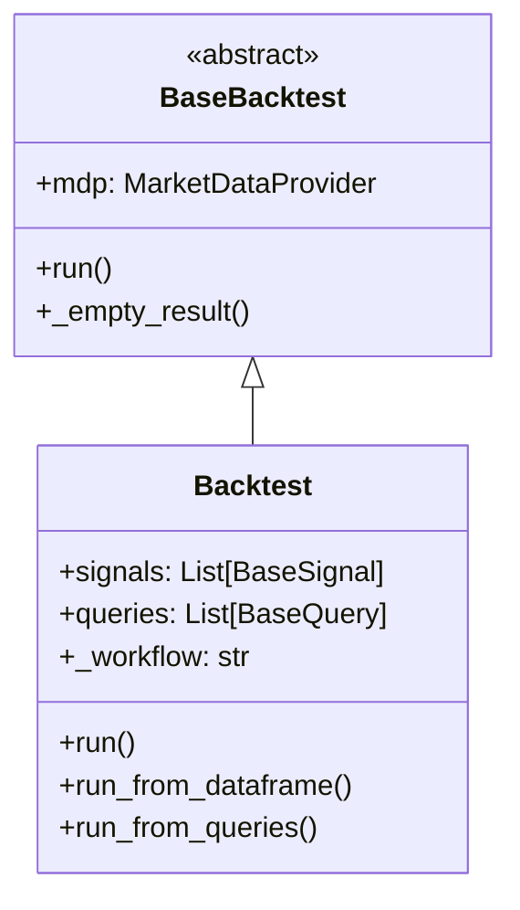
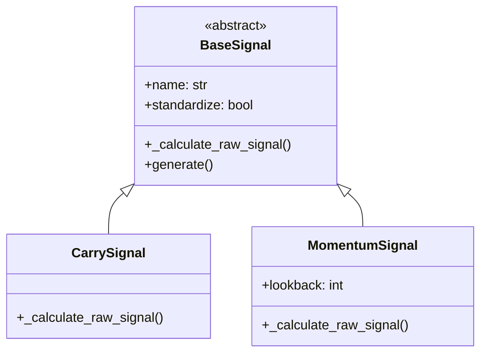
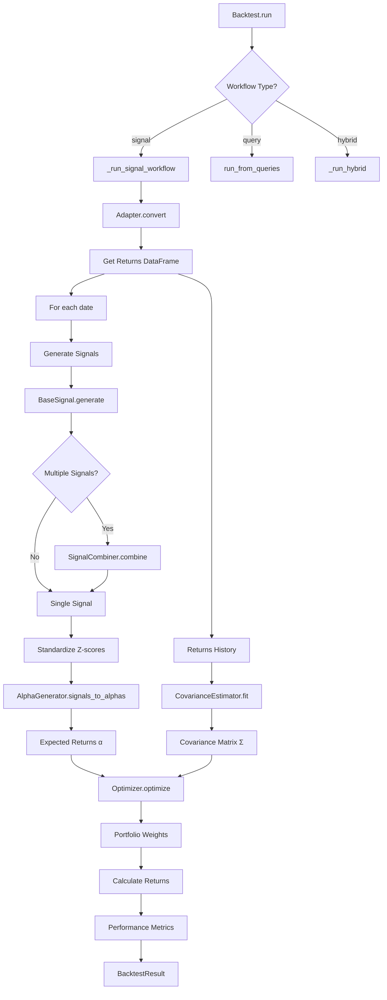
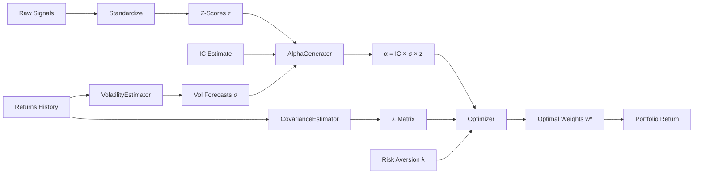
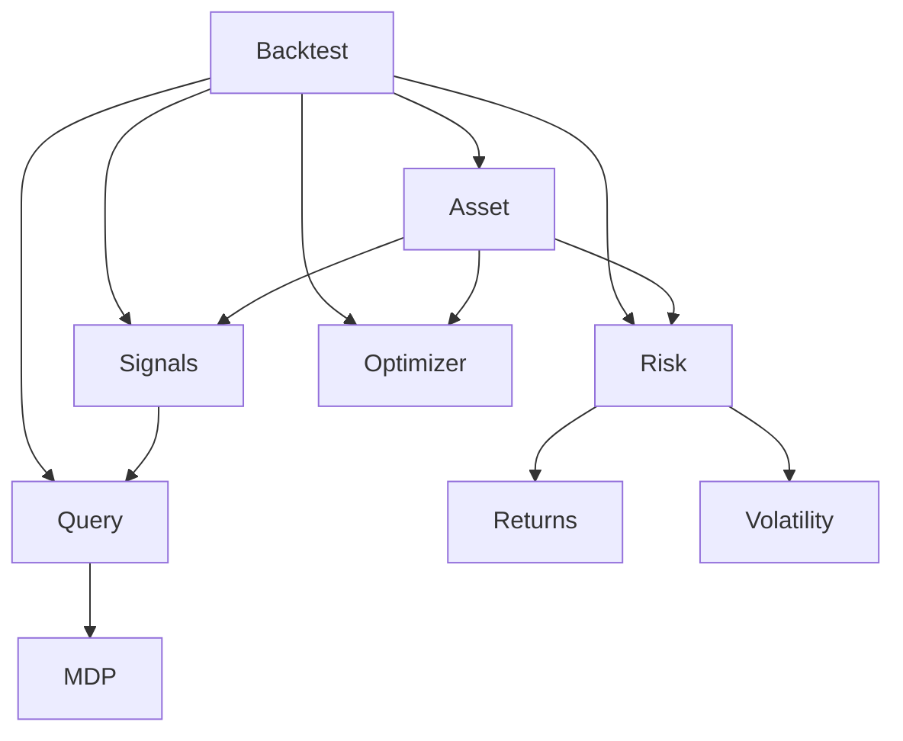
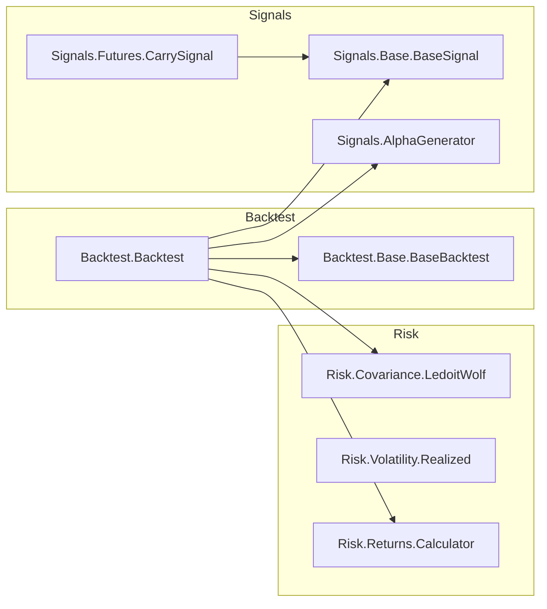

# Documentation Cleanup & Auto-Generation Plan

Created: 2025-11-14
Branch: claude/backtest-unification-setup-01CH1WQ6zsBhNHxU8xkhwVkQ

## Objective

Transform 164 markdown files (~110K lines) into unified, indexed documentation system with auto-generated architecture diagrams. Manual regeneration on demand, no automatic CI/CD.

## Current Inventory

```bash
find . -name "*.md" -type f | grep -v "/\." | grep -v venv | wc -l
# 164 files

find . -name "*.md" -type f | grep -v "/\." | grep -v venv | xargs wc -l | tail -1
# 109825 total lines
```

File Distribution:
- Root: 12 files (README, CLAUDE, etc.)
- docs/: 45 files
- docs/books/grinold_kahn_markdown/: 37 files
- docs/design/: 8 files
- docs/papers/: 50+ files
- docs/references/: 12 files

## Documentation Standards

All documentation must:
- State facts, not opinions
- Include no emojis, checkboxes, or unnecessary formatting
- Provide sufficient detail for clean VM execution with no context
- Link to source code with file:line references (e.g., `[Class](../path/file.py#L123-L456)`)
- Be indexed in central docs/INDEX.md

## Phase 1: Parallel Document Analysis

### Task 1.1: Inventory All Markdown Files

**Script**: `scripts/docs/analyze_all_markdown.py`

**For each file**, extract:
- Full path
- Line count, word count
- First commit date: `git log --follow --diff-filter=A`
- Last modified date: `git log -1 --follow`
- Number of commits: `git log --follow --oneline | wc -l`
- Files that reference this doc: `grep -r "filename" --include="*.py" --include="*.md"`
- Files this doc references (extract markdown links)
- Category: essential, active_docs, design, reference, completed_task, outdated, redundant, orphan

**Output**: `docs/analysis/inventory.json`

```json
{
  "analyzed_at": "2025-11-14T19:30:00Z",
  "total_files": 164,
  "total_lines": 109825,
  "files": [
    {
      "path": "README.md",
      "lines": 234,
      "words": 1543,
      "first_commit": "2024-01-15",
      "last_modified": "2025-11-14",
      "commit_count": 47,
      "referenced_by_code": ["Backtest/__init__.py:5"],
      "referenced_by_docs": ["docs/getting-started.md:12"],
      "references": ["CLAUDE.md", "docs/architecture/overview.md"],
      "category": "essential",
      "recommendation": "KEEP",
      "notes": "Main entry point, up-to-date"
    },
    {
      "path": "POLARS_MIGRATION_COMPLETE.md",
      "lines": 156,
      "words": 892,
      "first_commit": "2024-08-15",
      "last_modified": "2024-08-20",
      "commit_count": 3,
      "referenced_by_code": [],
      "referenced_by_docs": [],
      "references": ["POLARS_MIGRATION_PLAN.md"],
      "category": "completed_task",
      "recommendation": "ARCHIVE",
      "notes": "Completed task, historical value only"
    }
  ]
}
```

**Execution**:
```bash
python scripts/docs/analyze_all_markdown.py > docs/analysis/inventory.json
git add docs/analysis/inventory.json
git commit -m "docs: analyze all 164 markdown files"
git push -u origin claude/backtest-unification-setup-01CH1WQ6zsBhNHxU8xkhwVkQ
```

### Task 1.2: Categorize Documents

**Script**: `scripts/docs/categorize_docs.py`

**Category Definitions**:
- `essential`: README.md, CLAUDE.md, CONTRIBUTING.md
- `active_docs`: Current API docs, user guides, architecture
- `design`: Design decisions, still relevant
- `reference`: Book summaries, paper summaries
- `completed_task`: Phase summaries, migration complete docs
- `outdated`: Superseded by newer docs
- `redundant`: Duplicate content
- `orphan`: No references, no recent updates

**Output**: `docs/analysis/categorization.json`

```json
{
  "essential": ["README.md", "CLAUDE.md"],
  "active_docs": ["docs/BACKTEST_API.md", ...],
  "design": ["docs/design/BACKTEST_UNIFICATION_PLAN.md", ...],
  "reference": ["docs/books/GRINOLD_KAHN_EQUITY_SUMMARY.md", ...],
  "completed_task": ["POLARS_MIGRATION_COMPLETE.md", ...],
  "outdated": ["docs/GENERIC_BACKTEST_PROGRESS.md", ...],
  "redundant": ["GRINOLD_KAHN_FRAMEWORK.md", ...],
  "orphan": ["docs/old_design.md", ...]
}
```

**Execution**:
```bash
python scripts/docs/categorize_docs.py
git add docs/analysis/categorization.json
git commit -m "docs: categorize all markdown files"
git push -u origin claude/backtest-unification-setup-01CH1WQ6zsBhNHxU8xkhwVkQ
```

### Task 1.3: Identify Consolidation Groups

**Consolidation Groups**:

1. **Grinold-Kahn Documentation** (15 files)
   - Sources: GRINOLD_KAHN_DETAILED_SPECS.md, GRINOLD_KAHN_FRAMEWORK.md, docs/books/grinold_kahn_equity_notes_part*.md
   - Target: docs/architecture/grinold-kahn.md

2. **Backtest Documentation** (8 files)
   - Keep: docs/BACKTEST_API.md
   - Archive: Planning/progress docs
   - Target history: docs/architecture/backtest-evolution.md

3. **Phase Summaries** (12 files)
   - Sources: PHASE*_SUMMARY.md, SESSION_SUMMARY_*.md
   - Target: CHANGELOG.md

4. **Migration Documents** (4 files)
   - Sources: POLARS_MIGRATION_PLAN.md, POLARS_MIGRATION_COMPLETE.md
   - Target: docs/archive/migrations/polars-migration.md

5. **Book Chunks** (37 files)
   - Keep: docs/books/grinold_kahn_markdown/INDEX.md
   - Archive: Individual chunks

**Output**: `docs/analysis/consolidation-plan.json`

**Execution**:
```bash
python scripts/docs/identify_consolidations.py
git add docs/analysis/consolidation-plan.json
git commit -m "docs: identify consolidation groups"
git push -u origin claude/backtest-unification-setup-01CH1WQ6zsBhNHxU8xkhwVkQ
```

## Phase 2: Documentation Structure

### Target Structure

```
/
├── README.md                          # Project overview
├── CLAUDE.md                          # Development guidelines
├── CONTRIBUTING.md                    # How to contribute
├── CHANGELOG.md                       # Project history
├── docs/
│   ├── INDEX.md                       # Central documentation index
│   │
│   ├── architecture/
│   │   ├── overview.md               # System architecture
│   │   ├── class-hierarchy.md        # Auto-generated Mermaid
│   │   ├── data-flow.md              # Auto-generated Mermaid
│   │   ├── module-dependencies.md    # Auto-generated Mermaid
│   │   ├── grinold-kahn.md          # Consolidated GK docs
│   │   └── backtest-design.md        # Backtest architecture
│   │
│   ├── user-guides/
│   │   ├── installation.md           # Setup on clean VM
│   │   ├── quickstart.md             # First backtest
│   │   ├── creating-strategies.md    # Strategy development
│   │   ├── custom-signals.md         # Signal development
│   │   └── extending-risk-models.md  # Risk model extension
│   │
│   ├── api-reference/                 # Auto-generated from code
│   │   ├── backtest.md
│   │   ├── signals.md
│   │   ├── risk.md
│   │   ├── optimizer.md
│   │   ├── portfolio.md
│   │   └── query.md
│   │
│   ├── design/                        # Design decisions
│   │   ├── returns-first.md
│   │   ├── query-signal-bridges.md
│   │   └── portfolio-composition.md
│   │
│   ├── references/
│   │   ├── papers.md                 # Research paper summaries
│   │   └── books.md                  # Book summaries
│   │
│   └── archive/                       # Historical documents
│       ├── completed-tasks/
│       ├── migrations/
│       ├── phase-summaries/
│       └── book-chunks/
```

### Central Index (docs/INDEX.md)

```markdown
# ARBS Documentation Index

## Getting Started

- [Installation](user-guides/installation.md) - Setup instructions for clean VM
- [Quick Start](user-guides/quickstart.md) - Run your first backtest
- [Contributing](../CONTRIBUTING.md) - Development guidelines

## Architecture

- [System Overview](architecture/overview.md) - High-level design
- [Class Hierarchy](architecture/class-hierarchy.md) - Class inheritance (auto-generated)
- [Data Flow](architecture/data-flow.md) - Signal → Portfolio flow (auto-generated)
- [Module Dependencies](architecture/module-dependencies.md) - Import graph (auto-generated)
- [Grinold-Kahn Framework](architecture/grinold-kahn.md) - GK implementation
- [Backtest Design](architecture/backtest-design.md) - Backtest architecture

## User Guides

- [Creating Strategies](user-guides/creating-strategies.md) - Strategy development workflow
- [Custom Signals](user-guides/custom-signals.md) - Implementing signals
- [Extending Risk Models](user-guides/extending-risk-models.md) - Risk model development

## API Reference

- [Backtest](api-reference/backtest.md) - Backtest.Backtest class (auto-generated)
- [Signals](api-reference/signals.md) - Signal classes (auto-generated)
- [Risk Models](api-reference/risk.md) - Risk estimation (auto-generated)
- [Optimizers](api-reference/optimizer.md) - Portfolio optimization (auto-generated)
- [Portfolio](api-reference/portfolio.md) - Portfolio classes (auto-generated)
- [Query System](api-reference/query.md) - Query workflow (auto-generated)

## Design Decisions

- [Returns-First Design](design/returns-first.md) - Why returns over prices
- [Query-Signal Bridges](design/query-signal-bridges.md) - Bridging workflows
- [Portfolio Composition](design/portfolio-composition.md) - Nested portfolios

## References

- [Research Papers](references/papers.md) - Relevant academic papers
- [Books](references/books.md) - Book summaries

## Archive

- [Completed Tasks](archive/completed-tasks/) - Historical task documentation
- [Migrations](archive/migrations/) - Migration records
- [Phase Summaries](archive/phase-summaries/) - Development phases
```

**Execution**:
```bash
mkdir -p docs/{architecture,user-guides,api-reference,design,references,archive}
mkdir -p docs/archive/{completed-tasks,migrations,phase-summaries,book-chunks}

python scripts/docs/create_structure.py

git add docs/INDEX.md docs/architecture/ docs/user-guides/ docs/api-reference/
git commit -m "docs: create new documentation structure"
git push -u origin claude/backtest-unification-setup-01CH1WQ6zsBhNHxU8xkhwVkQ
```

## Phase 3: Auto-Generation Tools

### Tool 1: Class Diagram Generator

**Script**: `scripts/docs/generate_class_diagrams.py`

**Algorithm**:
1. Parse Python files with `ast` module
2. Extract class definitions and inheritance
3. Extract public methods and key attributes
4. Generate Mermaid classDiagram syntax
5. Write to docs/architecture/class-hierarchy.md

**Output Example** (docs/architecture/class-hierarchy.md):

```markdown
# Class Hierarchy

Auto-generated: 2025-11-14 19:30:00

## Backtest System



## Signal System



## Source Code References

- Backtest.Backtest: [Backtest/Backtest.py:73-642](../../Backtest/Backtest.py#L73)
- BaseSignal: [Signals/Base/BaseSignal.py:27-241](../../Signals/Base/BaseSignal.py#L27)
- CarrySignal: [Signals/Futures/CarrySignal.py:15-89](../../Signals/Futures/CarrySignal.py#L15)
```

**Usage**:
```bash
python scripts/docs/generate_class_diagrams.py
```

### Tool 2: Data Flow Diagram Generator

**Script**: `scripts/docs/generate_flow_diagrams.py`

**Algorithm**:
1. Define key workflows (templates)
2. Extract method calls from code with `ast`
3. Verify flow matches actual code
4. Generate Mermaid flowchart syntax
5. Write to docs/architecture/data-flow.md

**Output Example** (docs/architecture/data-flow.md):

```markdown
# Data Flow Diagrams

Auto-generated: 2025-11-14 19:30:00

## Signal-Based Backtest Workflow



## Grinold-Kahn Optimization Flow



## Source Code References

- Backtest._run_signal_workflow: [Backtest/Backtest.py:234-456](../../Backtest/Backtest.py#L234)
- AlphaGenerator.signals_to_alphas: [Signals/AlphaGenerator.py:67-123](../../Signals/AlphaGenerator.py#L67)
```

**Usage**:
```bash
python scripts/docs/generate_flow_diagrams.py
```

### Tool 3: Module Dependency Graph

**Script**: `scripts/docs/generate_dependency_graph.py`

**Algorithm**:
1. Parse all Python files
2. Extract import statements
3. Build dependency graph
4. Generate Mermaid graph syntax
5. Write to docs/architecture/module-dependencies.md

**Output Example** (docs/architecture/module-dependencies.md):

```markdown
# Module Dependencies

Auto-generated: 2025-11-14 19:30:00

## High-Level Module Structure



## Detailed Package Dependencies


```

**Usage**:
```bash
python scripts/docs/generate_dependency_graph.py
```

### Tool 4: API Reference Generator

**Script**: `scripts/docs/generate_api_docs.py`

**Algorithm**:
1. Use `ast` to parse Python files
2. Extract docstrings from classes and methods
3. Extract method signatures
4. Format as markdown with examples
5. Include source code links
6. Write to docs/api-reference/*.md

**Output Example** (docs/api-reference/backtest.md):

```markdown
# Backtest API Reference

Auto-generated: 2025-11-14 19:30:00

## Backtest.Backtest

Generic backtest with configurable components.

**Source**: [Backtest/Backtest.py:73-642](../../Backtest/Backtest.py#L73)

**Inheritance**: BaseBacktest → Backtest

### Constructor

```python
def __init__(
    self,
    mdp: Optional[Any] = None,
    adapter: Optional[Any] = None,
    signals: Optional[Union[BaseSignal, List[BaseSignal]]] = None,
    queries: Optional[List[BaseQuery]] = None,
    triggers: Optional[List[Any]] = None,
    alpha_generator: Optional[AlphaGenerator] = None,
    risk_model: Optional[Any] = None,
    optimizer: Optional[Any] = None,
    IC: float = 0.05,
    risk_aversion: float = 1.0,
    long_only: bool = True,
    min_history: int = 20,
)
```

**Parameters**:
- mdp (MarketDataProvider, optional): Market data provider for query workflow
- adapter (BaseAdapter, optional): Converts queries to DataFrame
- signals (BaseSignal | List[BaseSignal], optional): Signal(s) for alpha generation
- queries (List[BaseQuery], optional): Queries to execute
- IC (float): Information coefficient (default: 0.05)
- risk_aversion (float): Risk aversion parameter (default: 1.0)
- long_only (bool): Only long positions (default: True)
- min_history (int): Minimum periods for covariance (default: 20)

**Raises**:
- ValueError: If neither signals nor queries provided
- ValueError: If using queries without mdp

### Methods

#### run()

**Source**: [Backtest/Backtest.py:234-456](../../Backtest/Backtest.py#L234)

```python
def run(
    self,
    contracts: List[str] = None,
    dates: List[date] = None,
    time_grid: List[date] = None,
    **kwargs
) -> BacktestResult
```

Run backtest using detected workflow.

**Parameters**:
- contracts (List[str], optional): Contract identifiers for signal workflow
- dates (List[date], optional): Rebalance dates for signal workflow
- time_grid (List[date], optional): Time grid for query workflow

**Returns**: BacktestResult with performance metrics

**Workflows**:
- Signal workflow: Requires contracts and dates
- Query workflow: Requires time_grid
- Hybrid workflow: Combines both

**Example**:
```python
from Backtest.Backtest import Backtest
from Signals.Futures.CarrySignal import CarrySignal

backtest = Backtest(
    mdp=market_data_provider,
    signals=CarrySignal()
)
result = backtest.run(contracts=['SFRZ4', 'SFRH5'], dates=[...])
print(f"Sharpe: {result.sharpe_ratio}")
```
```

**Usage**:
```bash
python scripts/docs/generate_api_docs.py
```

### Master Regeneration Command

**Makefile**:
```makefile
.PHONY: docs
docs:
	@echo "Regenerating documentation..."
	python scripts/docs/generate_class_diagrams.py
	python scripts/docs/generate_flow_diagrams.py
	python scripts/docs/generate_dependency_graph.py
	python scripts/docs/generate_api_docs.py
	@echo "Documentation updated"
```

**Usage**:
```bash
make docs
```

Manual regeneration on demand. NO automatic CI/CD, NO pre-commit hooks.

## Phase 4: Execution on Clean VM

### Prerequisites

```bash
python --version  # 3.11+
git --version     # 2.0+
```

### Step 1: Clone and Branch

```bash
cd ~
git clone https://github.com/pfin/ARBS.git
cd ARBS
git checkout -b claude/docs-cleanup-$(date +%s)
```

### Step 2: Install Dependencies

```bash
pip install -r requirements.txt
pip install pdoc3 networkx
```

### Step 3: Analyze Documentation

```bash
mkdir -p docs/analysis scripts/docs

# Analyze all files
python scripts/docs/analyze_all_markdown.py > docs/analysis/inventory.json

# Categorize
python scripts/docs/categorize_docs.py

# Identify consolidations
python scripts/docs/identify_consolidations.py

# Commit
git add docs/analysis/
git commit -m "docs: analyze 164 markdown files"
git push -u origin $(git branch --show-current)
```

### Step 4: Review and Execute Cleanup

```bash
# Generate report
python scripts/docs/generate_report.py > docs/analysis/REPORT.md

# Review
less docs/analysis/REPORT.md

# Dry run
python scripts/docs/execute_cleanup.py --dry-run

# Execute
python scripts/docs/execute_cleanup.py

# Create structure
python scripts/docs/create_structure.py

# Commit
git add -A
git commit -m "docs: execute cleanup and create structure"
git push -u origin $(git branch --show-current)
```

### Step 5: Generate Auto-Docs

```bash
make docs

# Commit
git add docs/architecture/ docs/api-reference/
git commit -m "docs: generate architecture diagrams and API reference"
git push -u origin $(git branch --show-current)
```

### Step 6: Validate

```bash
# Validate links
python scripts/docs/validate_links.py

# Validate Mermaid
python scripts/docs/validate_mermaid.py

# Final commit
git add -A
git commit -m "docs: comprehensive cleanup complete

Analysis:
- 164 files analyzed
- Categorized and consolidated
- Auto-generation tools implemented
- Manual regeneration via make docs

Result: Unified indexed documentation system"
git push -u origin $(git branch --show-current)
```

## Orthogonal Task Breakdown

### Group A: Analysis Scripts (Parallel)

A1: scripts/docs/analyze_all_markdown.py (30 min)
A2: scripts/docs/categorize_docs.py (20 min)
A3: scripts/docs/identify_consolidations.py (20 min)
A4: scripts/docs/generate_report.py (15 min)

### Group B: Generation Scripts (Parallel)

B1: scripts/docs/generate_class_diagrams.py (45 min)
B2: scripts/docs/generate_flow_diagrams.py (45 min)
B3: scripts/docs/generate_dependency_graph.py (30 min)
B4: scripts/docs/generate_api_docs.py (45 min)

### Group C: Execution Scripts (Parallel)

C1: scripts/docs/execute_cleanup.py (30 min)
C2: scripts/docs/create_structure.py (20 min)
C3: scripts/docs/validate_links.py (20 min)
C4: scripts/docs/validate_mermaid.py (15 min)

### Group D: Content Consolidation (Sequential)

D1: Consolidate Grinold-Kahn docs (45 min)
D2: Consolidate backtest docs (30 min)
D3: Consolidate phase summaries to CHANGELOG (30 min)
D4: Create docs/INDEX.md (20 min)
D5: Create user guides (60 min)

## Success Criteria

Analysis Complete:
- inventory.json with 164 files
- categorization.json categorizes all files
- consolidation-plan.json identifies merge groups

Structure Complete:
- docs/INDEX.md exists and links all active docs
- Archive directory contains historical docs
- All active docs accessible from index

Auto-Generation Working:
- Class diagrams render in Mermaid
- Flow charts render in Mermaid
- Dependency graphs render in Mermaid
- API docs generated from docstrings
- Source code links work (file:line format)

Validation Passing:
- All internal links resolve
- All Mermaid syntax valid
- All code examples reference existing code
- No orphaned documents

Final State:
- Single command regenerates all auto-docs: make docs
- Clear navigation from README to docs/INDEX.md to any topic
- All documentation accurate as of commit date
- Manual regeneration only, no automatic hooks or CI/CD

## Timeline Estimate

Phase 1 (Analysis): 2 hours
Phase 2 (Structure): 2 hours
Phase 3 (Auto-Gen): 4 hours
Phase 4 (Execution): 1 hour

Total: 9 hours wall-clock time with parallelization
