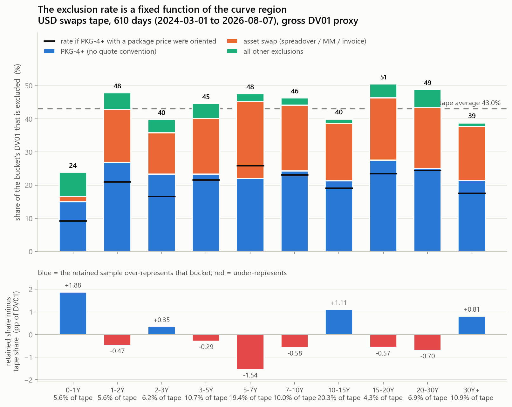
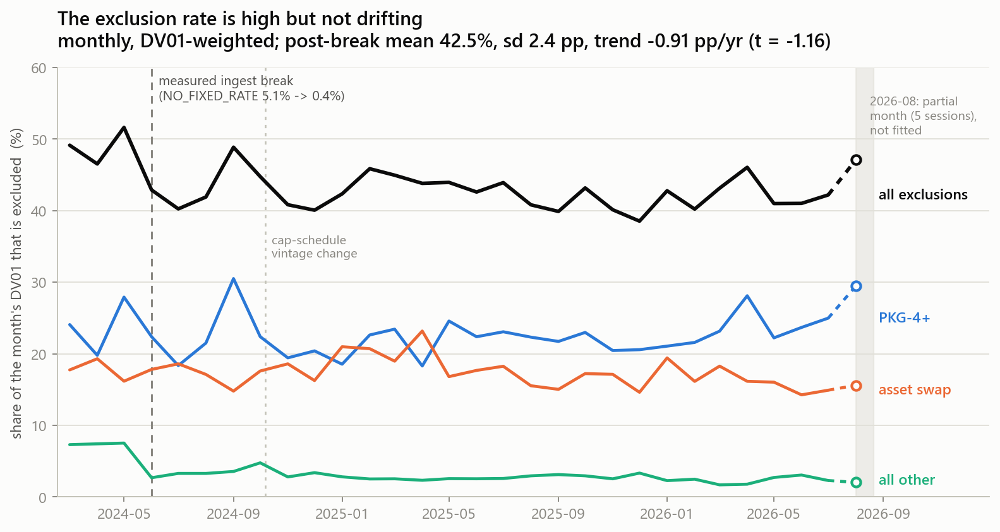

# Are the excluded packages a random sample of the tape?

**No. The retained population is a biased sample, and the bias is a fixed
function of the curve region.** Each ladder bucket's DV01 survives at a
different rate — 0.761 at 0–1Y down to 0.495 at 15–20Y, a **1.54× cross-bucket
scaling distortion** — so aggregate levels are comparable *within* a bucket over
time but **not across buckets**. The resulting composition tilt is +1.88 pp at
0–1Y (+33.6% relative), −1.54 pp at 5–7Y, **4.15 pp L1** overall.

**The skew is worse than "lost power" on two dimensions and better on one.**
Worse: the excluded `PKG-4+` family is **97.9% D2C** against 82.1% for the
retained population — it is *more* customer-facing than what is kept, not less —
and carries **28.7% of its DV01 in block legs** against 11.1% retained, so the
exclusion strips out the largest and most informative customer prints. Better:
the asset-swap family is **44.1% D2D**, so excluding *it* costs a customer-flow
series relatively little.

**The rate is stable, not drifting, and most of it is recoverable.** Post-break
(2024-07 onward) the exclusion rate is 42.51% of DV01, sd 2.39 pp, trend
−0.91 pp/yr (t = −1.16, n.s.). And **100% of `PKG-4+` DV01 carries a package
price or spread** — 22.16 of the 43.04 excluded points are `PKG-4+` with a
`package_transaction_price`, whose orientation needs only a repriced *swap*
package mid. Recovering that route alone would take retained DV01 from 56.96% to
**79.12%** and halve the distortion (bucket-rate spread 26.65 → 16.73 pp;
L1 4.15 → 2.08 pp).

---

## Scope, conventions, and how to trust this

- **Window**: the pinned 610-day tape, `2024-03-01 .. 2026-08-07`,
  2,326,781 legs / 1,437,838 units. Every leg on `_v3` carries a `package_id`,
  so *unit* and *package* are 1:1 here.
- **The split is `universe.unit_frame`'s own.** Nothing is re-derived: the
  scripts call `unit_frame` for the classification and `annotate_legs` for the
  per-leg predicates, and join on `_unit_group`.
- **DV01 means the gross `_dv01_proxy` convention** — `sanity.expected_dv01`
  summed as `Σ|leg DV01|`, with the 55 `notional = 1e20` sentinel legs forced to
  zero. Identical to the coverage report's. The tape's raw `risk` column is
  never summed.
- **Tenor bucket** = the leg's own maturity point, `forward_start_years +
  tenor_years`, with standard pillars on the right edge (a 10Y spot swap is
  `7-10Y`). Only 4 legs of 2,326,781 have no bucket, and they carry zero DV01.
- **`PKG4` vs `ASSETSWAP`** are the two halves of `UNORIENTABLE_PKG`, taken from
  `exclusion_detail` (which resolves trade-type details *before* `PKG-4+`, so a
  4-leg package containing a spreadover leg counts as spreadover, not `PKG-4+` —
  the class totals below match the coverage report's to six decimals).

### Validation gate — reproduced before anything downstream was computed

`scratch/pkgskew_validate.py`, **75/75 checks pass**:

| | measured here | reference (`scratch/_rep_full.txt`) |
|---|---|---|
| units | 1,437,838 | 1,437,838 |
| legs | 2,326,781 | 2,326,781 |
| kept units | 1,082,393 (75.28%) | 1,082,393 (75.28%) |
| DV01 proxy total | 80,660,906,449 | 80,660,906,449 |
| DV01 proxy kept | 45,941,783,080 (56.96%) | 45,941,783,080 (56.96%) |
| `UNORIENTABLE_PKG` | 272,373 units / 768,706 legs / 39.973637% | same |
| `UNORIENTABLE_PKG / PKG-4+` | 46,946 / 505,455 / 22.567462% | same |
| notional sentinels | 55 | 55 |
| days | 610 | 610 |

Every one of the seven exclusion constants and all ten `UNORIENTABLE_PKG`
details reconcile to 1e-5 pp, kept-venue counts reconcile exactly, and the
leg-level DV01 sum equals the unit-level sum to the dollar.

### The four populations

| class | units | legs | DV01 | % of tape DV01 |
|---|---:|---:|---:|---:|
| `KEPT` | 1,082,393 | 1,470,560 | 45,941,783,080 | **56.96** |
| `PKG4` (`UNORIENTABLE_PKG / PKG-4+`) | 46,946 | 505,455 | 18,203,119,196 | **22.57** |
| `ASSETSWAP` (spreadover / matched-maturity / invoice) | 225,427 | 263,251 | 14,039,978,728 | **17.41** |
| `OTHER_EXCL` (index, pricing error, no rate, …) | 83,072 | 87,515 | 2,476,025,445 | 3.07 |

---

## 1. Tenor mix — the headline

By leg DV01, allocated to the leg's own maturity bucket:

| bucket | tape DV01 | tape share % | retained share % | **Δ pp** | Δ relative % | **excl. rate %** | of which PKG-4+ | of which asset swap |
|---|---:|---:|---:|---:|---:|---:|---:|---:|
| 0-1Y | 4.51 bn | 5.59 | 7.47 | **+1.88** | **+33.6** | **23.90** | 14.96 | 1.52 |
| 1-2Y | 4.55 bn | 5.64 | 5.16 | −0.47 | −8.4 | 47.83 | 26.89 | 15.93 |
| 2-3Y | 5.01 bn | 6.22 | 6.57 | +0.35 | +5.7 | 39.81 | 23.28 | 12.51 |
| 3-5Y | 8.61 bn | 10.67 | 10.38 | −0.29 | −2.7 | 44.60 | 23.29 | 16.81 |
| 5-7Y | 15.65 bn | 19.40 | 17.86 | **−1.54** | −8.0 | 47.58 | 21.99 | 23.16 |
| 7-10Y | 8.07 bn | 10.01 | 9.43 | −0.58 | −5.8 | 46.32 | 24.27 | 19.90 |
| 10-15Y | 16.38 bn | 20.30 | 21.41 | +1.11 | +5.5 | 39.93 | 21.33 | 17.24 |
| 15-20Y | 3.48 bn | 4.32 | 3.75 | −0.57 | **−13.2** | **50.55** | 27.50 | 18.79 |
| 20-30Y | 5.60 bn | 6.94 | 6.24 | −0.70 | −10.1 | 48.79 | 24.94 | 18.44 |
| 30Y+ | 8.80 bn | 10.91 | 11.72 | +0.81 | +7.5 | 38.80 | 21.43 | 16.28 |

**Effect sizes.** The exclusion rate spans **26.65 pp** across buckets
(23.90% at 0–1Y to 50.55% at 15–20Y). Restated as what a ladder level is
multiplied by:

| bucket | 0-1Y | 1-2Y | 2-3Y | 3-5Y | 5-7Y | 7-10Y | 10-15Y | 15-20Y | 20-30Y | 30Y+ |
|---|---:|---:|---:|---:|---:|---:|---:|---:|---:|---:|
| **retention factor** | **0.761** | 0.522 | 0.602 | 0.554 | 0.524 | 0.537 | 0.601 | **0.495** | 0.512 | 0.612 |
| vs. the best bucket | 1.00 | 0.69 | 0.79 | 0.73 | 0.69 | 0.71 | 0.79 | 0.65 | 0.67 | 0.80 |

A reader comparing the 0–1Y ladder level to the 15–20Y level is comparing
76% of one bucket's tape DV01 against 50% of the other's. **That is the
consequential number.** The aggregate composition tilt is milder — L1 4.15 pp,
i.e. 4.15% of retained DV01 mass sits in the wrong bucket relative to the
tape — because the one strongly-different bucket (0–1Y) is only 5.6% of the
tape. But in *relative* terms 0–1Y is over-represented by a third.

By leg **count** the same shape holds and is milder (18.50% at 0–1Y to 44.98%
at 20–30Y, L1 3.02 pp): the excluded population is DV01-heavy relative to its
print count, which is the block/size story in §4.

**Robustness — annuity-spread allocation.** Reallocating each leg's DV01 across
buckets by its annuity span rather than pinning it to the maturity point (an
exact decomposition; asserted to sum back to each leg's `_dv01_proxy` in every
chunk) leaves the conclusion intact in direction but changes which bucket is the
outlier: rates then span **20.61 pp** (24.65% at 30Y+ to 45.26% at 3–5Y) with
L1 1.53 pp. The two bucketings answer different questions — maturity-point is
closer to a par swap's key-rate concentration, annuity-spread to its carry
profile — so **do not average them**. Both say the rate varies materially by
curve region; they disagree on where the least-excluded region sits.

### Does each bucket's rate hold still? (the drift test, applied per bucket)

Complete months 2024-07 .. 2026-07, n = 25:

| bucket | mean % | sd pp | min–max % | trend pp/yr | t |
|---|---:|---:|---:|---:|---:|
| 0-1Y | 23.94 | 4.29 | 17.6–32.9 | −2.87 | **−2.16** |
| 1-2Y | 47.52 | 5.60 | 37.5–55.9 | **+5.07** | **+3.21** |
| 2-3Y | 40.03 | 5.09 | 30.6–50.4 | −1.26 | −0.74 |
| 3-5Y | 44.15 | 5.25 | 35.2–52.4 | −2.91 | −1.73 |
| 5-7Y | 46.95 | 2.67 | 42.8–52.4 | +0.58 | +0.65 |
| 7-10Y | 45.61 | 5.09 | 38.7–57.3 | +0.89 | +0.52 |
| 10-15Y | 39.39 | 2.79 | 31.9–46.2 | −1.64 | −1.85 |
| 15-20Y | 49.50 | 6.99 | 39.4–72.5 | −2.40 | −1.03 |
| 20-30Y | 48.02 | 4.24 | 41.2–56.2 | +0.69 | +0.48 |
| 30Y+ | 38.05 | 4.23 | 31.1–45.7 | −1.70 | −1.22 |

The **cross-bucket spread of the means (25.57 pp) is 5.5× the median
within-bucket month-to-month sd (4.69 pp)**. So each bucket's retention factor
is a persistent property with monthly noise around it, not a wandering one:
a within-bucket time series is usable, a cross-bucket comparison is not.

Two exceptions to state plainly. **1–2Y drifts up at +5.07 pp/yr (t = +3.21)** —
that bucket's retention has fallen through the sample and a level built on it
would move for reasons unrelated to positioning. 0–1Y drifts the other way at
−2.87 pp/yr (t = −2.16). With ten buckets tested on 25 autocorrelated months,
one |t| > 2 is expected by chance; 1–2Y at t = 3.21 probably is not. 15–20Y
also has the widest month-to-month dispersion (sd 6.99 pp, one month at 72.5%)
on the smallest DV01 base (4.3% of the tape).

---

## 2. Time of day — the dimension where the skew is small

Execution hour ET. The tape's `as_of` day runs 20:00 ET the prior evening to
19:59 ET, so the session-ordered axis starts at 20:00.

| population | 07:00–16:59 ET share of its own DV01 | 20:00–02:59 ET (overnight) |
|---|---:|---:|
| retained | 87.24% | 4.76% |
| `PKG-4+` | 90.47% | **2.21%** |
| asset swap | 86.76% | 4.68% |
| other exclusions | 94.71% | 1.31% |
| whole tape | 88.11% | — |

The hourly exclusion rate rises through the session — 27.4% at 20:00, 33–36%
through the Asian hours, a 45–47% bulge at 05:00–06:00, 41.3% at 07:00, 39.7%
at 11:00 (the DV01 peak hour), then 45–50% from 12:00 to 17:00.

**Effect size: 3.2 pp of intraday footprint** between `PKG-4+` and the retained
population, against an 87–90% common concentration in the same ten hours. This
is a real but second-order difference: package business is slightly more
US-hours than the flow that is kept, and notably absent overnight (2.21% vs
4.76%, less than half). It is not a different kind of business by clock.

---

## 3. Venue — this one cuts *against* the exclusion, hard

Venue class from the pipeline's own classifier, DV01-weighted:

| | retained | `PKG-4+` | asset swap | other excl. |
|---|---:|---:|---:|---:|
| **D2C** | 82.14% | **97.90%** | 51.92% | 50.36% |
| **D2D** | 14.62% | **1.57%** | **44.12%** | 25.24% |
| `VENUE_UNKNOWN` | 3.24% | 0.53% | 3.96% | 24.40% |

The task flagged this as the dimension that might point the other way. It does —
but only for asset swaps.

- **`PKG-4+` is the opposite of IDB flow.** At 97.90% D2C it is *more*
  customer-facing than the population that is kept (82.14%), and its D2D share
  (1.57%) is a tenth of the retained population's. Excluding it therefore
  removes customer flow **disproportionately**, which makes the 22.57 pp of
  DV01 it costs strictly worse for a customer-flow series than a random 22.57 pp
  would be.
- **The evidence tier armors that claim.** **All** of the 97.90 D2C points are
  `EVIDENCE_REGISTRY` — operators named in a public venue registry, not
  unclassifiable prints defaulting to D2C. Only **0.533%** of the family is
  `OFF_FACILITY` (`XOFF`/`XXXX`) and 0.012% is fingerprint-tier. By platform:
  `TWSF` 83.45%, `BBSF` 9.12%, `BILT` 4.34%, `TREU` 0.87% — named SEFs.
- **Asset swaps are the reverse.** 44.12% of their DV01 (48.95% of their legs)
  is D2D. Roughly two-fifths of that 17.41 pp was never customer flow, so the
  effective customer-flow cost of the asset-swap exclusion is closer to
  **~9.7 pp** than to 17.41 pp.

Exclusion rate *within* each venue: D2C 41.12%, D2D 51.40%,
`VENUE_UNKNOWN` 45.79%.

---

## 4. Block, capped, size, and structure

**Block and capped.** `PKG-4+` is where the big prints are:

| | block % of legs | block % of DV01 | capped % of legs | capped % of DV01 |
|---|---:|---:|---:|---:|
| retained | 1.90 | 11.14 | 2.63 | 14.02 |
| `PKG-4+` | **5.35** | **28.65** | 4.21 | 21.16 |
| asset swap | 0.98 | 3.12 | 2.90 | 8.46 |
| other excl. | 0.44 | 2.02 | 5.03 | 21.54 |

`PKG-4+` carries **2.6× the retained population's block DV01 share**. Blocks are
the prints whose size is imputed rather than read, and — per
`WHAT_THE_LADDER_SUPPORTS.md` §5 — the largest and most informative. The
exclusion is concentrated on exactly those.

**Notional and per-leg DV01.** Per leg, $mm:

| | p10 | p25 | median | p75 | p90 | p99 | mean leg DV01 $/bp |
|---|---:|---:|---:|---:|---:|---:|---:|
| retained | 5 | 12 | 36 | 100 | 270 | 4,400 | 31,241 |
| `PKG-4+` | 1 | 6 | 30 | 100 | 250 | 2,200 | 36,013 |
| asset swap | 20 | 31 | 58 | 110 | 240 | 650 | 53,333 |

`PKG-4+` legs are individually slightly *smaller* than retained legs but far
more numerous per unit (505,455 legs across 46,946 units, 10.8 legs/unit), and
carry more DV01 each. Asset-swap legs are the tightest distribution on the tape
— a p10/p99 range of 20 to 650 against the retained population's 5 to 4,400 —
consistent with a standardised, dealer-intermediated product.

**Structure.** Every `PKG-4+` leg carries `trade_type = OUTRIGHT`: the package
is a bundle of outright swaps, not a labelled curve or fly. The top structures
by DV01 are **same-tenor bundles** — `10Y/10Y/10Y/10Y Pkg-4`,
`5Y/5Y/5Y/5Y Pkg-4`, `30Y/30Y/30Y/30Y Pkg-4`, `~7Y/~7Y/~7Y/~7Y Pkg-4` — with
mixed-tenor shapes (`2Y/2Y/10Y/10Y Pkg-4`) further down. Leg counts run 4 to
well past 17; 4-leg packages are 13.3% of the family's DV01 and 6-leg 8.7%,
with a long tail.

The asset-swap family is 74.80% single-leg by DV01 (a lone spreadover print),
17.13% two-leg, 8.07% three-leg.

**Other.** Lifecycle DV01 share: retained 5.45%, `PKG-4+` **1.35%**, asset swap
6.93%. Rate index: `PKG-4+` 97.41% SOFR / 2.59% Fed Funds against retained
95.26 / 4.74 — near-identical, so the exclusion is not an index story.

---

## 5. Stability over time

**Verdict: high but not drifting.** Over complete months 2024-07 .. 2026-07 the
DV01 exclusion rate averages **42.51%, sd 2.39 pp, trend −0.91 pp/yr
(t = −1.16)** — not distinguishable from flat. The components partly offset:
`PKG-4+` +1.03 pp/yr (t = +1.12), asset swap −1.39 pp/yr (t = −2.02), other
−0.56 pp/yr (t = −3.16). The asset-swap decline is a mild *composition* drift
inside a stable total, and because asset swaps sit at specific tenors it is
worth watching, but at −1.4 pp/yr it does not disqualify a daily indicator.

**Over the full 29 months the trend looks like −2.11 pp/yr (se 0.73) — that is
an artifact and should not be quoted.** It is produced entirely by an ingest
change:

| exclusion, % of month's DV01 | 2024-03 | 2024-04 | 2024-05 | **2024-06** | 2024-07 | 2024-08 |
|---|---:|---:|---:|---:|---:|---:|
| `NO_FIXED_RATE` | 5.26 | 5.67 | 5.07 | **0.37** | 0.45 | 1.44 |
| all other exclusions | 43.87 | 40.84 | 46.54 | 42.51 | 39.79 | 40.46 |

**The break lands at the May→June 2024 boundary, not the 2024-07 date the docs
carry** for the ingest change. Chart B marks it where the data says it is.
`NO_FIXED_RATE` decays further to near-zero from 2024-11 and is exactly 0.000%
from 2026-04.

*Why the fit window starts 2024-07 and not 2024-06:* the break is measured at
the May→June boundary, but 2024-06 is the transition month itself, so the
"post-break" statistics start the month after to stay clear of it. Including
June changes nothing material — June 2024 is 42.88% against a window mean of
42.51%.

Regime-break steps, daily DV01-weighted:

| break | whole-sample pre → post | step | local ±60 trading days | step |
|---|---|---:|---|---:|
| 2024-07-01 (ingest) | 47.62% → 42.58% | −5.03 pp | 47.17% → 43.94% | −3.23 pp |
| 2024-10-07 (cap vintage) | 45.84% → 42.43% | −3.41 pp | 44.59% → 41.80% | −2.79 pp |

The 2024-10-07 step is largely the tail of the same 2024-06 shift rather than a
cap-schedule effect: `PKG-4+` moves −1.42 pp across it and asset swaps
+0.27 pp, i.e. no coherent regime signature. Note also that the pre-2024-07 tape
carries **no termination events at all**, so some pre/post composition change
there is mechanical.

**Practical read:** if the pre-2024-07 window is dropped (which the lifecycle
gap independently argues for), the exclusion rate is a stable 42.5% ± 2.4 pp
level. A daily indicator's *level* would not move for exclusion reasons —
except in the 1–2Y bucket, where it would.

---

## 6. The direction question, honestly scoped

The excluded units cannot be classified — that is why they are excluded — so no
direction is imputed to them here. What is observable:

**Are they more RV-shaped?** By how many tenor buckets a unit's legs span:

| DV01 % within class | one bucket | two | three or more |
|---|---:|---:|---:|
| retained | 57.35 | 26.62 | 16.03 |
| `PKG-4+` | **26.99** | 25.74 | **47.27** |
| asset swap | **76.03** | 16.15 | 7.83 |

Median maturity span (`mat_max − mat_min`) is **5.0 years for `PKG-4+`**
(p75 20.1y) against 0.0 for both the retained population and asset swaps.
So `PKG-4+` genuinely *is* the RV/curve business the task anticipated —
about half its DV01 spans three or more buckets — while the asset-swap family
is overwhelmingly single-point.

**The one-bucket sub-population is the directly harmful case.** 13,966 `PKG-4+`
units, **4.91 bn DV01 = 26.99% of the family and 6.09% of the whole tape**, have
every leg in a single bucket — the `10Y/10Y/10Y/10Y` shapes. A package like that
contributes DV01 to one ladder bucket in a way a curve trade does not, so its
exclusion removes a level rather than a shape. As a share of each bucket's own
tape DV01 it runs 11.07% at 0–1Y, 8.32% at 15–20Y, 6.92% at 1–2Y, 6.45% at
3–5Y, and 4.0–6.3% elsewhere.

*Caveat, and it matters:* the DV01 here is **gross** (`Σ|leg DV01|`). Four clips
of the same 10Y at four prices may be internally offsetting — a rebalance or a
list — in which case the *net* harm is smaller than the gross pond. Which of the
two it is cannot be known without orienting the legs, which is the thing that
cannot be done. Read 6.09% as an upper bound on the bucket-level damage.

**Do they carry a package price or spread?** Yes — see §7. The tape's own OPA
machinery has already half-solved `PKG-4+`: `opa_sign_confidence` is
`EXACT` on 15.20% of its DV01, `TIGHT` on 15.99% and `LOOSE` on 43.87% —
**75.05% at some stated confidence**, with 24.90% `UNRESOLVED`. On the
asset-swap family the same field is NULL on 79.19%.

---

## 7. The recovery path — measured, not built

Any-leg presence of a package price (`package_transaction_price`) or spread
(`package_transaction_spread`), by DV01:

| detail | DV01 | PTP % | PTS-only % | either % | % of tape DV01 |
|---|---:|---:|---:|---:|---:|
| `PKG-4+` | 18.20 bn | **98.21** | 1.79 | **100.00** | 22.57 |
| `SPREADOVER` | 4.87 bn | 0.00 | 100.00 | 100.00 | 6.04 |
| `MATCHED_MATURITY` | 3.16 bn | 12.53 | 8.36 | 20.89 | 3.92 |
| `INVOICE` | 2.47 bn | 13.86 | 8.41 | 22.27 | 3.06 |
| `SPREADOVER_CURVE` | 1.58 bn | 0.15 | 99.85 | 100.00 | 1.96 |
| `SPREADOVER_FLY` | 1.09 bn | 0.01 | 99.99 | 100.00 | 1.36 |
| `INVOICE_SWITCH` | 0.40 bn | 8.26 | 8.83 | 17.08 | 0.50 |
| `MATCHED_MATURITY_CURVE` | 0.32 bn | 59.70 | 19.10 | 78.80 | 0.40 |
| `INVOICE_CALENDAR` | 0.10 bn | 10.38 | 5.20 | 15.58 | 0.12 |
| `MATCHED_MATURITY_FLY` | 0.04 bn | 50.14 | 49.86 | 100.00 | 0.05 |

**The answer splits in two, and only the first half is recoverable by the route
the task specifies.**

**(a) `PKG-4+` — 22.16 pp of the 43.04, recoverable by the stated route.**
98.21% of the family's DV01 (46,057 of 46,946 units) carries a
`package_transaction_price`, and every remaining unit carries a spread — **the
family's coverage is 100%, with zero units carrying neither**. Because all legs
of a `PKG-4+` package are swaps, that price *can* be compared against a repriced
swap-package mid with no per-leg quote convention needed. `ptp_group_id` is
present on 99.96% of its DV01.

The price is a real number, not a placeholder: of 46,057 non-null values only
**23 are exactly zero** (0.05%, 0.04% of DV01), none exceeds 1e12, **46.15% are
negative** (so it is a signed net cashflow, as an orientable package price must
be), and the non-zero median is $250,037. `ptp_price_notation` is `1` on 93.94%
of the family's DV01 and `3` on 4.22% — a two-value vocabulary a follow-up rule
would need to honour, against a 70% NULL notation on the retained population.

**(b) Asset swaps — 11.33 pp carries a price or spread, but the missing leg is
still missing.** 58.53% of asset-swap DV01 carries a PTS and 65.07% a PTS or
PTP. But a spreadover's spread is a spread **to a Treasury**, and comparing it
against a repriced *swap* package mid is not the same operation — the bond is
not priced on this tape. What the tape does supply is the bond's **identity**:
`ust_cusip` is populated on 48.24% of asset-swap DV01 (and 53.63% of `PKG-4+`).
*Inferred, not measured:* ARBS already has a UST price source
(`MDP/FixedRateBonds`, and the Citi bond warm covers the whole 349-bond UST
universe), so this is a scoped external-data follow-up rather than a public-data
impossibility — but it is a different and larger piece of work than (a), and
34.93% of the family carries neither field at all.

**What (a) alone would buy:**

| | now | after orienting `PKG-4+` with a package price |
|---|---:|---:|
| retained DV01 | 56.96% | **79.12%** |
| bucket exclusion-rate spread | 26.65 pp | **16.73 pp** |
| L1 composition distance | 4.15 pp | **2.08 pp** |
| worst bucket delta | +1.88 pp (0-1Y) | −1.24 pp (5-7Y) |
| worst retention factor | 0.495 (15-20Y) | 0.740 (5-7Y) |

Per bucket the exclusion rate would fall to 9.20% (0–1Y), 21.00% (1–2Y),
16.62% (2–3Y), 21.55% (3–5Y), 25.93% (5–7Y), 23.16% (7–10Y), 19.09% (10–15Y),
23.51% (15–20Y), 24.44% (20–30Y), 17.55% (30Y+). And the recovered pond is
**99.47% D2C** — it is customer flow.

**This is a pond size, not a working rule.** Presence of a price is a necessary
condition, not a sufficient one: the repricing pass over multi-leg packages, the
notation handling, the dead-zone treatment and the confidence calibration are
all unbuilt. The claim measured here is that the *input* exists on 100% of the
family, which is what turns the 22.57 pp from a permanent limit into a scoped
follow-up.

---

## 8. What a consumer should do with an indicator built on 57% of DV01

1. **Do not compare levels across tenor buckets.** They are scaled by factors
   spanning 1.54×. If a cross-bucket comparison is needed, divide each bucket by
   its retention factor from §1 — but note that this rescales a *gross* DV01
   share and assumes the excluded flow in a bucket has the same directional mix
   as the retained flow, which is exactly the thing that cannot be verified.
2. **Within-bucket time series are the defensible use.** The per-bucket rate is
   persistent (cross-bucket spread 5.5× the within-bucket monthly sd).
3. **Treat 1–2Y with suspicion.** Its exclusion rate rises +5.07 pp/yr
   (t = +3.21); a level there moves for sampling reasons.
4. **Drop the pre-2024-07 window** — the exclusion rate steps −3.2 pp there for
   ingest reasons and the tape carries no terminations before it.
5. **Expect the series to under-report large customer prints.** The excluded
   `PKG-4+` family is 97.9% D2C and 28.7% block by DV01; the retained
   population is 82.1% D2C and 11.1% block. Whatever the indicator says about
   the size of customer risk transfer, it is a low reading, and it is lowest in
   the long end.
6. **The asset-swap exclusion is the cheap one.** At 44.1% D2D, only about
   9.7 pp of its 17.41 pp was ever customer flow.

---

## Reproduction

All under `scratch/` in the `ARBS-dd` worktree; cache on `D:\pkgskew_cache`
(C: hit zero bytes free mid-session). Python invoked directly from
`C:/Users/chris/anaconda3/envs/stir/python.exe`; `ARBS_SUPABASE_ENABLED=0`;
the tape was read only, never written.

| script | what it does |
|---|---|
| `pkgskew_extract.py` | 30 monthly chunks → per-leg, per-unit and annuity-spread parquets. Records a sha256 of `universe.py` and `sanity.py` and refuses to mix module vintages on resume. |
| `pkgskew_validate.py` | 75 assertions against `scratch/_rep_full.txt`. **Run this first.** |
| `pkgskew_analyse.py` | §1–§8 tables |
| `pkgskew_extra.py` | per-bucket monthly stability, venue evidence tier, PTP value sanity |
| `pkgskew_charts.py` | the two PNGs |
