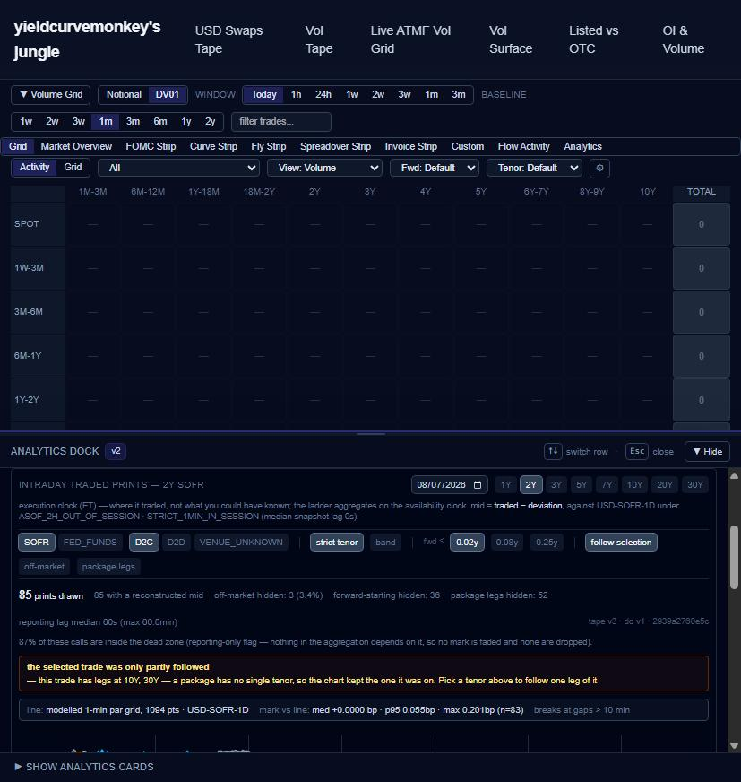

# Intraday prints in the analytics dock, following the tape's selection

Follows [#450](https://github.com/yieldcurvemonkey/ARBS/pull/450), now merged.
One commit, 7 files.

The prints figure now lives **where you look for analytics** — the dock behind
**“▲ Show Analytics”** — instead of the Volume Grid’s *Analytics* tab, and it
**follows the trade selected in the tape above it**. It is mounted once, not
twice: removed from `AnalyticsDashboardView` so there is one instance and one
fetch.

---

## Following the selection

A new `prints` tab renders **outside** the `baseTrade` guard, for the same
reason MMS does and one more: it does not read `rows` at all — it queries one
session of one tenor from its own endpoint.

From the focused row it takes the **tenor, rate index, venue class and tape
day**. Two measured facts shaped that, and both were caught in the browser
rather than by a test:

**1. The tenor is on the LEGS, not the row.** Measured against the live payload,
a tape row exposes `package_tenors`, `legs_count`, `rate_index_clean` and
`legs_json` — and no `tenor_display`. That field is per leg. The first cut read
it off the row, got `undefined` for every trade, and the panel correctly refused
to follow anything at all.

**2. The tape day is not the execution date.** `as_of_date` rolls at **20:00
ET**, so an evening print belongs to the *following* session. Deriving the day
from the calendar date would query the wrong session for every evening trade and
render an empty chart that reads as “nothing traded”.

## Nothing is guessed

A package has no single tenor — the live tape includes a 17-leg trade running
4Y/5Y/7Y. So a multi-tenor selection does **not** pick a leg. It leaves the
chart where it was and says which tenors were there:

> the selected trade was only partly followed
> — this trade has legs at 10Y, 30Y — a package has no single tenor, so the
> chart kept the one it was on. Pick a tenor above to follow one leg of it

Same for a tenor outside the eight the chart draws. Silently swapping in a
different instrument under the reader’s own selection is the failure this whole
panel is built against.

Following is a **toggle**, not a cage — unpin to hold one instrument on screen
while clicking around the tape.

## Verified in Chrome, not headless

Driven through the real browser:

- the dock opens and the **Intraday Prints** tab renders the Plotly figure;
- selecting a 2Y outright moves the panel from `10Y SOFR` to **`2Y SOFR`** with
  the 2Y chip lit;
- selecting a package shows the refusal above rather than swapping in a leg;
- the grid chip reads `1094 pts · USD-SOFR-1D · med +0.0000 bp · p95 0.055bp ·
  max 0.201bp (n=83)`.

**One thing headless would never have found:** `/usd-swaps-v2` is a redirect
shim to `/usd-swaps`, and a browser holding a page across a rebuild gets
`ChunkLoadError` — `next start` serves HTML from the build it booted with, so
the server must be restarted after every rebuild.

## Tests

51 in the prints suites (+11 for following), **1,697 total**. Five failures, all
pre-existing and none in this diff:

| suite | |
|---|---|
| `LegsSubTable`, `MmsTab` ×3 | pre-existing; verified failing at `origin/main` earlier in this work |
| `volume-grid › discovers fomc bucket labels (filters to upcoming)` | **newly red, not from this change** — it hardcodes `JUL26`/`SEP26`/`DEC27` against a 30-day lookback and expired when the clock rolled to 2026-08-13. A time-bomb test; one line to make the labels relative to `now`. |

`tsc` clean, `next build` clean.
