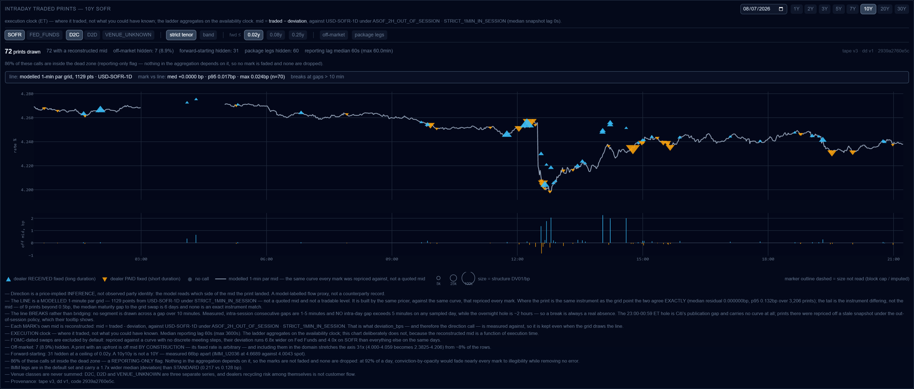

# dealer_flow_chart on the front end — a Plotly figure on the Citi curves

Stacked on [#445](https://github.com/yieldcurvemonkey/ARBS/pull/445). Base is
`feat/tape-flow-chart-base` (= `4df5e368`), so this PR is only the flow-chart
work; everything under it — the materialisation tables, the ladder, the prints
API, the performance fixes — is #445's.

Ports `notebooks/exploratory/dealer_flow_chart.ipynb` to the Analytics view:
**the intraday timeseries of swap mids, annotated with which side the dealer
took on every print.**

---

## Net diff is 5 files, and that is the point

The first commit built this on the **wrong curve** and the second removes it.
Both are kept so the reasoning is on the record, but a reviewer only needs the
net effect:

| file | |
|---|---|
| `IntradayPrintsPlot.tsx` | **new** — the Plotly figure |
| `IntradayPrintsPanel.tsx` | swaps recharts + the hand-drawn deviation strip for it |
| `img/fe-09-intraday-prints-plotly.png` | what it looks like |
| `scratch/stir01_…`, `scratch/stir02_…` | the probes that closed the curve-source question |

## The wrong turn, and what it measured

I first built this on `arbs_stir_direction_v1` — the STIR classifier — whose
`curve_mid` comes from the Barchart STIR curve
(`USD-OIS-Q12xM12STIRT-SERFFX-MIX23`). That was the wrong source: **the Citi
Velocity direction already exists for every printed SDR swap**, as
`arbs_dd_unit_v1` plus the `arbs_dd_curve_mid_v1` 1-minute Citi par grid, both
already backfilled in #445. So the chart never needed a new data source — it
needed a new renderer.

The STIR panel, its two routes and its tests are **deleted rather than left
mounted**: dead code with the wrong curve behind it is an invitation to plot the
wrong thing.

One measurement from that detour is worth keeping. `scratch/stir01` priced the
Citi curve against the stored Barchart mid on the reference cell
(2026-07-29, the July→September FOMC structure, Fed Funds, 105 trades):

| | |
|---|---:|
| Citi priced | **105 / 105** |
| Citi − Barchart mid | median **+0.645 bp** (p05 +0.182, p95 +1.094) |
| RECEIVED spread, Barchart → Citi | **1.472 → 0.257 bp** |
| unit-conversion control | median abs err **0.000000 bp** |

The two mids are **not interchangeable** — a systematic sub-bp basis that eats
most of a typical receive's edge. That is why the Citi-derived direction is the
one to draw, and why swapping curves under a direction derived from the other
one would put marks on the wrong side of their own line.

## The figure

One Plotly figure replacing the recharts chart **and** the separate hand-drawn
deviation strip. Follows the dynamic-import + `purge` pattern already used by
`DockTimeseriesChart` in the same directory — `plotly.js-dist-min` is ~3 MB and
must not reach the initial bundle, and it has no SSR story.

- **Dark** — transparent paper, slate plot ground, monospace slate ink.
- **Crosshair** — `hovermode: 'x unified'` with spikes on both axes,
  `spikemode: 'across'`. Verified live: 4 spike lines and one hover label
  carrying `11:42 · mid 4.24595% · dealer RECEIVED · traded 4.24590% ·
  deviation 0.062 bp · DV01 51,253 / bp · 63.0M · 10Y · STANDARD`.
- **Two panels, one x axis** — rate on top, signed distance from mid below,
  sharing `xaxis` so the spike crosses both. The question a reader has at a mark
  is *how far off mid was that*, and the answer is directly underneath it.
- **Filters** unchanged: tenor, rate index, venue class, strict/band tenor
  match, forward-start ceiling, off-market, package legs. Pan and scroll-zoom on.

## Everything it refused before, it still refuses

- **Off-domain marks are PINNED to the edge** and never own the axis — 11
  off-market prints stretched the traded band **31×** on the reference day.
- **The mid line breaks rather than bridging** (`connectgaps: false`), solid for
  the real 1-minute grid and dashed for the per-print reconstruction.
- **Direction is never re-derived.** It comes from the server's
  `dealer_direction`; the classifier's call is `sign(deviation − mid_bias)`, and
  re-deriving from `sign(deviation)` alone would invert exactly the near-mid
  prints while looking completely plausible.
- Marks are grouped into ~5 traces by (tone, shape) rather than one per print,
  so the empty-`<Scatter>` defect #445 fixed cannot recur here.

## Verification

Live against a production build: y ticks 4.200–4.260, crosshair working, **no
page errors, no console errors**. `tsc` clean, `next build` clean, 1,691 unit
tests (the 34 STIR tests go with the deleted panel), same 4 pre-existing
failures in `LegsSubTable` / `MmsTab` — verified pre-existing at `origin/main`
in #445.

## Where it lives

`/usd-swaps-v2` → the **Volume Grid** card → the **Analytics** tab (last of ten:
Grid · Market Overview · FOMC Strip · Curve Strip · Fly Strip · Spreadover Strip
· Invoice Strip · Custom · Flow Activity · **Analytics**).

⚠️ The **“▲ Show Analytics”** button at the top right opens a *different*
component (`AnalyticsPanel`, a bottom dock) and does **not** lead here. Two
unrelated things share the name; worth renaming one of them.

