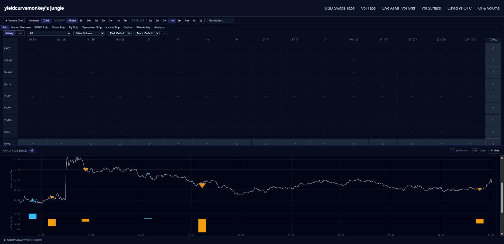

# CURVE and FLY structures on the intraday chart

Follows [#453](https://github.com/yieldcurvemonkey/ARBS/pull/453), merged. One commit.

Selecting a 10s30s on the tape used to say *“a package has no single tenor, pick
a leg.”* That was wrong, and I was wrong to write it. **A 10s30s curve is an
instrument**: it has a level (a bp spread), a continuous mid (its two legs of the
1-minute Citi grid combined under the same weights), and a direction the pipeline
already computes at **structure grain**. “No single tenor” is not “no instrument”.

Selecting a curve or fly now opens its own chart — the minutely spread with every
print of that structure and the dealer’s side on each.



---

## The arithmetic is exact, not reconstructed

`deviation_bps` is already structure-grain, so:

```
structure_bp = 100 * SUM_i q_i * (fixed_rate_i * 100)
mid_bp       = structure_bp - deviation_bps
q = (1) OUTRIGHT   (-1,+1) CURVE   (-1,+2,-1) FLY
```

Verified on **25,692 units over 26 months** — CURVE 17,197/17,197 to 1.3e-12 bp,
FLY 8,495/8,495 to 2.2e-12 bp. Three wrong FLY hypotheses were run as a mutation
test on the checker itself and all fail loudly (negated weights median |err|
4.76 bp; belly at index 0, 14.55 bp; belly at index 2, 14.73 bp).

**Hand-traced against the trade this was reported on**, `PTS_4652395859000000101`:
legs 4.2395 / 4.4550 → `(4.4550 − 4.2395) × 100` = **21.5500 bp**, exactly the
`RATE 21.55 bps` in the tape header, with mid 21.5955, dealer PAID, DV01 20,348,
notional 37.0 MM — every field matching.

The grid line is the same combination applied to `arbs_dd_curve_mid_v1`, and
reproduces the per-print mid to a **median 3.98e-13 bp** over 3,372 prints — 567
minutely points on the reference cell.

## Four defects this found, three of them mine

**1. A sign inversion I had already written.** My first cut ordered the tenor
tuple by tenor-years. That disagrees with the pipeline’s canonical order
(`expiration_date, effective_date, trade_id, leg_order`) on **3.55% of CURVE
units** and *inverts* them: `CURVE_10_1159337735` is 10Y10Y vs 20Y10Y — canonical
**−70.500 bp**, tenor-sorted **+70.500 bp** — decided by two `tenor_years` that
differ by 0.003. Selection is now **set equality** and the row’s own canonical
tuple is returned as the authority. Order can no longer decide a sign.

**2. The grid is spot-only.** 0 of 4,529 forward-start legs match it (max residual
35.6 bp) and 37% of CURVE units carry a forward leg. The line is now **withheld**
when any drawn print is forward-starting, and says so, rather than drawing a spot
par spread under marks that are not on it.

**3. A reversed tuple returned HTTP 200 with zero rows** — a silently empty chart,
the exact failure this panel exists to prevent. Fixed by the set equality above.

**4. The counts were not a partition** — 6 of 16 units on the reference cell fell
into no bucket, so the chips under-reported what was hidden. They now sum.

## A regex that could never match

`structureOf` returned null for every structure while every probe showed perfect
inputs (`package_structure` `"10Y/15Y/30Y Fly"`, legs `["10Y","15Y","30Y"]`).
Cause: I wrote the pattern through a shell heredoc, so `\b` arrived as a literal
**backspace byte (0x08)** and the pattern was `/<BS>curve$/i`. `CLAUDE.md` warns
about exactly this. Found with `cat -A`, pinned by a unit test on the live
inputs, and the whole diff is now scanned for stray control bytes.

## One more hazard, disclosed rather than hit

`dealer_direction` is **not** `sign(deviation_bps)` — the pipeline signs the
**bias-corrected** deviation (`dev − b0`), which matches on **100.000%** of units
against 96.1% for the raw sign. Nothing here re-derives it; the stored call is
used, and the chart says so.

## Scope and risk

The outright path is **untouched** — a new endpoint (`/direction/structure`) and a
new panel, so the already-merged chart carries no regression risk. The dark
Plotly layout is extracted to `analytics-plotly.ts` so the two charts cannot drift
apart on crosshair, ink or hover.

Verified in Chrome: selecting a curve gives **“10s30s curve — SOFR · D2C”**, 6
prints, y-axis 21.00–23.00 bp.

**Tests:** 1,700 pass (+3 `structureOf`). Five pre-existing failures, none in this
diff — `LegsSubTable`, `MmsTab` ×3, and `volume-grid › discovers fomc bucket
labels`, which hardcodes `JUL26`/`SEP26`/`DEC27` against a 30-day lookback and
expired when the clock rolled. `tsc` clean, build clean.
