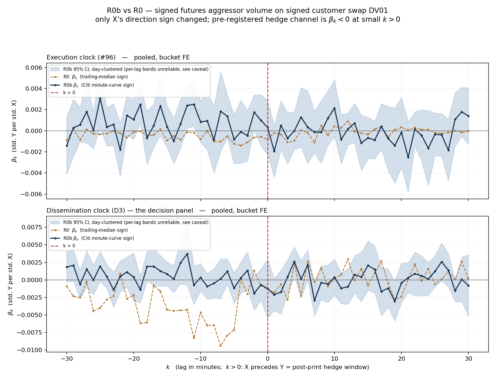

# R0b — result

**Verdict under `r0_prereg.md`, verbatim, on the dissemination clock: FAIL.**
**Verdict after `r0b_prereg.md`'s informativeness gate: UNINFORMATIVE — but for a reason
that is itself the finding, and not the reason R0 was uninformative.**

**The second payoff, the pre-registered `k < 0` discriminator, is decisive: the trough
VANISHED.** R0's coherent pre-print trough — `sum(beta_k, k<=-1) = -0.1075`, `t = -5.90`,
48% of the mass in `k = -17..-2` — becomes `+0.0159`, `t = +1.955`, *insignificant under
the governing inference and of the opposite sign*, with 88% of the whole `|beta_k|` profile
being what pure noise would produce. Against the table fixed in advance in
`r0b_prereg.md`, that is the third row: **it was the stale-median artifact, as R0's caveat
1 hypothesised — established more strongly than the collapse case would have.**

**In one sentence:** with the direction sign taken from a real-time curve instead of a
trailing median, there is no post-print hedge signal (`sum(beta_k, k>=1) = -0.0011`,
`t = -0.13`) *and* the pre-print mass that was R0's only significant finding disappears —
so R0's `k < 0` trough was an artifact of its own mid rule, and the hedge channel is now
excluded down to `|sum beta_k| = 0.019` rather than 0.062.

This was the outcome recorded in advance. `R0_RESULT.md` states, before R0b was run, that
because `rho` is a lower bound R0b was **expected to return FAIL rather than PASS**. It
returned FAIL. No surprise clause is invoked.

Run once, one specification, on 2026-08-11. Estimator: `r0_leadlag/run_r0b.py`.
X builder: `r0_leadlag/build_x_r0b.py`. Outputs: `out/r0b_betas.png`, `out/r0b_table.csv`,
`out/r0b_betas.csv`, `out/r0b_verdict.txt`, `out/r0b_gate.csv`, `out/r0b_xcorr.csv`,
`out/r0b_coverage.csv`, `out/r0b_run.log`, `out/r0b_x_build.log`.

---

## The one change, and the proof that it is the only one

X's direction sign is now `sign(fixed_rate - Citi USD-SOFR-1D minute-curve par rate)` at
the print's snapped execution minute, read through `IRSwapsMDP(source="citivelo_excel_rl")`
— the RL token. `+1` above mid, `-1` below, full stop: no probability model, no `tau`, no
dead zone, no import of `SDRUtils.dealer_direction` or `SDRUtils.stir_flow`.

That the rest is untouched is not asserted, it is **gated**. `build_x_r0b.py` first
re-derives *R0's own X* from the same per-print frame using the median sign and compares it
to `data/x_signed_dv01.parquet`:

```
shape (281197, 8) vs (281197, 8)   unmatched cells 0
max |d signed_dv01| = 0.000e+00    max |d gross_dv01| = 0.000e+00   max |d n_prints| = 0
```

Bit-exact. The binning, the bucket map, the dv01, the two clocks, the emit window and the
grain are therefore R0's, and the R0b file differs from R0's in exactly one column.
`run_r0b.py` then imports `rolling_scale`, `build_grid`, `make_design`, `run_one`,
`ols_with_ses`, `lincomb`, `diffcomb`, `x_series` and `selftest` from `run_r0.py` rather
than copying them, so the estimator cannot drift either. Y was not touched.

## The headline

```
N_days = 67   (distinct CME session dates in the estimation sample)
N_bins = 402,946 bucket-minute observations
          (of 421,666 on Y's grid; 18,720 dropped as session edges)
```
Identical to R0's, as it must be — Y and the grid are unchanged.

**Pooled, dissemination clock, all flow — the panel the decision rule is read off:**

| quantity | R0b | day-clustered SE | day-clustered t | Newey-West t (60) | R0, for contrast |
|---|---|---|---|---|---|
| `sum(beta_k, k <= -1)` | **+0.01591** | 0.00814 | **+1.955** | +2.38 | −0.10746 (t −5.90) |
| `sum(beta_k, k >= +1)` | **−0.00114** | 0.00901 | **−0.13** | −0.16 | +0.00761 (t +0.59) |
| difference (pos − neg) | −0.01706 | 0.01456 | −1.17 | −1.71 | +0.11508 (t +5.18) |
| `beta_(k=0)` | −0.00124 | 0.00213 | −0.58 | — | −0.00135 (t −0.63) |

- `|S_pos| / |S_neg|` = **0.072**. PASS needs ≥ 2.0.
- post-print share = **0.067**.
- **`t = +1.955` on the pre-print sum is BELOW the 1.96 criterion**, not above it. The
  rounding to "+1.96" in the console log is a rounding. Newey-West puts it at +2.38; the
  prereg says day-clustered governs, so **the pre-print sum is not significant**. Recorded
  as a cluster/NW disagreement, in the same spirit as R0's caveat 8.

Against the pre-registered rule:

> FAIL = mass concentrated at `k < 0`, **or** post-print mass indistinguishable from zero
> under day-clustered standard errors.

The post-print sum is indistinguishable from zero (`t = -0.13`, an eighth of R0's already
insignificant t). The first FAIL limb no longer applies — the `k < 0` mass is gone — so
**R0b fails on the post-print limb alone**, which is the limb that was never in doubt and
never rested on the artifact.

## The chart



`out/r0b_betas.png`, two panels, both runs on the same axes, day-clustered 95% bands on
R0b. The dissemination panel is the whole result: R0's orange profile digs a coherent
trough from about `k = -20` to `k = -2` and R0b's navy profile is scatter around zero.

**The per-lag bands are not reliable and are drawn only for shape.** With `G = 67`
clusters against 66 lag regressors plus five Y lags and the absorbed fixed effects, the
cluster meat matrix has rank at most 67; per-lag standard errors, per-lag bands, and any
"coherent trough" language about individual lags are all unreliable in both directions.
The one-dimensional sums that decide the verdict are single linear combinations and are
unaffected.

## The `k < 0` discriminator — the second payoff

Pre-registered reading, from `r0b_prereg.md`:

| R0b outcome at `k < 0` | reading |
|---|---|
| trough **survives**, spanning ~`-20..-2` | genuine pre-dissemination activity |
| trough **collapses to `\|k\| <= 1`** | the stale-median artifact |
| trough **vanishes entirely** | same conclusion, more strongly |

Measured, dissemination clock, pooled, in R0's own windows:

| window | R0 sum | R0 mass share | **R0b sum** | **R0b mass share** |
|---|---|---|---|---|
| `k` −30..−18 | −0.03588 | 24.6% | +0.00832 | 21.1% |
| **`k` −17..−2** | **−0.07075** | **48.0%** | **+0.00829** | **26.2%** |
| `k` −1 | −0.00083 | 0.5% | −0.00070 | 1.0% |
| `k` 0 | −0.00135 | 0.9% | −0.00124 | 1.7% |
| `k` +1 | −0.00181 | 1.2% | −0.00210 | 2.9% |
| `k` +2..+17 | +0.00792 | 15.3% | +0.00085 | 27.5% |
| `k` +18..+30 | +0.00151 | 9.5% | +0.00011 | 19.6% |

**This is the "vanishes" row.** Four independent ways of saying so:

1. **Magnitude.** `|S_neg|` falls from 0.1075 to 0.0159, a factor of 6.8, and loses
   significance under the governing inference.
2. **Sign.** What remains is *positive* — the opposite of R0's. A real pre-dissemination
   phenomenon cannot reverse sign when the mid convention changes.
3. **Shape.** The two `k<0` windows carry 21.1% and 26.2% of the mass across 13 and 16
   lags respectively — i.e. flat, not troughed. R0's `-17..-2` carried 48.0% over 16 lags.
   The five most negative R0b lags are `-2, -23, -19, -5, -9`: scattered, where R0's were
   `-7, -11, -6, -5, -9`, adjacent and inside the measured publication lag.
4. **Noise floor.** Under the global null, `E[sum |beta_hat_k|] = sum se_k * sqrt(2/pi)`.
   For R0b's dissemination profile that is **0.06321 against an observed 0.07190 — 88% of
   the mass is what pure noise produces** (96% on the execution clock). The same
   calculation on R0 gives **61% (diss) and 65% (exec)**, reproducing the figures the
   adversarial review measured independently, which is how this implementation was checked
   before being applied to R0b. R0's profile stood materially above its noise floor; R0b's
   barely clears it.

**The collapse case is foreclosed by measurement, not by argument.** The prereg's sharp
reading — sub-minute staleness can only show at `k = -1` — required the curve to be at
most one minute stale. It is: **100.000% of the 166,155 joins matched at an offset of
exactly +0 minutes** (`exec_min - ref_min`), i.e. the curve is read at the start of the
print's own minute, never earlier. The 2-minute `merge_asof` tolerance never had to reach
past one minute. And `k = -1` carries 1.0% of the mass, sum −0.00070. The trough did not
hide at `k = -1`; there is no trough.

**D2, the centroid of the `|beta_k|` mass**: diss **−0.570** bins for R0b against **−6.46**
for R0; exec −1.482 against −3.26. The mass has moved back to the origin. Reported with
the caveat the review established: at an 88% noise share this statistic is largely a
decomposition of noise, and the two panels are contaminated by different amounts (88% vs
96%), so the diss−exec difference is not interpretable for R0b. No de-noised centroid is
published — `E|beta_hat| != |beta| + se*sqrt(2/pi)` when `beta != 0`.

## The informativeness gate — verbatim, then the degeneracy

`r0b_prereg.md`: *R0b is informative iff its MDE is below the magnitude of the pre-print
mass it measures.* `rho` for R0b is 1 by construction; it was computed rather than assumed
(`corr(X_R0b, X_curve) = 1.000000`) and divided by, so `MDE = 1.96 * SE(sum beta_k, k>=1)`.

| scope | MDE | `\|S_neg\|` | gate | R0's MDE | R0b is better by |
|---|---|---|---|---|---|
| POOLED | 0.0177 | 0.0159 | **UNINFORMATIVE** | 0.0620 | 3.5× |
| SFR_FF | 0.0193 | 0.0082 | **UNINFORMATIVE** | 0.263 | 13.6× |
| TU | 0.0462 | 0.0263 | **UNINFORMATIVE** | 0.154 | 3.3× |
| FV | 0.0325 | 0.0255 | **UNINFORMATIVE** | 0.089 | 2.7× |
| TY_UXY | 0.0341 | 0.0076 | **UNINFORMATIVE** | 0.082 | 2.4× |
| US | 0.0466 | 0.0173 | **UNINFORMATIVE** | 0.185 | 4.0× |

**Six of six scopes are UNINFORMATIVE and that is the label**, applied verbatim, not argued
away. But the degeneracy was **pre-declared, in `r0b_deviations.md` R0b-6, before the
estimator was written**:

> if the `k < 0` trough collapses — which is one of the two pre-registered discriminator
> outcomes — then `|S_neg| -> 0` and this gate fails *by construction*, in every bucket,
> however good R0b's power actually is.

That is exactly what happened. The gate compares R0b's power against a yardstick that the
discriminator destroyed: `|S_neg|` is no longer a real effect, it is an insignificant
residue 88% of which is noise. **R0b's power did not deteriorate — it improved by 2.4× to
13.6× in every bucket**, and the pooled MDE of 0.0177 is the smallest number this program
has produced. The gate's answer and the plain-English answer point in opposite directions,
and both are reported because the rule says so.

The pooled margin is narrow — 0.0177 against 0.0159, 11% — and is recorded here as R0's
caveat 10 recorded its own narrow margin. Per bucket it is not close (TY_UXY 0.0341 against
0.0076).

## What R0b actually excludes — the number that matters

R0's attenuation-corrected 95% interval on the **true** post-print sum was
`(-0.043, +0.081)`, and `ATTENUATION.md` recorded that a true hedge channel of −0.043 —
two-thirds the size of the pre-print mass R0 detected — **was not excluded**.

R0b's interval, with `rho = 1` so no correction is needed:

```
-0.00114  +-  1.96 x 0.00901   =   (-0.0188, +0.0165)
```

**The moderate hedge channel R0 could not exclude is excluded.** Anything as large as
−0.019 standardised units in the pre-registered direction is now outside the interval. That
is the single most decision-relevant number R0b produces, and it is a reporting of the
same interval inversion `ATTENUATION.md` performed, not a reinterpretation.

Scope, per `r0b_prereg.md`: **decisive for TU / FV / TY_UXY / US, provisional for SFR_FF**,
pending leg-level combo reconstruction, which was not run. SFR_FF is doubly provisional —
24.66% of `sr3` and 20.67% of `zq` volume is in the excluded combo instruments on the Y
side, and R0b's X covers only 30.1% of its DV01 on the X side.

## Per bucket — dissemination clock, all flow

| bucket | `sum(beta_k, k<=-1)` | t | `sum(beta_k, k>=1)` | t | post-print share |
|---|---|---|---|---|---|
| SFR_FF | +0.0082 | +1.16 | −0.0074 | −0.75 | 0.472 |
| TU | +0.0263 | +1.55 | −0.0022 | −0.09 | 0.078 |
| FV | +0.0255 | +1.85 | −0.0180 | −1.09 | 0.414 |
| TY_UXY | +0.0076 | +0.46 | +0.0085 | +0.49 | 0.528 |
| US | +0.0173 | +1.03 | +0.0155 | +0.65 | 0.472 |

**Zero of five buckets show significant pre-print mass** (R0: five of five) and **zero of
five show significant post-print mass** (R0: zero of five). The disappearance is uniform;
no bucket dissents.

## The execution clock, and the significant positive `k < 0` there

Pooled, execution clock, all flow: `sum(beta_k, k<=-1)` = **+0.0210, t = +2.56**, and
D2C-only **+0.0239, t = +3.17**. This is significant, it is in `out/r0b_table.csv`, and it
must be addressed rather than left for a reader to find.

It is the **mirror** of R0's artifact, and it strengthens the artifact reading rather than
complicating it. R0's caveat 1 laid out the chain for a stale median: futures are bought,
yields fall, the next prints sit *below* a median still holding older higher rates, so
`X < 0` follows `Y > 0` — a negative `beta` at `k < 0`. Under a real-time curve the
staleness sits on the other side of the comparison: the curve marks down immediately while
a printed swap rate was agreed at a level struck slightly earlier, so the print sits
*above* the freshly lowered mid and `X > 0` follows `Y > 0` — a **positive** `beta` at
`k < 0`. Each mid rule produces mechanical pre-print mass with the sign its own staleness
direction implies. That two opposite conventions produce two opposite `k < 0` masses is
evidence that **neither** is pre-dissemination information.

Stated as a caveat, with both candidate explanations — print-versus-curve latency, or
noise, since 96% of the execution profile's mass is at the noise floor — and **no variant
run was made to choose between them**.

Post-print, execution clock, pooled: `sum(beta_k, k>=1)` = −0.0049, `t = -0.61`. The hedge
*mechanism* is not detectable either, now at 2.4–13.6× the power R0 had.

## Direct comparison to R0 — how far the input moved

`corr(X_curve, X_curve)` is 1, so the informative comparison is between the two series the
two regressions actually consume, on Y's own grid after R4 standardisation:

| measure | exec | diss |
|---|---|---|
| Pearson, standardised (the regression's own input) | **+0.106** | **+0.257** |
| Spearman, same series | +0.230 | +0.226 |
| Pearson, unstandardised | +0.337 | +0.320 |

The standardised Pearson is outlier-dominated — the top 1% of cells carry 93% (exec) and
90% (diss) of the covariance — which is why it differs so much between two clocks that
share every sign. The rank and unstandardised measures are stable at ~0.23 and ~0.33 and
are the honest summary: **the two X's share roughly a quarter to a third of their
variation.** Per bucket, standardised, dissemination: SFR_FF +0.107, TU +0.259, FV +0.380,
TY_UXY +0.328, US +0.280 (`out/r0b_xcorr.csv`).

This number confounds two things and is labelled as doing so: sign *disagreement* on prints
both rules sign (67.6% agreement on the 161,604 prints where both are non-zero, against
D1's 68.3% on its smaller sample), and *coverage difference* (below).

## Coverage — reported, not assumed

A print with no curve is **dropped, not defaulted**: it contributes 0 to `signed_dv01`,
which is estimation-identical to deletion because `x_series` reads that column and nothing
else. `gross_dv01` and `n_prints` still count every in-scope print, and are byte-identical
to R0's file, so the signed share is readable from the file itself.

| bucket | in-window prints | R0 signed (prints / DV01) | **R0b signed (prints / DV01)** |
|---|---|---|---|
| SFR_FF | 41,745 | 86.1% / 89.3% | **42.1% / 30.1%** |
| TU | 38,575 | 91.7% / 91.1% | **49.0% / 47.7%** |
| FV | 87,204 | 93.0% / 95.1% | **58.5% / 59.2%** |
| TY_UXY | 73,682 | 92.5% / 93.0% | **64.3% / 64.7%** |
| US | 51,319 | 89.7% / 87.9% | **61.1% / 59.6%** |
| **ALL** | **292,525** | **91.1% / 91.7%** | **56.8% / 57.7%** |

Three restrictions, all in `r0b_deviations.md` R0b-3 before execution:

- **Spot-starting only.** A forward-start print is not comparable to a spot par rate, and
  `fwd_key` is a *bucketed* label (`0-3M`, `3-6M`, …) from which no exact forward start can
  be recovered. 40% of legs are forward-starting and they are concentrated in the front
  end, which is why SFR_FF's DV01 coverage is 30.1%.
- **Non-MAC.** A MAC coupon is not a par rate.
- **Citi's published session, 01:00–22:59 ET.** 98.2% retained (3,175 legs excluded).
  Citi publishes nothing 23:00–00:59 ET and the minute store has no lag tolerance: the pull
  logs show it serving a snapshot from *after* the requested instant and from a different
  local date, both at the ET-midnight boundary. For a rule that infers direction from a
  print, a forward-looking reference is circular, so those minutes are excluded rather than
  filled.

**Inside the emit window the join then matches 100.0%** — every one of the 10,697 unmatched
prints is a pre-window mid warm-up leg from 2026-04-24..04-30, outside the R0 window
entirely, which the reference series does not span and which contributes no row to X.

The reference tenor set was **extended from D1's twelve to twenty-eight** under a rule
frozen before the first pull (R0b-4): every tenor label present among spot non-MAC
in-window prints that is in `SPOT_TENORS`, intersected with the pulls that complete. All 28
completed; none was excluded. This lifted coverage from 49.0% to 57.7% of in-window DV01,
with the gains concentrated in US and SFR_FF. D1's twelve were a *diagnostic sample* —
adequate for measuring `rho`, but an unforced attenuation of X if inherited as the input.

## Splits

Full grid in `out/r0b_table.csv` (60 rows). No verdict is read off a split.

Cells where `sum(beta_k, k>=1)` is significant, out of 60: **five**, and they do not agree
with each other — `exec nonblock FV` −0.0272 (t −1.98), `diss block POOLED` −0.0154
(t −2.24) and `diss IDB TU` −0.0027 (t −3.53) carry the registered negative sign, while
`exec IDB US` +0.0377 (t +2.01) and `diss IDB US` +0.0625 (t +3.31) carry the wrong one.
Three and two out of sixty is what noise looks like, and the two IDB US cells are the same
cell on two clocks. R0 found the same pattern (three the registered way, four the other).

The pre-print side is where the change shows: R0 had significant negative `k<0` mass in
essentially every non-block and D2C cell on both clocks. R0b has 18 significant `k<0` cells
of 60, **16 of them positive** and the two negatives both in IDB FV, with 13 of the 18 on
the execution clock and most of the rest in D2C — consistent with the mirror-artifact
reading above.

## The two attenuation measurements (adversarial-review addendum)

Requested after the R0b freeze and after the reference pull had started; computed by
`run_r0b_attenuation.py`, output in `out/r0b_dense_rho.csv`,
`out/r0b_variance_decomp.csv`, `out/r0b_sign_decomp.csv`, `out/r0b_attenuation.log`.
**Neither changes R0's label** — the pre-registered rule fired on the pre-registered
statistic — they size how conservative the downgrade was.

### 1. Dense-grid `rho` — 0.405 was not an artifact of grid sparsity

| grid | `rho` print | `rho` 1-minute | `rho` daily | sign agreement | n prints |
|---|---|---|---|---|---|
| D1's twelve tenors | 0.501 | **0.405** | 0.262 | 68.3% | 139,168 |
| R0b's twenty-eight tenors | 0.475 | **0.406** | 0.214 | 67.6% | 161,604 |

The 1-minute `rho` moves by 0.001 on a print set 16% larger spanning 28 tenors instead of
12. On the **full regression grid** — every bucket-minute Y has, including the empty
minutes D1's `groupby(exec_min)` never saw — the Pearson figure rises to +0.883 (exec) and
+0.481 (diss), but the top 1% of cells contribute 99% and 92% of that covariance and the
Spearman equivalents are +0.316 and +0.317. The dense-grid Pearson is an outlier statistic,
not a denser measurement of the same thing. **Conclusion: D1's 0.405 was not depressed by
grid sparsity.**

### 2. Separating reference error from genuine damping

**Control, reproduced.** Cells of (tenor, 30min) with n ≥ 10: 4,333 cells, 89,901 prints,
**median |cell-median `dev_curve`| = 0.09 bp** — against the review's independently measured
0.11 bp on 89,309 prints. The reference is well centred. (For `dev_median` the same
statistic is 0.25 bp.)

**The moment-based decomposition failed its own known-answer check and is reported as a
failure.** Modelling `dev_curve = d - u`, `dev_median = d - w` with independent errors gives
`sd(d) = 26.1 bp`, `sd(u) = 9.6 bp`, `sd(w) = 12.4 bp`; a Gaussian sign model built from
those three numbers predicts **82.2% per-print sign agreement against 67.6% measured**. The
model is rejected. Two reasons, both visible: winsorising at 1/99 still leaves `sd(d)` at
26 bp against an IQR of 3.4 bp, so the moments are set by the tail; and `u ⊥ w ⊥ d` is
exactly what the high-pass mechanism violates, because a trailing median follows the flow
and so `w` is correlated with `d` by construction. The 0.719 / 0.775 split it implies is
**not** reported as a result. The same failure disposes of the cell-variance route: on
(tenor, 30min) cells the estimate is a difference of two nearly equal 85 bp numbers, and on
(tenor, minute) cells `n >= 10` selects a pathological subset whose median deviation is
16 bp.

**The sign-level decomposition, which is exact for ±1 variables, is identified.** For a
rule with error probability `p`, `corr(sign_rule, sign_true) = 1 - 2p`, and if the two
rules' errors are independent the measured disagreement satisfies
`P(disagree) = p_med + p_cur - 2 p_med p_cur`. Measured `P(disagree) = 0.3239`, so the
sign-level counterpart of `rho` is 0.352. `p_cur` is then simulated from the reference's own
**measured** error: the curve is read at the start of the print's minute, so the staleness
error is `theta x (that minute's reference move)`, `theta ~ U(0,1)`, with the move taken
from the reference series itself (2,739,685 consecutive minutes: p50 0.015 bp, p90 0.131 bp,
p99 0.374 bp).

| error source | `p_cur` | ⇒ `p_med` | `corr(X_med, X*)` | slack vs the bound |
|---|---|---|---|---|
| staleness (identified) | 0.0773 | 0.2917 | **0.417** | **+18.3%** |
| cell bias (not identified) | 0.3189 | 0.0140 | 0.972 | +176% |

Only the first row is a measurement. The second removes each cell's whole median deviation
as if it were reference error, but that median is dominated by genuine cell-level skew —
real order flow trading to one side — and subtracting it flips 31.9% of signs, which would
make the reference *worse* than the median rule. It is shown to record the identification
failure.

**So: `rho_true ≈ 0.405 × 1.183 = 0.479`, still below the 0.50 threshold that fired R0's
downgrade.** The review's point is confirmed and quantified — `rho = 0.405` does understate
the median rule's reliability, R0's MDE of 0.0620 is an upper bound on its blindness, and
the downgrade was conservative — but the correction is **too small to have reversed it**.
R0's label stands, and it stands for the right reason.

The residual slack cannot be identified, and the reason is itself a finding: **32% of
prints sit within 0.09 bp of the curve mid.** For those the "true" sign is not a quantity
any mid rule can recover — it barely exists — so both rules are coin flips there and X
carries ±dv01 of pure noise in *both* specifications. Reference error and absent estimand
are not separable at that scale.

## Caveats

**1. R0b's X measures 57.7% of in-window DV01, R0's measured 91.7%.** This is the largest
limitation R0b imports and it was declared before execution (R0b-3). The exclusions are
structural, not selective within the covered set — forward-starting, MAC, non-`SPOT_TENORS`
tenors, and Citi's 23:00–00:59 ET gap — but front-end hedging is disproportionately
forward-starting, which is why SFR_FF retains only 30.1% of DV01 and why its verdict is
provisional on both sides.

**2. The pre-print sum sits on the significance boundary and the two estimators disagree.**
Day-clustered `t = +1.955`, Newey-West `t = +2.38`. Day-clustered governs per the prereg, so
it is reported as insignificant, but a reader should know the margin is 0.005.

**3. Per-lag inference is unreliable in both directions.** `G = 67` clusters against 66 lag
regressors plus five Y lags and the absorbed fixed effects leaves the cluster meat matrix
of rank ≤ 67. The bands on the chart are shape, not inference. The verdict sums are single
linear combinations and are unaffected.

**4. `sum |beta_k|` is badly noise-contaminated**, at 88% (diss) and 96% (exec) of the
observed mass for R0b. Every mass-share figure and the D2 centroid in this document is
partly a decomposition of noise, and the two panels are contaminated by different amounts,
so the diss−exec centroid difference is not interpretable for R0b as it was for R0.

**5. Y is unchanged and so are all of its limitations.** Combo instruments are excluded
(sr3 24.66%, zq 20.67%, Treasury roots 10–15%); `side = 'N'` volume is unsigned; Y is in
contracts, unweighted; and Y is **aggressor-signed**, so a passively worked hedge enters
with the opposite sign and partially self-cancels. `r0b_prereg.md` records that no version
of R0 or R0b can separate this, because MBO carries no counterparty. R0b resolves the
X-attenuation axis only.

**6. The curve is read at the execution minute on both clocks.** Byte-identity with R0
requires it — `build_x_tape.attach_mid_sign` computes the median in execution order and
applies it to both panels — and it is the correct economics, since whether the customer
paid or received is a property of the trade when it was struck. Declared in R0b-2.

**7. Tenor labels are matched to exact reference tenors.** A print labelled `10y` with
`tenor_years = 10.02` is compared to a 10y par rate. Same convention as D1; the error is a
fraction of a basis point of curve slope and is symmetric.

**8. The reference is one curve provider.** `dev_curve` is `rate - Citi USD-SOFR-1D par
rate`; a different provider would give slightly different signs for prints near mid, which
as measured above is a third of the tape.

**9. SFR_FF carries 44 sessions against 67 for the others**, unchanged from R0.

## Validation — before the estimator touched real data

| gate | result |
|---|---|
| R0's full `selftest()`, imported not copied | PASSED — `beta(+3)` = −0.2106 vs an a-priori −0.2067 (t −68.6); mirror at `k=-3` recovered with `beta(+3)` = +0.0003; null DGP `t = -0.26`; FE absorption 4.2e-15; cluster SE vs statsmodels 3.6e-15 |
| Plumbing on the REAL grid with **R0b's** X (Y := `-0.25*Xstd_(t-7)` + noise) | `beta(+7)` = **−0.2331** vs a prediction of −0.2343, **t = −86.25**; `beta(-7)` = −0.0016; max abs beta at every other lag 0.0019 |
| Session reconstruction vs `data/y_sessions.csv` (hard gate) | counts and dates both match |
| GATE 0 — R0's own X reproduced from the per-print frame | **max abs diff 0.000e+00** on all three columns |
| Units detected from the data, not assumed | median `ref_rate/fixed_rate` = 100.012 → reference percent, tape decimal |
| Orientation, vectorised | **166,155 / 166,155 = 100.0000%** |
| Orientation, by eye | 8 / 8 on prints drawn at a fixed seed, raw numbers printed in `out/r0b_x_build.log` |
| Reference centred | per-day median `dev_curve` p50 −0.05 bp (p5 −0.11, p95 −0.01, worst −0.20); `corr(dev_curve, rate level)` = −0.008 |
| Agreement must RISE with `\|dev\|` | 53→91% by `\|dev_median\|` decile, 50→93% by `\|dev_curve\|`; 90.6 / 94.0 / 97.9 / **99.5%** at 5 / 10 / 20 / 50 bp |
| Curve sign vs `build_x_tape.customer_sign_from_mid` | agrees on 2,000 sampled prints |
| Every reference series re-verified after the move to `D:` | 28 series, 97,858–97,861 minutes each, span checked, duplicate-free, NaN-free |

The estimator can see an effect of this size at this lag, in this data, on this code path,
with **R0b's own X**. It did not see one at `k > 0`.

## Disclosure — how many times things ran, and what changed after the freeze

Recorded because the discipline requires it.

- **`r0b_deviations.md` was written and is unedited since.** It was frozen before the first
  reference pull, because the tenor rule governs the pulls. The coordinator's request for
  the two attenuation measurements arrived **after** that freeze and mid-pull; it has been
  honoured in this file and in `run_r0b_attenuation.py`, and deliberately **not**
  back-written into the deviations record, which would poison its ordering claim.
- **`run_r0b.py` executed exactly twice: once as `--selftest` (preflight, no real data) and
  once for the single real run.** Both invocations were pre-declared in R0b-10. No variant
  was run, no specification was changed after seeing a number, and the verdict comes from
  the first and only real execution.
- **`build_x_r0b.py` executed once.**
- **`run_r0b_attenuation.py` executed three times**, and this must be stated plainly: its
  first two estimators **failed their own known-answer checks** and were replaced. Run 1
  used a Gaussian sign model, which predicted 82.2% agreement against 67.6% measured and
  was rejected. Run 2 replaced it with a threshold bound on `p_cur`, which was degenerate
  because 32% of the tape prints within 0.09 bp of mid. Run 3 is the staleness flip
  simulation reported above. All three are described in this document, including the two
  failures, and none of them touches the pre-registered estimator or its verdict.
- **The reference pull was interrupted twice** — once by three parallel processes
  exhausting RAM (11y, 40y, 18m died with `_ArrayMemoryError`; no orphans survived) and once
  by the 10-minute foreground cap killing 40y and 50y mid-pull. The pull script was made
  chunk-resumable in response and every one of the 28 tenors completed. No tenor was
  excluded, so R0b-4's exclusion clause was never invoked.
- **This agent ran no git write command** and did not edit `r0_prereg.md`,
  `r0_prereg_addendum_1.md` or `r0b_prereg.md`.
- **A concurrent process committed this workstream's in-flight files**, as one did during
  R0. Commit `07eeb1f2` at 17:27:26, authored under the repository's own identity, contains
  the adversarial review's changes to `R0_RESULT.md` together with **`r0b_deviations.md`**
  and an early copy of `scratch_r0b_pull_ref.py`. It was not made by this agent and nothing
  was done to undo it. One useful side effect: the deviations file is now timestamped in the
  git log at **17:27**, nearly an hour before the single real run at **18:23**, so its
  "frozen before execution" claim is checkable by a third party and not merely asserted.
  `r0b_deviations.md` shows no working-tree modification against that commit — the frozen
  content is what was committed. `scratch_r0b_pull_ref.py` does differ, by the chunk-resume
  change described above, which was made after 17:27 and has no bearing on any number.
- All caches were written to `D:\r0b_cache\` (199 MB). **`C:` free space fell from 3.7 GB
  at the start of R0b to 212 MB by the end**, none of it attributable to this workstream —
  its footprint on `C:` is 32 MB of `r0_leadlag/` including the outputs, and the shared
  `data/ts` cache did not grow because `ts_base_dir` was pointed at `D:`. Concurrent work in
  this repository is consuming the volume; flagged because the next process to write there
  may not be so lucky.

---

*Estimator `run_r0b.py`, X builder `build_x_r0b.py`, reference pull
`scratch_r0b_pull_ref.py`, attenuation `run_r0b_attenuation.py`. Everything the data forced
is in `r0b_deviations.md`, frozen before execution.*
