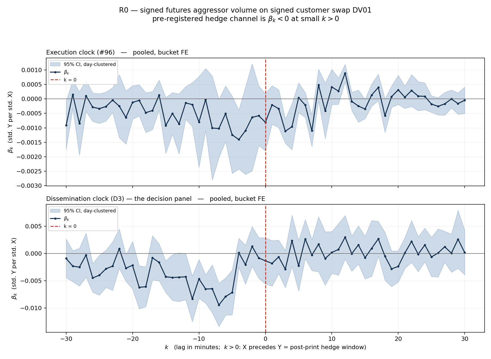

# R0 — result

**Verdict: FAIL**, stated against `r0_prereg.md` verbatim, on the dissemination clock.

The intraday front-running premise does not survive. Customer swap flow, as inferred from
the public SDR tape, does **not** predict signed aggressor volume in the corresponding
futures contract at positive lags. What the data shows instead is the mirror image: the
futures flow is already done by the time the print is public.

Run once, one specification, on 2026-08-11. Estimator: `r0_leadlag/run_r0.py`.
Outputs: `out/r0_betas.png`, `out/r0_table.csv`, `out/r0_betas.csv`, `out/r0_run.log`.

---

## The headline

```
N_days = 67   (distinct CME session dates in the estimation sample)
N_bins = 402,946 bucket-minute observations
          (of 421,666 on Y's grid; 18,720 dropped as session edges)
```

| bucket | N_days | N_bins |
|---|---|---|
| SFR_FF | 44 | 57,600 |
| TU | 67 | 86,331 |
| FV | 67 | 86,336 |
| TY_UXY | 67 | 86,340 |
| US | 67 | 86,339 |

**Pooled, dissemination clock, all flow — the panel the decision rule is read off:**

| quantity | value | day-clustered SE | day-clustered t | Newey-West t (60) |
|---|---|---|---|---|
| `sum(beta_k, k <= -1)` | **−0.10746** | 0.01823 | **−5.90** | −9.03 |
| `sum(beta_k, k >= +1)` | **+0.00761** | 0.01280 | **+0.59** | +0.64 |
| difference (pos − neg) | +0.11508 | 0.02220 | **+5.18** | +6.36 |
| `beta_(k=0)` | −0.00135 | 0.00216 | −0.63 | — |

- `|S_pos| / |S_neg|` = **0.071**. PASS needs ≥ 2.0.
- post-print share = **0.066**.
- Day-clustered and Newey-West **agree** on every significance call in this panel.

Against the pre-registered rule:

> FAIL = mass concentrated at `k < 0`, **or** post-print mass indistinguishable from zero
> under day-clustered standard errors.

**Both** FAIL conditions hold. The post-print sum is indistinguishable from zero
(t = +0.59), and the mass is concentrated at `k < 0` (t = −5.90). It is not a marginal
call in either direction.

Note also that the small post-print sum that does exist has the **wrong sign**
(+0.0076, i.e. positive X → positive Y). The prereg fixes the sign in advance —
`customer pays fixed → dealer received → dealer long duration → dealer SELLS futures`,
so the hedge channel is `beta_k < 0`. A positive `beta` "is not a pass, it is a different
phenomenon". It is in any case not significant.

## The chart



`out/r0_betas.png`. Two panels, execution clock above, dissemination clock below;
day-clustered 95% bands; vertical line at `k = 0`. `k > 0` means X precedes Y, i.e. the
post-print hedge window.

The dissemination panel is the whole result in one picture: a coherent trough of negative
`beta_k` running from about `k = −20` to `k = −2`, and nothing at all to the right of
zero.

## Where the mass actually sits

Pooled, share of total `|beta_k|`:

| window | exec: sum | exec: mass share | diss: sum | diss: mass share |
|---|---|---|---|---|
| `k` −30..−18 | −0.00396 | 16.8% | −0.03588 | 24.6% |
| **`k` −17..−2** | **−0.01063** | **40.7%** | **−0.07075** | **48.0%** |
| `k` −1 | −0.00058 | 2.2% | −0.00083 | 0.5% |
| `k` 0 | −0.00081 | 3.0% | −0.00135 | 0.9% |
| `k` +1 | −0.00021 | 0.8% | −0.00181 | 1.2% |
| `k` +2..+17 | −0.00218 | 27.9% | +0.00792 | 15.3% |
| `k` +18..+30 | −0.00046 | 8.7% | +0.00151 | 9.5% |

Most negative lags on the dissemination clock: **k = −7, −11, −6, −5, −9**.

The publication lag for exactly these prints, measured first-hand from
`cache/tape_legs_signed.parquet`, is **p5 2.77 / p50 4.70 / p95 17.23 minutes** (min 1.10,
zero negative lags, 292,525/292,525 recovered). The `beta_k` trough sits exactly inside it, and 48% of the mass falls
in `k = −17..−2`. That is not a coincidence and it is not a specification error — the
addendum anticipated it in writing:

> a hedge executed shortly after the trade can land **before** dissemination, appearing at
> negative `k` on the dissemination panel. That is a real property of the opportunity, not
> a specification error.

**D2, the attenuation-invariant statistic** (centroid of the `|beta_k|` mass):
exec **−3.26** bins, diss **−6.46** bins, difference **−3.20** bins. Moving from the
execution clock to the dissemination clock shifts the mass 3.2 minutes further into the
past — the right order of magnitude for a ~5-minute median publication lag, and derived
from the betas alone, so it is immune to the attenuation discussed below.

## Per bucket — the same result five times

Dissemination clock, all flow:

| bucket | `sum(beta_k, k<=-1)` | t (day-clust) | `sum(beta_k, k>=1)` | t (day-clust) | post-print share |
|---|---|---|---|---|---|
| SFR_FF | −0.1325 | **−3.37** | −0.0085 | −0.18 | 0.061 |
| TU | −0.0508 | **−2.48** | −0.0044 | −0.15 | 0.079 |
| FV | −0.1179 | **−4.48** | +0.0356 | +1.90 | 0.232 |
| TY_UXY | −0.1538 | **−4.84** | −0.0162 | −0.79 | 0.095 |
| US | −0.1066 | **−3.59** | +0.0339 | +1.13 | 0.241 |

**Five of five decision buckets** show significant pre-print mass and **zero of five**
show significant post-print mass. There is no bucket carrying the pooled result and no
bucket dissenting from it.

## The execution clock says the mechanism is not there either

This is the more damning of the two panels, and the addendum fixed its interpretation in
advance: *"Execution clock, mass at `k > 0` — the hedge mechanism exists: the dealer
trades futures after taking the swap on."*

Pooled, execution clock: `sum(beta_k, k>=1)` = **−0.0029, t = −1.51**. Not significant.
`sum(beta_k, k<=-1)` = −0.0152, t = −1.31. Also not significant.

So it is not merely that the hedge is exhausted before the print is public. On the
execution clock, at pooled level, there is no detectable post-execution futures hedge
either. The only place the registered sign appears significantly at `k >= 1` anywhere in
the all-flow runs is **TU on the execution clock** (−0.0183, t = −2.14) — and Newey-West
puts it at −1.92, below the threshold. Day-clustered governs per the prereg, so it stands
as a lone weakly-significant cell out of twelve; it is not the basis for anything.

## Splits (block / non-block, D2C / IDB)

Full grid in `out/r0_table.csv` (60 rows: 2 clocks x 5 splits x pooled + 5 buckets).
No verdict is read off a split. Nothing in them rescues the premise.

Cells where `sum(beta_k, k>=1)` is significant with the **pre-registered (negative)** sign:

| clock | split | bucket | `sum(beta_k,k>=1)` | t |
|---|---|---|---|---|
| exec | all | TU | −0.0183 | −2.14 |
| exec | D2C | TU | −0.0190 | −2.26 |
| diss | block | US | −0.0342 | −2.59 |

Cells where it is significant with the **wrong** sign:

| clock | split | bucket | `sum(beta_k,k>=1)` | t |
|---|---|---|---|---|
| exec | IDB | US | +0.0600 | +4.86 |
| diss | IDB | US | +0.0588 | +3.66 |
| diss | nonblock | FV | +0.0593 | +3.05 |
| diss | nonblock | US | +0.0605 | +2.16 |

Three cells the registered way and four the other way, out of 48 split cells, is what
noise looks like. The pre-print mass, by contrast, is significant and negative in
essentially every non-block and D2C cell on both clocks — the same finding as the
headline, not a new one.

The block split is the one place with an interpretable structure: **block flow shows no
pre-print mass at all** (diss pooled block `S_neg` = −0.0017, t = −0.18, against
non-block −0.1245, t = −6.16). Blocks carry a statutory 15-minute publication delay, so
by the time a block prints, a 30-minute window either side is mostly outside the relevant
horizon. Consistent with the clock story; not independent evidence for it.

## Do any of the prereg's "uninformative rather than negative" conditions apply?

The prereg lists three, recorded in advance so they cannot be invoked selectively.
**None of them fired.**

| condition | status |
|---|---|
| Fewer than ~20 trading days of overlap between MBO and tape | **No.** 67 session dates for four buckets, 44 for SFR_FF. Both well above the floor. |
| A bucket with no measurable futures flow in the sample | **No.** The smallest decision bucket, US, still carries 25.7m contracts of gross aggressor volume and 2.3m trades; every bucket has substantial flow. |
| A dissemination clock not actually recoverable, forcing a legal-delay estimate | **No.** Verified first-hand: `dissem_is_real` is true for **292,525 / 292,525** execution-in-window legs (100.00%), with **0** negative lags and a minimum lag of 1.10 min. The dissemination panel tests the clock, not an estimate, and needs no such label. |

So the FAIL is a negative result, not an uninformative one, on the prereg's own terms.
The one remaining downgrade path is the addendum-1 rule, addressed next.

## Addendum-1 D1 — is this a real null, or no power?

<!--D1-->

## Caveats

Reported as caveats, per the discipline. None of them was allowed to change the
specification, and the run was not repeated under a variant.

**1. The significant `k < 0` mass has exactly the sign a stale trailing median produces
mechanically.** This is the sharpest caveat on the result and it is worth stating
precisely. X's direction sign is `fixed_rate − trailing same-key median`. Suppose futures
are bought aggressively at time `t` (`Y_t > 0`). Futures price rises, yields fall, and
swap prints over the next few minutes sit **below** a median that still contains the older,
higher rates — so they are classified customer-received, `X < 0`. A pure price-impact
chain with no information content therefore produces `Y_t > 0` followed by `X_{t+j} < 0`,
which is a **negative `beta` at `k < 0`** — precisely what is measured, on both clocks.

The addendum is right that *attenuation* cannot manufacture pre-print mass, because
damping shrinks magnitudes without moving mass across lags. But the median's *staleness*
can, and its sign prediction matches the measurement. So the `k < 0` finding must **not**
be read as evidence of leakage or pre-hedging without further work. D1's sign-agreement
rate is the quantifier of that channel, and no second specification was run to test it —
the addendum licenses `rho` and sign agreement, not another regression.

**Crucially, the FAIL does not rest on the `k < 0` mass.** It rests on `sum(beta_k, k>=1)`
being indistinguishable from zero, and no staleness artifact manufactures a zero.

**2. Combo instruments are excluded from Y, and worst exactly where it matters most.**
Discarded share of traded futures volume: **sr3 24.66%, zq 20.67%** (both in SFR_FF),
against 10–15% for the Treasury roots. A dealer hedging a swap with a futures **spread**
rather than an outright is invisible to Y. This is measurement error in Y — attenuating,
not sign-flipping — but it is the largest single caveat on Y and it is concentrated in the
bucket with the fewest sessions.

**3. `side = 'N'` volume is unsigned, not dropped:** 9.54% (sr3) and 9.87% (zq) of
outright volume, 0.55–1.89% for Treasuries. Attenuating.

**4. 6.5–8.4% of X's DV01 does not land on Y's grid** (exec 92.1% on grid, diss 91.6%),
and for **SFR_FF only 69.8% / 68.9%** does. Two causes: X spans 2026-05-01..08-07 while Y
spans 05-07..08-06, and SFR_FF's Y grid is 44 sessions against X's 68 days. Swap flow that
arrives when the bucket's futures book is outside its session cannot be tested.

**5. SFR_FF carries 44 sessions against 67 for the others**, because the `sr3` MBO extract
is 53 UTC days, not the 79 the brief assumed. Above the prereg's ~20-day floor, but the
SFR_FF panel is two-thirds the length of the others.

**6. Block notionals are capped by rule**, so block-bucket DV01 is understated by
construction (1.91% of in-window prints flagged `is_notional_capped`). No filter applied;
`is_block` is carried as a split.

**7. Y is in contracts, unweighted.** TY_UXY adds ZN and TN contracts and SFR_FF adds SR3
and ZQ contracts without DV01 weighting, as specified. The rolling-standard-deviation
standardisation absorbs the scale but not the relative weighting inside a bucket.

**8. Two marginal Newey-West / day-clustered disagreements**, both in the all-flow runs:
`exec TU k>=1` (cluster −2.14, NW −1.92) and `exec FV k<=-1` (cluster −1.74, NW −1.97).
Both straddle the threshold. Day-clustered governs, per the prereg. Neither affects the
verdict.

**9. A cluster-label defect was caught by the runner's own known-answer gate, fixed, and
the run repeated.** Disclosed in full because it means the script executed twice. The
first execution derived the CME session date as "the date of the session's last minute in
Chicago", which mislabels the four evening-only 2026-08-07 sessions as 2026-08-06 and
merges them into the previous day's cluster (238 of 402,946 observations; 66 clusters
instead of 67). The gate compared the reconstruction against `data/y_sessions.csv`,
reported the mismatch, and — a defect in itself — continued. The fix takes the session
date from `y_sessions.csv`, which is authoritative, and makes the gate hard-fail. The
headline moved by nothing: `S_neg` t **−5.8963 → −5.8963**, `S_pos` t **+0.5947 →
+0.5947**, verdict FAIL both times. The pre-fix log is kept at
`out/_prefix_clusterlabel_run.log`.

## How the estimator itself was validated, before it saw the real data

A lead-lag estimator that is silently transposed reports a clean null and hides exactly
what it was built to find. `run_r0.py` refuses to touch the real inputs until all of the
following pass, and prints them at the top of every run:

| check | result |
|---|---|
| Known effect injected at `k = +3` with the pre-registered negative sign | recovered `beta(+3)` = −0.2106 against **an a-priori prediction of −0.2067** (the prereg standardises both series, so the estimand is `true_b * scale_X / scale_Y`, not `true_b`); rel err +1.9%, t = −68.6; max abs beta at every other lag 0.0092; `beta(−3)` = −0.0044 |
| Mirror: effect injected at `k = −3` | recovered at −3 (−0.2021, t = −60.8); `beta(+3)` = +0.0003, t = +0.11. **Lag orientation is not transposed** |
| Null DGP | `sum(k>=1)` t = −0.26, `sum(k<=-1)` t = +0.34. No manufactured significance |
| Two-way FE absorption vs explicit dummies | max abs diff **4.2e-15** |
| Day-clustered SE vs `statsmodels` `cov_type='cluster'` | max rel diff **3.6e-15** |
| Newey-West vs `statsmodels` HAC | max rel diff 7.5e-04 (small-sample factor differs by design) |
| **Plumbing check on the REAL grid and REAL X** — Y replaced by `−0.25 * Xstd_(t−7) + noise`, same sessions, same sparse-X reindex, same keep mask | `beta(+7)` = −0.2304 against a prediction of −0.2382, t = −41.9; `beta(−7)` = −0.0001; max abs beta at every other lag 0.0025 |
| Session reconstruction vs `data/y_sessions.csv` | session counts **and** session dates match exactly (hard gate) |

The estimator can see a real effect of this size at this lag, in this data, on this code
path. It did not see one at `k > 0`.

**The headline number was then recomputed by a second implementation**
(`scratch_verify_headline.py`): same design matrix, but estimated with `statsmodels`
`OLS(cov_type='cluster')` and the sums formed by `t_test` rather than by the hand-rolled
`c'Vc`.

| | run_r0.py | statsmodels |
|---|---|---|
| `sum(beta_k, k<=-1)` | −0.10746 | −0.10746 |
| `sum(beta_k, k>=+1)` | +0.00761 | +0.00761 |
| difference | +0.11508 | +0.11508 |
| SE on `k<=-1` | 0.01823 | 0.01820 |
| t on `k<=-1` | −5.8963 | −5.9061 |

Point estimates are identical. The standard errors differ by exactly one known factor:
`run_r0.py` counts the **1,324 absorbed fixed effects** in the small-sample correction,
`(n−1)/(n−k−k_fe)`, while `statsmodels` cannot see them and uses `(n−1)/(n−k)`. The
predicted ratio is **1.001647**, which maps 0.018201 → 0.018231 (reported 0.01823) and
−5.9061 → −5.8964 (reported −5.8963). **R0's standard errors are the more conservative of
the two.**

## Inputs, verified first-hand before use

Both upstream deliverables were loaded and checked against their reports before the
regression was written. Everything material reconciled exactly:

- **X** — 281,197 rows; exec 145,143 cells / 58,220 minutes / 292,525 prints; diss 136,054
  / 52,678 / 292,547; 68 UTC days 2026-05-01..08-07; per-bucket prints, gross DV01 and
  minute counts match the report to the digit; 0 rows with `|signed| > gross`, 0 negative
  or zero gross, 0 nulls, 0 duplicate grain keys.
- **Y** — 512,019 rows; per-bucket bins, sessions, gross/signed volume and trade counts
  match `y_coverage.csv` and the report exactly; 0 duplicate `(bucket, minute)`, 0 rows
  with `|signed| > gross`, 0 nulls; gap-derived session counts reproduce
  `y_sessions.csv` (67 / 44) exactly.

One immaterial discrepancy: the X workstream's `r0_deviations.md` says "292,528 of
292,528 in-window prints" while its report and the parquet say 292,525 (exec) and 292,547
(diss). A wording slip in the prose, not a data defect — the file matches the report.

---

*The estimator, the selftest, and all outputs are in `r0_leadlag/`. `r0_prereg.md` was not
edited. Everything the data forced is in `r0_deviations.md`, including the runner's own
choices, which were frozen there before `run_r0.py` was written.*
